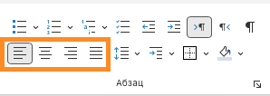
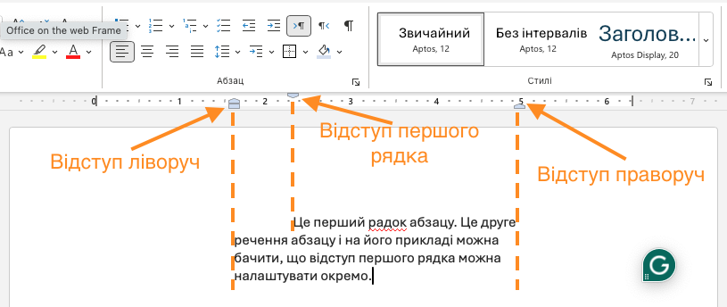
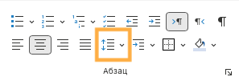
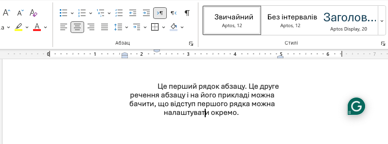
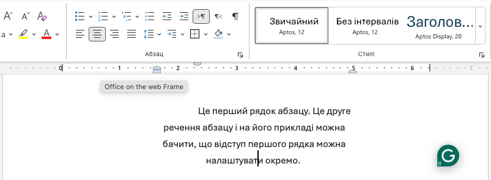

# Форматування абзаців в Microsoft Word

## Урок 44

---

## 🎯 Сьогодні ми дізнаємося

- ℹ️ Що таке абзац.
- 🔧 Які дії можна виконувати з абзацом.
- ✏️ Які властивості має абзац і як їх змінювати.

---

## 🔧 Дії з абзацом

1. 🆕 **Створити абзац** – натиснути `Enter`.
2. 🔀 **Розбити на абзаци** – поставити курсор у потрібне місце та натиснути `Enter`.
3. 🔗 **Об’єднати абзаци** – поставити курсор на початку другого абзацу і натиснути `Backspace`.
4. 🗑️ **Видалити абзац** – виділити текст і натиснути `Delete`.

---

## 1️⃣ Вирівнювання тексту

  

- 📜 **Ліворуч** – текст вирівнюється до лівого краю, правий край може бути нерівним.
- 📍 **По центру** – текст розташовується рівномірно по центру сторінки.
- 📎 **Праворуч** – текст вирівнюється до правого краю, лівий край може бути нерівним.
- 📏 **По ширині** – текст рівномірно розтягується між лівим і правим краєм, створюючи рівні краї.

### 🛠️ Як змінити?

- 🔹 Виділити текст.
- 🔹 На панелі інструментів `Основне` обрати потрібну кнопку вирівнювання.
  

  

  

---

## ↔️ Відступи

  

- 📏 Відступ — це відстань від краю сторінки до початку абзацу.
- 📐 Можна змінювати **лівий** та **правий** відступи, а також відступ **першого рядка абзацу**.

### ✨ Як змінити?

- 📌 Виділити абзац.
- 🔧 На лінійці пересунути маркери або скористатися меню **«Абзац»**.

  

  

  

---

## 📏 Міжрядковий інтервал

  

- 📖 Це відстань між рядками в абзаці.
- 👀 Використовується для зручного читання тексту.

### 🔍 Як змінити?

- 🔹 Виділити текст.
- 🔹 У вкладці `Основне` натиснути кнопку `Міжрядковий інтервал` і обрати потрібне значення.
  

  

  

---

## 📏 Приклад міжрядкового інтервалу

  

### Міжрядковий інтервал 1.0

  

  

### Міжрядковий інтервал 1.5

💡 Зверніть увагу, як змінилася відстань між рядками тексту в порівнянні зі знімком екрану ліворуч.
  

---

## 🏁 Підсумок

- 📝 Абзац допомагає зробити текст зрозумілим.
- 🔧 Ми можемо створювати, розбивати, об’єднувати та видаляти абзаци.
- ✏️ Форматування абзацу включає **вирівнювання, відступи та міжрядковий інтервал**.

🎯 **Спробуйте самостійно відформатувати текст у Word!**

---

## 📝 Практичне завдання

<section class="slide">

1. Створи новий документ у Word.
2. Скопіюй тест за [посиланням](https://docs.google.com/document/d/1qe_VRKIyY7i0LONOBVHg-Y3Ppz5pMjle43_7ha0G0Qo/edit?usp=sharing),
   та встав його в документ Word.
3. **Відформатуй абзаци:**
   - 📝 Розбий текст на 4 абзаци, так, щоб кожне речення починалося з нового абзацу (натисни Enter у потрібних місцях).
   - 📜 Зміни вирівнювання:
     - 1-й абзац – **ліворуч**.
     - 2-й абзац – **по центру**.
     - 3-й абзац – **праворуч**.
     - 4-й абзац – **за шириною**.
   - 📏 Для **всіх** абзаців додай **відступ ліворуч** та **відступ праворуч** по 4см, а відступ **першого рядка** абзацу 6см.
   - 📖 Зміни міжрядковий інтервал на 1,5.
   - 💾 Збережи документ під назвою `"<ВАШЕ-ІМʼЯ>-форматування-абзаців"`

✅ **Покажи роботу вчителю!**

</section>
