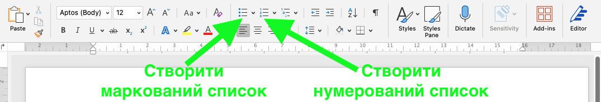
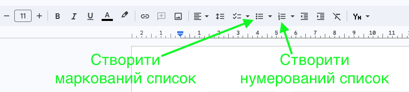

# 📝 Списки в текстових редакторах

## Інформатика | 5 клас

---

## 🎯 Що сьогодні дізнаємось?

✅ Що таке **списки** в текстових редакторах.
✅ Які **типи списків** бувають.
✅ Як створити списки у **Microsoft Word** та **Google Документах**.
✅ **Практичне завдання** для закріплення знань.

---

## 📜 Що таке списки?

**Список** – це спосіб оформлення тексту, коли кожен елемент розташований у рядок зі спеціальним позначенням.

📌 Використовуються для:
🔹 Виділення важливих пунктів.
🔹 Покращення читабельності тексту.
🔹 Структурування інформації.

---

## 📌 Види списків

🔴 **Маркований (ненумерований)**
✔ Кожен пункт має символ (•, ▪, ➤).

🔵 **Нумерований**
✔ Пункти йдуть по порядку (1, 2, 3…).

🟢 **Багаторівневий**
✔ Включає **основні** та **підпункти**.

---

## 🔴 Маркований список

📌 Використовується для **переліку предметів або ідей**, коли порядок неважливий.

✏ **Приклад:**
- 🍎 Яблуко
- 🍌 Банан
- 🍓 Полуниця

---

## 🔵 Нумерований список

📌 Використовується для **впорядкованих дій або інструкцій**.

✏ **Приклад:**
1. Відкрити програму.
2. Вибрати файл.
3. Натиснути «Зберегти».

---

## 🟢 Багаторівневий список

<section class="text-content">

📌 Використовується для **структурованої інформації** з підпунктами.

✏ **Приклад:**
1. 🏫 **Шкільні предмети**
   - 📖 Українська мова
   - 🔢 Математика
2. 🎨 **Хобі**
   - 🎶 Музика
   - 🏀 Спорт

</section>

---

## 🖥 Як створити списки в Word?

<section class="text-content">

1️⃣ Виділити текст.
2️⃣ Натиснути на кнопку **«Маркований список»** 🔘 або **«Нумерований список»** 1️⃣.
3️⃣ Вибрати потрібний стиль.
4️⃣ Для **багаторівневого списку** натиснути **Tab** (відступ).

📌 **Приклад кнопок у Word:**

</section>

---

## 🌍 Як створити списки в Google Документах?

<section class="text-content">

1️⃣ Виділити текст.
3️⃣ Вибрати **нумерований** або **маркований** на панелі інструментів
4️⃣ Для **багаторівневого списку** натиснути **Tab** (відступ).

📌 **Приклад кнопок у Google Docs:**

</section>

---

## 🎯 Практичне завдання (10 хв)

📌 **Створіть у Word або Google Документах список:**

1️⃣ **Маркoваний список** з 3 вашими улюбленими стравами.
2️⃣ **Нумерований список** з вашими уроками в середу.
