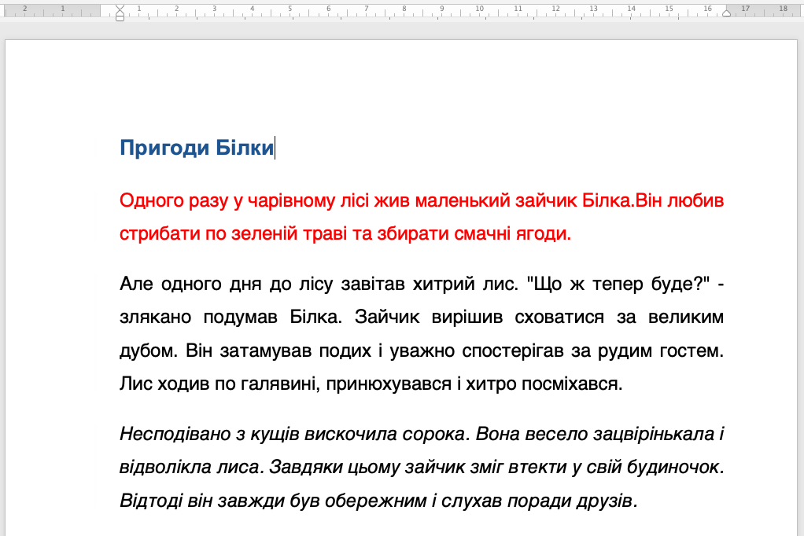

# 📝 Форматування тексту в Word та Google Docs

## Урок 50 - Практичне завдання

📌 **Оформлення казки**

---

## 🎯 **Що будемо робити?**

✅ **Копіювати текст казки** 📜
✅ **Форматувати текст (шрифт, колір, розмір, стиль)** 🎨
✅ **Відформатувати абзаци (Вирівнювання, відступи)** 🎨
✅ **Змінювати параметри сторінки (поля, інтервали)** 📏

---

## 📜 Інструкції

<section class="instructions-container">
  

1) Створіть новий документ Word
2) Скопіюйте текст з [посилання](https://docs.google.com/document/d/1Z1pS3mN3_IelWcTJrtutzNERJfYHwraIiLIdQ2xXXR0/edit?usp=sharing) у свій документ Word
3) Щось інше
4) 📌 **Назва**:
  🔹 Додайте заголовок **"Пригоди Білки"**
  🔹 Зробіть його **жирним**, **синім**, Втановіть розмір **16 pt**
5) 📌 **Основний текст**:
  🔹 Розмір шрифта **14 pt**
  🔹 Вирівняйте **по ширині** 📏
  🔹 Шрифт: **Helvetica**
  🔹 Перший абзац виділіть червоним кольором 🔴
  🔹 Останнє речення – виділіть *курсивом* ✍
  🔹 Відступ **ліворуч 3 см**
  🔹 Відступ **праворуч 2 см**
  🔹 Відступ **першого рядка 4 см**
  🔹 Міжрядковий інтервал 1.5

  

  

*Приклад результату*

  

</section>
