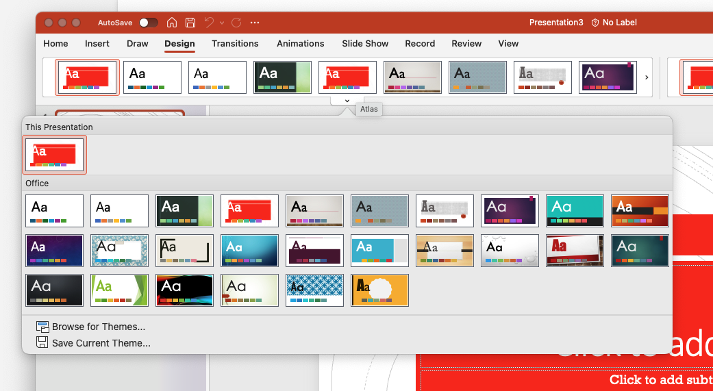
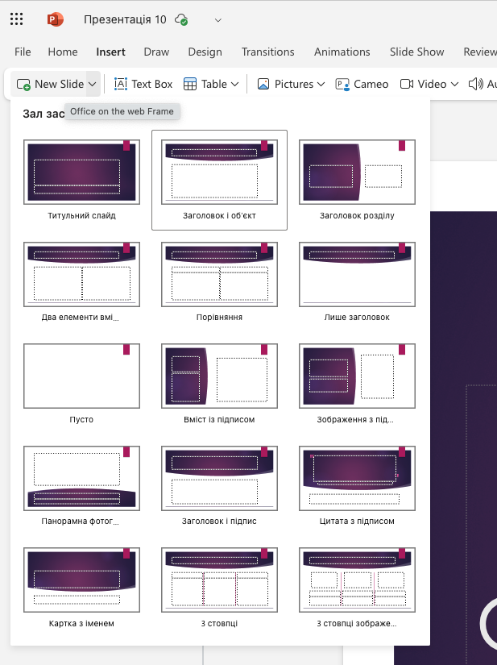

# 🖥️ Шаблони презентацій

## та структура слайдів у PowerPoint

### Урок **56**

---

## 🎯 Що дізнаємося на уроці

- Що таке **шаблон презентації**
- Що таке **структура слайду**
- Як вибрати і змінити **макет слайду**
- Попрацюємо в **PowerPoint**

---

## 🧩 Що таке шаблон презентації?

📌 **Шаблон** – це готовий дизайн слайдів.
Він містить:

- кольори
- шрифти
- розміщення тексту
- стилі заголовків

> 👀 Використовуємо шаблони, щоб презентація була **гарною та зручною**!

---

## Як обрати шаблон для презентації?

Обери шаблон коли створюєш нову презентацію, або щміни шаблон існуючої презентації або використай панель інструсентів `Макет`

---

## 🧱 Структура презентації

🗂 Презентація має кілька типових слайдів:

1️⃣ **Титульний слайд** – назва, автор
2️⃣ **Слайд з інформацією про автора** (не обовʼязково)
3️⃣ **Зміст перзентації** (не обовʼязково)
4️⃣ **Основні слайди** – текст, зображення
5️⃣ **Слайди розділювачі**
6️⃣ **Слайд із висновками**
7️⃣ **Контактна інформація** (не обов’язково)

---

## 🖼️ Що таке макет слайду?

📋 **Макет слайду** — це розташування елементів:

- де буде заголовок
- де буде текст
- де буде малюнок

> 📐 Кожен слайд може мати **свій макет**!

---

## 🧮 Види макетів

👆 У PowerPoint можна обрати макет:

- Титульний слай (перший слайд презентації)
- Розідлювач (щоб розділити частини/розділи презентації)
- Заголовок + вміст (піходить для більшості текстових слайдів)
- Лише заголовок (підходить, для слайду де буде лише картинка)
- Дві колонки (підходть для слайду порівння)
- Малюнок + текст (підходить для слайду де буде малюнок і текст)
- Порожній слайд (вирішуєш **ти**)

--

## Приклад вибору макету

### Натисни на стрілку біля кнопки `Додати Слайд` та обери потрібний макет

---

## 🖱️ Як змінити макет слайду?

1. Виділи слайд у списку ліворуч
2. Вгорі натисни **"Макет"**
3. Обери потрібний варіант
4. Додай вміст

> ✨ Не бійтеся експериментувати з виглядом слайдів!

---

## ✍️ Попрактикуємося!

🎯 Створи презентацію на тему
**«Моє хобі»** або **«Мої улюблені речі»**

💼 Вимоги:

- 1 титульний слайд
- 2–3 слайди з різними макетами
- Використати шаблон оформлення

---

## 🧠 Що запам’ятали?

🗨️ Обговоримо:

- Чим шаблон відрізняється від макету?
- Який макет сподобався найбільше?
- Чи зручно працювати з шаблонами?
