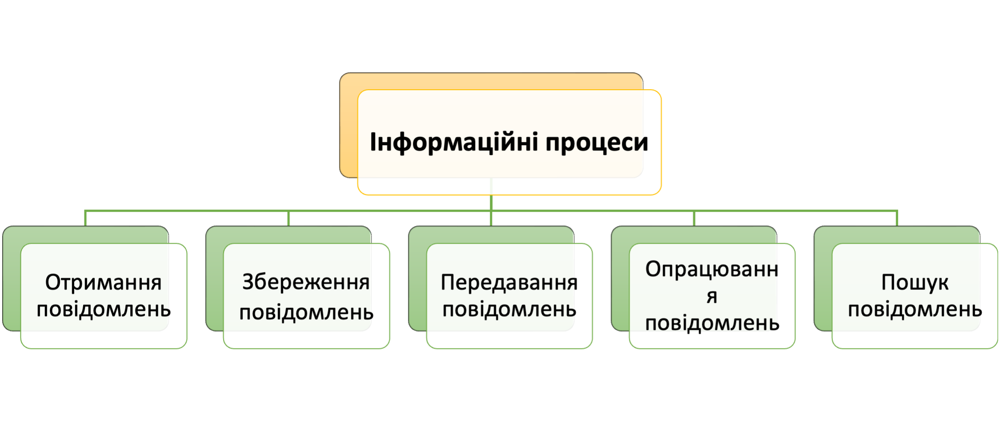

# 🧠 Інформаційні процеси

## 📚 Урок **01**

---

## 🎯 Сьогодні ми дізнаємося

- ℹ️ Що таке **інформаційні процеси**
- 🏷️ Які дії людина виконує з інформацією

---

## 🤔 Що таке інформаційні процеси

Людина постійно отримує, шукає, зберігає, опрацьовує та передає повідомлення. При цьому вона може виконувати різноманітні дії з повідомленнями залежно від поставленої мети. Такі дії називають **інформаційними процесами**.

---

## 🗂️ Які бувають інформаційні процеси

<section class="image-center">

</section>

---

## 📝 Завдання

<section class="grid-container">

[Вправа](https://learningapps.org/view2507712): Вкажи дії, що відповідають запропонованим інформаційним процесам.

</section>

---

## 🏠 Домашнє завдання

1. Вивчити **правила безпеки** в кабінеті інформатики
2. Прочитати "Відкриття 1" с. 5–6
1. Вивчити **правила безпеки** в кабінеті інформатики
2. Прочитати "Відкриття 1" с. 5–6
