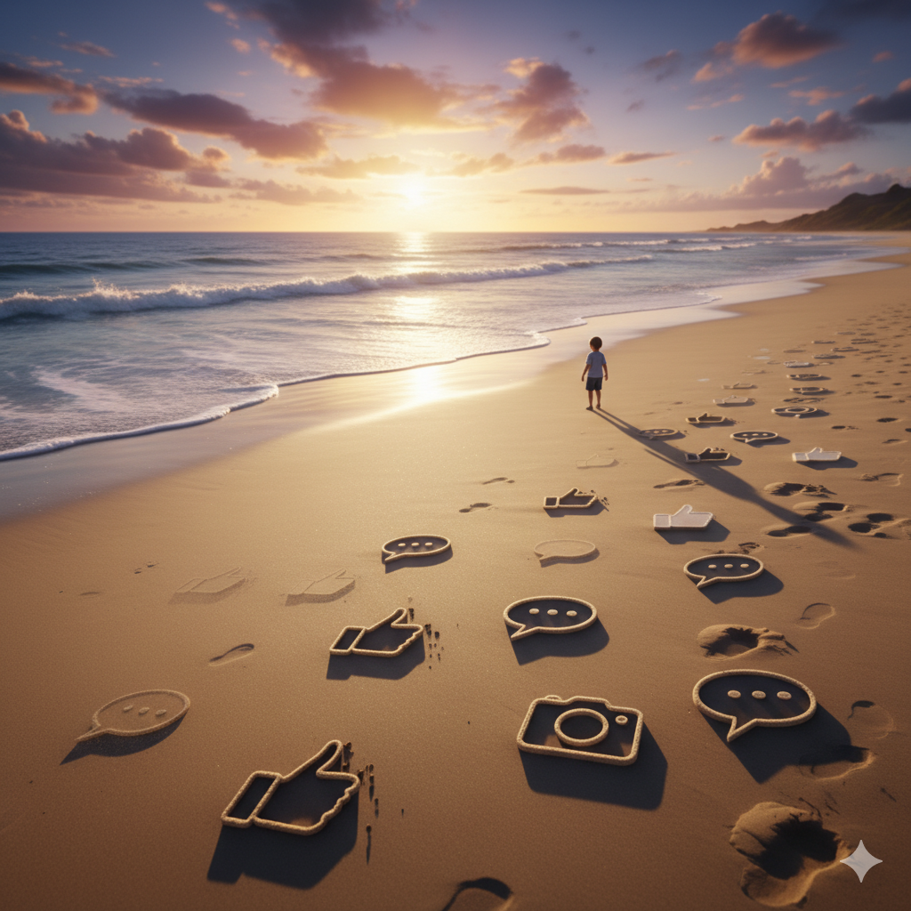

# 👣 Цифровий слід

## Що ми залишаємо в Інтернеті?
### Урок **13**

---

## 🎯 Сьогодні ми дізнаємося

- 🤔 Що таке **"цифровий слід"**.
- 👣 Які бувають види цифрового сліду: **активний** та **пасивний**.
- 😟 Чому важливо дбати про свою інформацію в мережі.
- 🛡️ Як захистити свій цифровий слід.

---

## 🤔 Що таке цифровий слід?

**Цифровий слід** — це вся інформація, яку ти свідомо чи несвідомо залишаєш про себе в Інтернеті.

 

🌊 Уяви, що Інтернет — це піщаний пляж. Кожен твій крок, лайк чи коментар залишає на ньому слід. Деякі сліди залишаються **назавжди**.

---

## 👣 Активний цифровий слід

Це інформація, яку ми публікуємо **свідомо** та **навмисно**.

 

**Приклади:**
* 📸 Фото та відео в **Instagram** чи **TikTok**.
* ✍️ Коментарі під відео на **YouTube**.
* 📝 Повідомлення на форумах чи в чатах.
* ✅ Лайки та репости.

---

## 🐾 Пасивний цифровий слід

Це дані, що збираються про нас **автоматично**, часто без нашої активної участі.

 

**Приклади:**

- 🔍 Історія пошуку в **Google**.
- 📍 Дані про твоє місцезнаходження **(геолокація)**.
- 🍪 Файли **cookie**, які запам'ятовують, які сайти ти відвідував.
- 💻 Твоя **IP-адреса**.

---

## 😟 Чому це важливо?

  

### **Репутація** 🧑‍🏫

Твій цифровий слід формує твій **онлайн-образ**. Його можуть побачити друзі, вчителі, а в майбутньому — роботодавці.

  

  

### **Безпека** 🔒

Інформацію про тебе (де ти живеш, навчаєшся, що любиш) можуть використати **шахраї**.

  

🌟 **Але є і гарна новина:** ти можеш створювати **позитивний** цифровий слід, ділячись своїми успіхами, творчістю та добрими справами!

---

## 💻 Практична робота

### **Вправа "Мій профіль — моя фортеця"** 🏰

1. Об'єднайтеся у групи.
2. Відкрийте текстовий редактор Word.
3. Складіть **5 головних правил** на тему: "Як захистити свій цифровий слід".
4. Збережіть документ. Будьте готові презентувати свої правила класу!

***Ідеї для правил:** "Думай, перш ніж публікувати!", "Налаштуй приватність", "Не ділися геолокацією", "Не додавай незнайомців у друзі".*

---

## 🎲 Гра: Активний чи пасивний слід?

Я називаю дію — ви вирішуєте!

- **Написати коментар** ➡️
- **Переглянути відео на YouTube** ➡️
- **Завантажити фото в Instagram** ➡️
- **Пошукати щось у Google** ➡️
- **Поставити лайк** 👍 ➡️

---

## 🏠 Домашнє завдання

У зошиті **намалюйте** свій **"позитивний цифровий слід"**: що б ви хотіли, щоб Інтернет знав про вас? (Ваші хобі, досягнення, мрії).

💡 Пам'ятай: ти — господар свого цифрового сліду!

