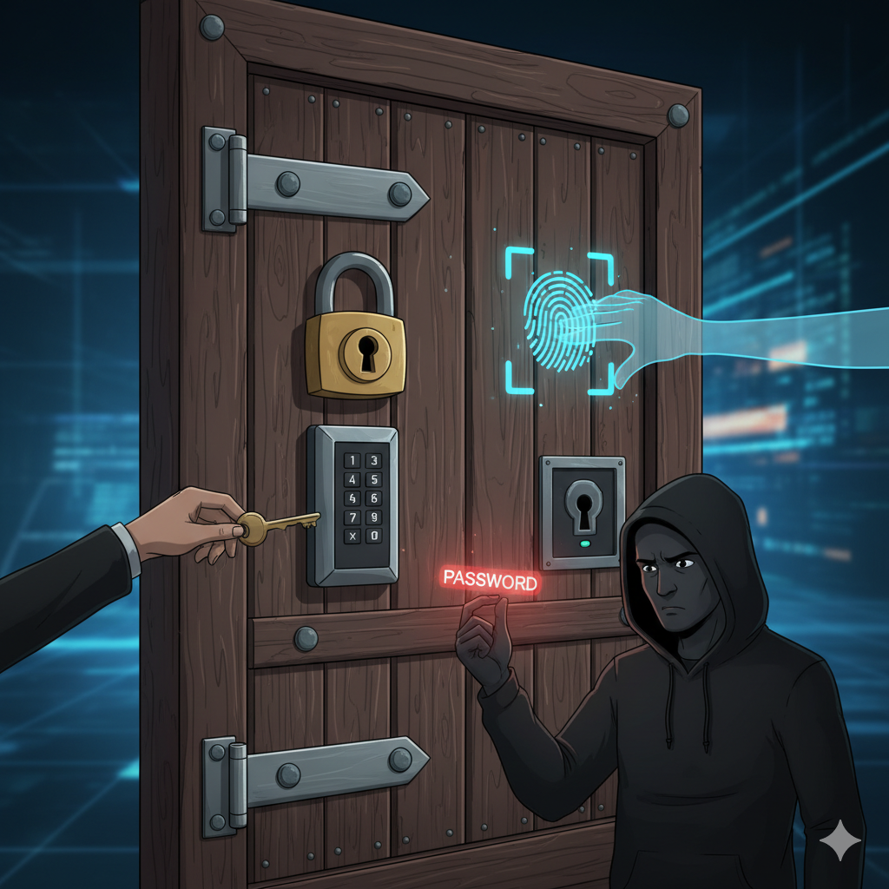

# 🔐 Заходи безпеки та захисту. Поняття про захищені паролі

## Урок **14**

---

## 🎯 Сьогодні ми дізнаємося

- 🤔 Чому важливо захищати свої акаунти в Інтернеті.
- 🛡️ Що таке надійний пароль та які його ознаки.
- ✍️ Як створювати паролі, які легко запам'ятати, за допомогою **кодових фраз**.
- 📲 Що таке **багатофакторна автентифікація** і навіщо вона потрібна.

---

## 🤔 Навіщо захищати свої акаунти?

Ваш акаунт (обліковий запис) — це як **цифровий ключ** 🔑 до вашого особистого світу.

Він містить:
- ✉️ Особисте листування
- 🖼️ Фотографії та відео
- 📞 Контакти друзів
- 🎮 Ігровий прогрес
- 💳 Іноді навіть доступ до грошей

**Залишити акаунт без захисту — це як залишити двері свого будинку відчиненими!**

---

## 💪 Що таке надійний пароль?

- 🔐 **Довжина:** Не менше **12 символів**.
- 🧩 **Складність:** Використовуйте **великі** та **малі** літери, **цифри** та **символи** (!?#$).
- ☝️ **Унікальність:** **Один сервіс — один унікальний пароль!**
- 🔄 **Оновлення:** Змінюйте паролі хоча б раз на кілька місяців.

⚠️ **Ніколи не використовуйте особисту інформацію** (ім'я, дату народження, кличку тваринки) у паролях. Її легко вгадати!

---

## ✍️ Кодові фрази (Passphrases)

Складно запам'ятати `P@$sW0rD123`? 🤔 Є кращий спосіб!

**Кодова фраза** — це пароль із кількох слів. Він **довгий**, **надійний**, але його **легко запам'ятати**.

**Приклад:** `4-Veseli-Kotyky-Ily-Smachnu-Rybku!`

---

## 📲 Багатофакторна автентифікація (2FA)

Це **додатковий рівень захисту** вашого акаунту. Навіть якщо хтось вкраде ваш пароль, він не зможе увійти без другого "ключа".

**Що може бути другим фактором?**
- 💬 Код із SMS-повідомлення
- 📱 Код зі спеціального додатка (Google Authenticator)
- 👍 Відбиток пальця або сканування обличчя

**Аналогія:** це як подвійний замок на дверях. Одного ключа-пароля недостатньо! 🚪🔑

---

## 🧠 Давайте перевіримо себе!

<section class="text-medium">

1. Яка мінімальна довжина надійного пароля?
2. Що таке **кодова фраза**? Наведіть приклад.
3. Чому не можна використовувати пароль `Olena2012`?
4. Навіщо потрібна **багатофакторна автентифікація**?
5. Ваш друг використовує пароль `qwerty123` для всіх сайтів. Що ви йому порадите?

</section>

---

## 🏠 Домашнє завдання

### **Підготовка до проекту "Сімейний порадник з безпеки"** 👨‍👩‍👧‍👦

1. **Дізнайтеся:** Розпитайте своїх батьків, бабусь, дідусів або старших родичів, які правила безпеки в Інтернеті вони знають та використовують. Запиши результат в зошит.
2. **Проаналізуйте:** Подумайте, які з цих порад є корисними, а які, можливо, вже застаріли.
3. **Підготуйтеся:** На наступному уроці ми разом створимо спільний "Порадник з безпеки", використовуючи зібрану вами інформацію! 🛡️

