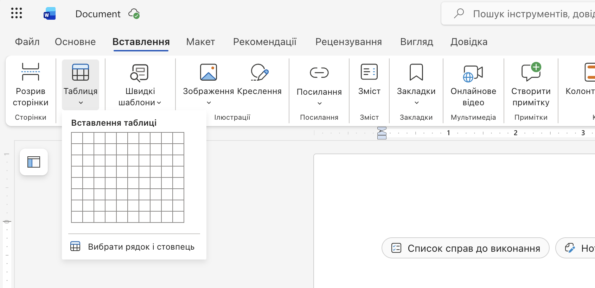
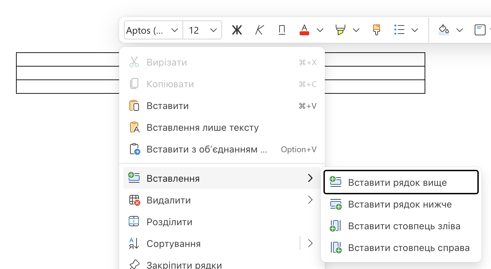
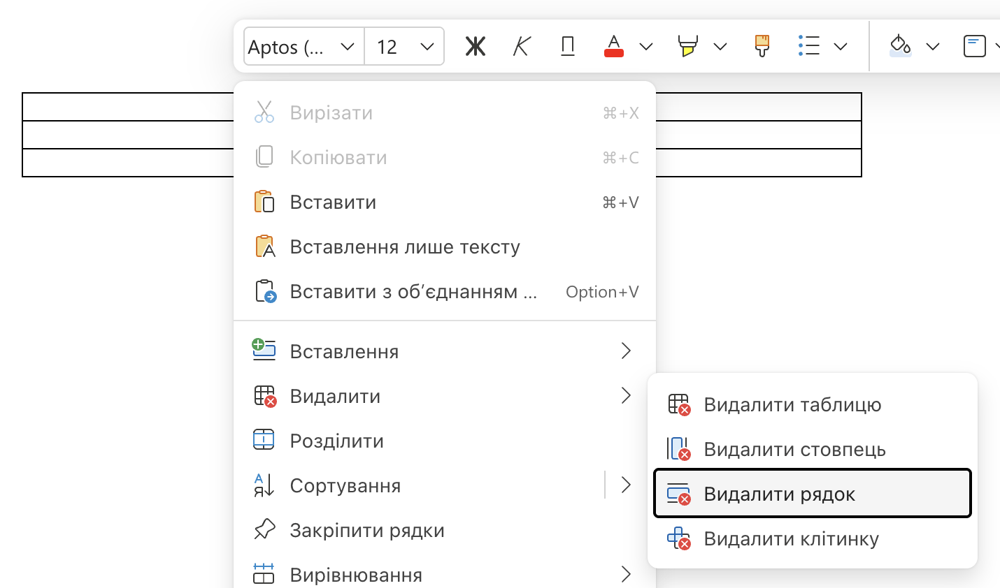

# Додавання, редагування та форматування таблиць

## 🏫 Урок 34

---

## 🎯 Сьогодні ми дізнаємося

- 🧱 Що таке таблиця та з чого вона складається.
- 🛠️ Як створити таблицю в Word Online.
- 🖱️ Як редагувати таблицю через контекстне меню.
- 🎨 Як форматувати комірки, рядки та стовпці.

---

## 🧠 Пригадаймо

1. Які об'єкти можна додавати до текстового документа?
2. Для чого ми використовуємо списки?
3. Як зручніше подати розклад уроків або календар погоди?

---

## 📘 Що таке таблиця?

**Таблиця** — це спосіб впорядкування даних. Вона складається з:

- **Рядків** (горизонтально) ➡️
- **Стовпців** (вертикально) ⬇️
- **Комірок** (на перетині рядка і стовпця) 🔲

---

## 🛠️ Як створити таблицю ([Word Online](https://word.cloud.microsoft/open/onedrive/))

  

1. Перейдіть на вкладку **Вставлення** (Insert).
2. Натисніть кнопку **Таблиця**.
3. Виділіть мишкою необхідну кількість рядків та стовпців у сітці (наприклад, 3x4).

  

  

  

---

## 🖱️ Редагування таблиці

Використовуйте **праву кнопку миші (ПКМ)** на комірці для виклику меню:

  

### ➕ Вставити

Додати рядок зверху/знизу або стовпець зліва/справа.

  

  

### ❌ Видалити

Видалити комірку, рядок, стовпець або всю таблицю.

  

---

## 🎨 Форматування таблиці

- **Зміна розміру:** Наведіть курсор на межу рядка/стовпця (курсор ↔️ або ↕️) і перетягніть.
- **Оформлення:** Вкладка **Макет таблиці** (Table Layout) або **Конструктор** (Design) — зміна заливки, меж.
- **Текст:** Вкладка **Основне** (Home) — зміна шрифту, розміру, вирівнювання.

---

# 💻 Практична робота
## "Мій розклад на понеділок"

---

## 🟢 Рівень 1 (Достатній - ⭐️)

1. Створіть таблицю: **3 стовпці** на **6 рядків**.
2. Заповніть шапку (1-й рядок): *№ уроку*, *Предмет*, *Кабінет*.
3. Впишіть 5 уроків вашого розкладу на понеділок.

---

## 🟡 Рівень 2 (Середній - ⭐️⭐️)

1. Виконайте завдання 1-го рівня.
2. 1-й рядок (шапка): зробіть шрифт **жирним** (Bold) і вирівняйте **по центру**.
3. Звузьте 1-й стовпець (*№ уроку*).
4. Додайте стовпець справа (ПКМ → Вставити → Стовпець справа) і назвіть його *Час*.

---

## 🔴 Рівень 3 (Високий - ⭐️⭐️⭐️)

1. Виконайте попередні рівні.
2. Додайте рядок **зверху** (ПКМ → Вставити → Рядок зверху).
3. **Об'єднайте комірки** нового рядка (ПКМ → Merge cells).
4. Напишіть "Понеділок", зробіть **світло-синю заливку**.
5. Встановіть **товстіші зовнішні межі** для таблиці.

