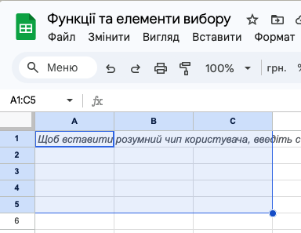

# Введення та редагування даних. Діапазон клітинок.

## 🏫 Урок **37**

---

## 🎯 Сьогодні ми дізнаємося

- ⌨️ Як правильно вводити та змінювати дані в таблиці.
- 📊 Як програма автоматично розпізнає типи даних.
- 🖱️ Що таке діапазон клітинок та як з ним працювати.
- 🛠️ Як додавати нові рядки та стовпці.

---

## ⌨️ Введення та редагування

Вводити дані можна безпосередньо в клітинку або в **Рядок формул**.

### Запам'ятайте:

- Подвійний клік або клавіша `F2` — редагування вмісту.
- `Enter` — підтвердити введення (перехід вниз).
- `Tab` — підтвердити введення (перехід вправо).
- `Esc` — скасувати введення.

---

## 🔍 Типи даних та вирівнювання

Електронна таблиця — розумна! Вона сама визначає тип даних за замовчуванням:

  

### Текст

Вирівнюється по **ЛІВОМУ** краю.

  

  

### Числа / Дати

Вирівнюється по **ПРАВОМУ** краю.

  

⚠️ Якщо число вирівнялося зліва — комп'ютер вважає його текстом!

---

## 📏 Діапазон клітинок

**Діапазон** — це сукупність клітинок, які утворюють прямокутник.

  

Адреса діапазону: `A1:C5`
(Ліва верхня клітинка : Права нижня клітинка)

  

  

  

---

## 📋 Копіювання та автозаповнення

- **Ctrl+C / Ctrl+V** — стандартне копіювання.
- **Маркер автозаповнення** — маленький квадратик у правому куті виділеної клітинки.

  Потягніть за маркер автозаповнення, щоб швидко скопіювати дані або створити список (наприклад, 1, 2, 3...).

---

## 🛠️ Робота з рядками та стовпцями

Ви можете легко змінювати структуру таблиці:

1. Натисніть **правою кнопкою миші** на заголовку (літері стовпця або цифрі рядка).
2. Оберіть потрібну дію:
   - ➕ Вставити (додає новий порожній елемент).
   - ❌ Вилучити (повністю видаляє вибране).
   - 👁️ Приховати.

---

## 🚀 Практичне завдання (Рівень 1)

  <h3>Завдання 1: "Мій розклад" ⭐️</h3>
  <ul>
    <li>Створіть таблицю з 3 стовпцями: "№", "Предмет", "Час".</li>
    <li>Заповніть 5 рядків даними.</li>
    <li>Перевірте, чи числа (№) і текст (Предмет) вирівнялися по різних краях.</li>
  </ul>
  
💰 Максимальна оцінка: 6 балів

---

## 🚀 Практичне завдання (Рівень 2)

  <h3>Завдання 2: "Магазин" ⭐️⭐️</h3>
  <ul>
    <li>Виконайте Завдання 1.</li>
    <li>Зафарбуйте діапазон <b>A10:C12</b> кольором.</li>
    <li>Додайте новий стовпець між "Предмет" та "Час".</li>
    <li>Використайте <b>маркер автозаповнення</b> для нумерації рядків.</li>
  </ul>
  
💰 Максимальна оцінка: 9 балів

---

## 🚀 Практичне завдання (Рівень 3)

  <h3>Завдання 3: "Аналітик" ⭐️⭐️⭐️</h3>
  <ul>
    <li>Скопіюйте дані розкладу у діапазон <b>E1:G5</b>.</li>
    <li>Вилучіть третій рядок таблиці.</li>
    <li>Введіть дату народження. Якщо вона зліва — змініть її формат, щоб програма зрозуміла, що це дата.</li>
  </ul>
  
💰 Максимальна оцінка: 12 балів

