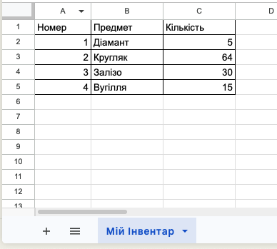
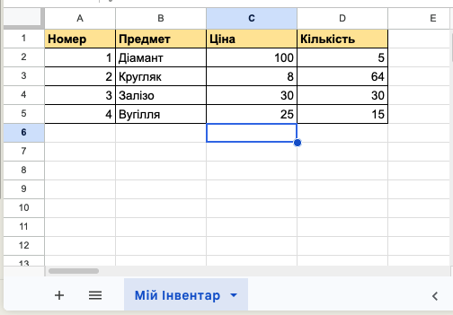

# Введення та редагування даних. Діапазони

## 🏫 Урок **38**

---

## 🎯 Сьогодні ми дізнаємося

- 🔢 Як комп'ютер розрізняє **Текст** та **Числа**.
- 🔳 Що таке **діапазон клітинок** і як його записати.
- 🖱️ Як швидко виділяти великі частини таблиці.
- 🎮 Створимо інвентар для Minecraft/Roblox.

---

## 🧐 Типи даних у комірках

Комп'ютер "розуміє", що саме ви написали, і вирівнює це автоматично:

  

    📝

### Текстові дані

Слова, назви, імена.
**Вирівнювання:** ⬅️ За лівим краєм

  

  

    🔢

### Числові дані

Кількість, ціна, дата.
**Вирівнювання:** ➡️ За правим краєм
  

---

## 🔳 Що таке діапазон?

**Діапазон клітинок** — це прямокутна область таблиці, яка складається з декількох клітинок.

📝 **Як записується адреса?**
Через двокрапку: `Перша клітинка:Остання клітинка`

Приклад: **A1:C5**
*(Від верхньої лівої A1 до нижньої правої C5)*

---

## 🖱️ Способи виділення

  

**🖱️ Мишкою**
Натисни ліву кнопку всередині клітинки (білий хрестик) і тягни.

  

  

**⌨️ Клавіатурою**
Затисни `Shift` і натискай стрілочки ⬅️ ⬆️ ⬇️ ➡️.

  

  

**🏗️ Цілий стовпець/ряд**
Клацни мишею на букву стовпця (A, B...) або цифру рядка (1, 2...).

  

---

# 🛠️ Практична робота

## Тема: "Ігровий світ"

Відкрийте **[Google Таблиці](https://docs.google.com/spreadsheets/)** (або Excel).
Ми створимо інвентар геймера.

---

## ⭐️ Рівень "Середній" (до 6 балів)

  

1. Створіть новий файл.
2. Перейменуйте аркуш у: `Мій інвентар`.
3. Заповніть дані як показано в прикладі
4. **Завдання:** Виділіть діапазон (таблицю) мишкою та додайте рамки як показано на малюнку.

  

  

  

---

## ⭐️⭐️ Рівень "Достатній" (до 9 балів)

  

1. Виділіть діапазон заголовків **A1:C1**.
2. Зробіть текст **жирним** і залийте клітинки **жовтим** кольором 🎨.
3. Додайте стовпець `Ціна` між стовпцями **B** і **C**.
4. Заповніть його вигаданими цінами (наприклад: 100, 5, 50).

  

  

  

---

## ⭐️⭐️⭐️ Рівень "Високий" (до 12 балів)

  

1. Додайте новий Аркуш, та назвіть його **"Порівняння ігор"**.
2. Введіть назви стовпців (**A1:C1**) : `Гра`, `Рік виходу`, `Рейтинг`.
3. Заповніть дані про **Minecraft** та **Roblox** (скористайтеся пошуком в Інтернеті).
4. ↔️ **Ширина:** Змініть ширину стовпців так, щоб усі назви поміщалися повністю (двічі клікніть між буквами стовпців).
5. Відформатуйте таблицю як показано на малюнку

  

  

  

