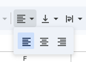
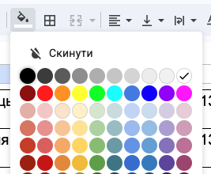

# Форматування таблиць

## 🏫 Урок **39**

---

## 🎯 Сьогодні ми дізнаємося

- 🎨 Що таке форматування таблиці.
- 📐 Як змінювати розміри стовпців та рядків.
- 🖌️ Як налаштувати межі та колір заливки.
- 📍 Як вирівнювати текст у комірках.

---

## 💡 Що таке форматування?

У роботі з електронними таблицями важливо не тільки ввести дані, а й зробити їх зручними для читання.

**Форматування таблиці** — це зміна зовнішнього вигляду: властивостей шрифту, меж, кольору заливки та розмірів елементів таблиці.

---

## 📏 Зміна розмірів

Ви можете змінювати ширину стовпців та висоту рядків:

1. **Вручну:** перетягнути межу між заголовками (A, B... або 1, 2...).
2. **Автопідбір:** дуже зручний спосіб!

Щоб автоматично підібрати ширину стовпця під вміст, двічі клацніть лівою кнопкою миші на правій межі заголовка стовпця.

---

## 📍 Вирівнювання тексту

У Google Таблицях та Excel є два види вирівнювання одночасно:

  

**Горизонтальне:** ⬅️ ліворуч, ↔️ по центру, ➡️ праворуч.

  

  

  

  

**Вертикальне:** ⬆️ по верхньому краю, ↕️ посередині, ⬇️ по нижньому краю.

  

  

  

---

## ⟼ Перенесення тексту

Якщо текст не поміщається в комірку по довжині, то можна використати функцію перенесення тексту, щоб він:

  

- Переповнював комірку (стандартна поведінка)
- Переносився на новий рядок
- Обрізався

  

  

  

---

## 🖌️ Межі та Заливка

  

### 🎨 Заливка

Використовуйте інструмент "Колір заливки" (відерце), щоб виділити заголовки або важливі дані.

  

  

  

  

### ✏️ Межі

Сітка, яку ви бачите на екрані, зазвичай не друкується. Щоб таблиця мала межі, їх треба увімкнути спеціальною кнопкою.

  

  

  

---

## 🛠️ Практична робота

Виконуємо завдання в **Google Таблицях** або **Excel**

1. В клітинку **A1** напишіть довге словосполучення чи речення (наприклад своє прізвище, ім'я та по-батькові).
2. Використайте функцію **перенесення тексту**, щоб:
   1. Увімкнути переповнення
   2. Увімкнути перенесення
   3. Увімкнути обрізання
3. Автоматично налаштуйте ширину колонки (двічі клацніть лівою кнопкою миші по межі між стовпцями **A** та **B**).
4. Збільшіть ширину та висоту стовпця. Вирівняйте текст за центром горизонтально та вертикально.
5. Оберіть діапазон **A1:D8** та увімкніть усі межі.

