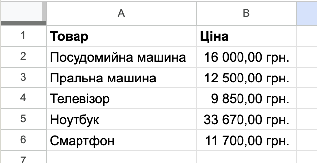
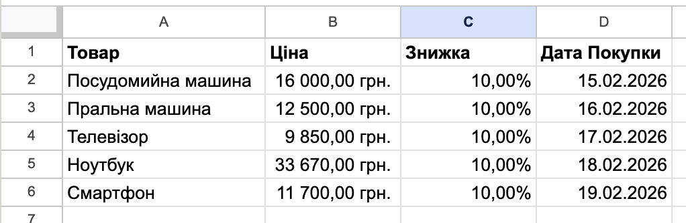

# Типи даних: числові, грошові, дати, текст, відсотки

## 🏫 Урок **40**

---

## 🎯 Сьогодні ми дізнаємося

- ℹ️ Що таке формат даних.
- 🔧 Навіщо форматувати дані в таблицях.
- ✏️ Які основні типи даних існують.
- 🛠️ Як змінити формат у Google Таблицях та Excel.

---

## 🤔 Поміркуймо!

Спробуйте додати 2 і 2. Який результат у вас вийшов?

А тепер спробуйте додати небо до 10 жирафів? Чи вдалося вам виконати цю дію?

Електронна таблиця бачить це як **текст**, а не як число. Щоб рахувати, нам потрібно правильно вказати "мову", якою ми спілкуємося з програмою — тобто **формат даних**.

---

## 📝 Занотуйте в зошит

**Формат даних** — це спосіб інтерпретації вмісту клітинки електронною таблицею. Він визначає, як дані виглядають та що з ними можна робити.

---

## 📊 Основні типи даних (частина 1)

  

### 🔤 Текст

Будь-які символи. Не використовується для математичних обчислень.

  

  

### 🔢 Число
Тільки цифри. Дозволяє додавати, множити та виконувати інші дії.

  

  

### 💰 Грошовий

Автоматично додає символ валюти (₴, $, €) до числа.

  

---

## 📊 Основні типи даних (частина 2)

  

### 📅 Дата

Записується як ДД.ММ.РРРР (є і інші форми запису). Дозволяє рахувати кількість днів між подіями.

  

  

### % Відсотки

Множить число на 100 і додає знак %. (Наприклад, 0,1 перетворюється на 10%).

  

---

## 🛠️ Як змінити формат?

  

### 🌐 Google Таблиці

Меню **Формат** → **Число** або кнопка **123** на панелі.

  

  

### 💻 MS Excel

Вкладка **Основне** → група **Число** → вибір у списку.

  

---

## 💻 Практична робота

### Завдання: "Список покупок"

1. ⭐️ Створіть список із 5 товарів та їхніх цін. Встановіть для цін "Грошовий" формат (₴).
2. ⭐️⭐️ Додайте дату покупки (формат Дата) та знижку 0,1 (формат Відсотки).

