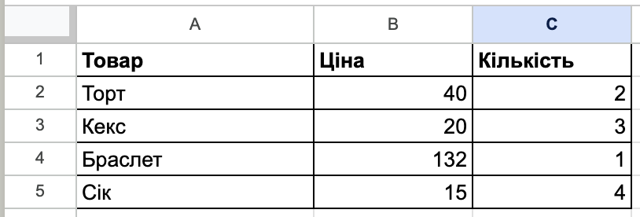
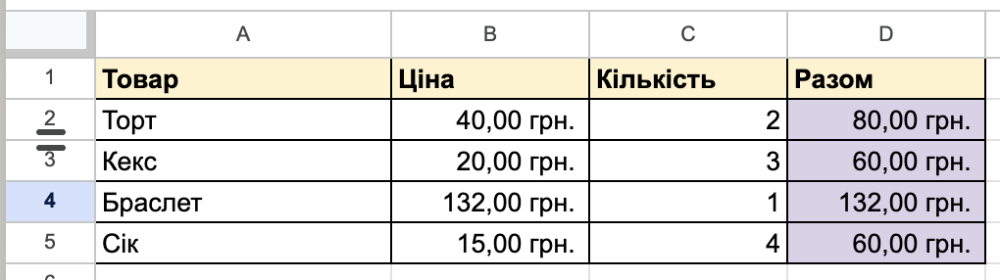
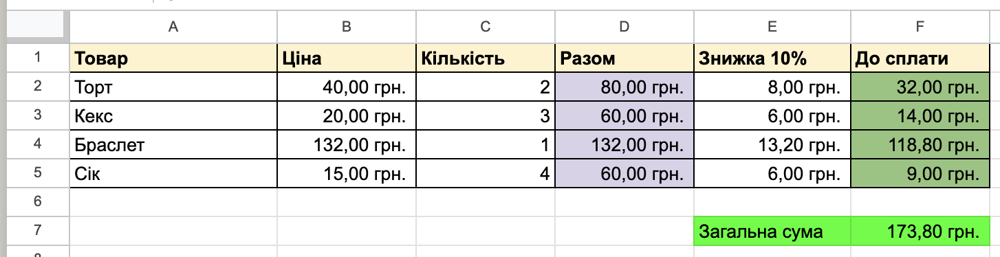

# Обчислення з числовими даними електронної таблиці

## 🏫 Урок **42**

---

## 🎯 Сьогодні ми дізнаємося

- 🧮 Як створювати формули з використанням арифметичних операцій.
- 🔗 Чому важливо використовувати посилання на клітинки замість звичайних чисел.
- 🎨 Як форматувати таблиці та працювати над проєктом "Мій шкільний ярмарок".

---

## 🧠 Згадаємо минулий урок

  

**1.** Які формати даних ми вивчали? (Текст, Число, Грошовий, Відсотки...)

  

  

**2.** Як змінити колір клітинки або додати межі таблиці?

  

  

**3.** Що таке "адреса клітинки" і як вона виглядає?

  

---

## ✍️ Занотуйте в зошит

**Головні правила обчислень:**

1. Будь-яка формула **ЗАВЖДИ** починається зі знака **`=`** (дорівнює).
2. Використовуйте **адреси клітинок** (наприклад, `=A1+B1`), а не просто числа. Тоді при зміні числа в клітинці результат перерахується автоматично!
3. Основні арифметичні дії:
   - **`+`** (додавання)
   - **`-`** (віднімання)
   - **`*`** (множення)
   - **`/`** (ділення)

---

## 💻 Практична робота: Проєкт

  

    🎪

### "Мій шкільний ярмарок"

Сьогодні ми створимо електронну таблицю для розрахунку прибутку від продажу товарів на уявному шкільному ярмарку. Уважно читайте завдання та переходьте від простішого до складнішого.

  

---

## 🛠️ Практичне завдання (Етап 1)

### ⭐️ Рівень "Достатній" (до 6 балів)

1. Відкрийте програму для роботи з електронними таблицями.
2. Створіть таблицю на 3 стовпці з заголовками: **Товар**, **Ціна**, **Кількість**.
3. Заповніть 4 рядки будь-якими товарами (наприклад: Торт, Кекс, Браслет, Сік).
4. Додайте межі до таблиці та зробіть заголовок жирним шрифтом.
5. Введіть довільні числа в стовпці "Ціна" та "Кількість".

### Зразок

---

## 🛠️ Практичне завдання (Етап 2)

### ⭐️⭐️ Середній рівень (до 9 балів)

1. **Виконайте завдання початкового рівня.**
2. Додайте 4-й стовпець і назвіть його **"Разом"**.
3. У стовпці "Разом" напишіть формулу множення **Ціни** на **Кількість**.
4. Використайте **автозаповнення** (потягніть за маркер у правому нижньому кутку клітинки), щоб швидко скопіювати формулу для всіх товарів.
5. Встановіть для стовпців "Ціна" та "Разом" **Грошовий формат** (грн).
6. Відформатуйте межі та кольори відповідно до зразка.

### Зразок

---

## 🛠️ Практичне завдання (Етап 3)

### ⭐️⭐️⭐️ Високий рівень (до 12 балів)

1. **Виконайте попередні завдання.**
2. Додайте 5-й стовпець **"Знижка 10%"**. Обчисліть суму знижки за формулою (наприклад: `=D2 * 10%`).
3. Додайте 6-й стовпець **"До сплати"**, де відніміть знижку від загальної суми.
4. Внизу таблиці зробіть підпис **"Загальна сума виручки"** та порахуйте суму всіх товарів (можна використати функцію `SUM`).
5. Відформатуйте таблицю відповідно до зразка.

### Зразок

