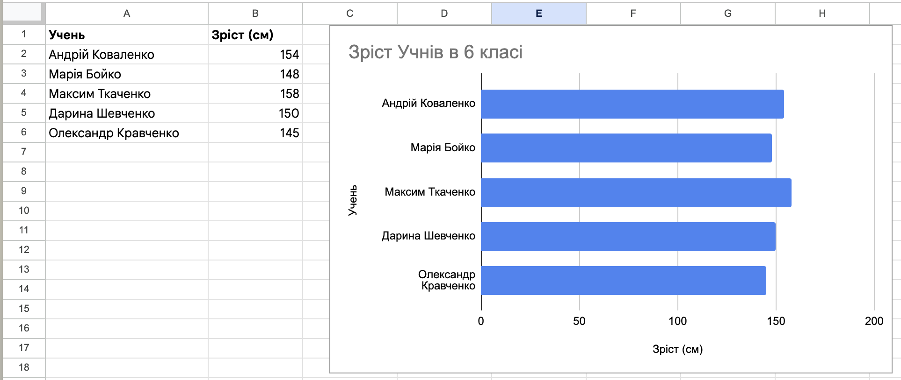

# Основні типи числових діаграм

## 🏫 Урок **43-44**

---

## 🎯 Сьогодні ми дізнаємося

- ℹ️ Що таке діаграма та навіщо її створювати.
- 🔧 Які бувають типи числових діаграм.
- ✏️ З яких об'єктів складається діаграма.
- 📊 Як самостійно побудувати діаграму в Excel або Google Таблицях.

---

## 🤔 Навіщо нам діаграми?

Уявіть, що вам потрібно порівняти ріст усіх учнів у класі, маючи лише список чисел. Це важко та довго, правда?

А тепер уявіть стовпчики різної висоти — одразу видно, хто найвищий!

**Діаграма** — це наочний спосіб показати числа, щоб їх було легше порівнювати.

---

## 💡 Коли і навіщо їх створювати?

Діаграми потрібні для:
- 📊 **Швидкого порівняння показників** (наприклад, оцінки учнів).
- 📈 **Відстеження змін у часі** (наприклад, температура за тиждень).
- 🍕 **Візуалізації частин цілого** (наприклад, скільки часу займає сон, а скільки — ігри).

---

## 📝 Основні типи діаграм (в зошит)

- **Гістограма (або стовпчаста діаграма)**: для порівняння кількох величин (хто найвищий у класі?).
- **Лінійна**: показує, як змінюється значення з часом (як змінювалась температура повітря минулого тижня?).
- **Кругова**: для відображення частин одного цілого.

---

## 🧩 Об'єкти діаграми

Кожна діаграма складається з елементів, які можна налаштовувати:

- **Область діаграми** — весь прямокутник, де розміщено графік.
- **Назва діаграми** — пояснює, що саме ми бачимо.
- **Осі (X та Y)** — підказують, що і в яких одиницях ми порівнюємо.
- **Ряд даних** — самі стовпці, точки або сектори, що відображають числа.
- **Легенда** — список позначень (пояснення кольорів).

---

## 🛠️ Як побудувати діаграму?

### 💼 Excel

1. **Виділіть** діапазон комірок із даними (разом із заголовками).
2. Відкрийте вкладку **Вставлення**.
3. У блоці **Діаграми** оберіть потрібний тип (стовпчасту, лінійну або кругову).
4. За потреби налаштуйте **назву**, **легенду** та **підписи осей**.

### 🌐 Google Таблиці

1. **Виділіть** діапазон комірок із даними (разом із заголовками).
2. У верхньому меню натисніть **Вставка → Діаграма**.
3. У редакторі діаграми праворуч оберіть потрібний **тип діаграми**.
4. У вкладці **Налаштувати** змініть назву, легенду, кольори та інші параметри.

---

## 🎥 Відеоінструкція: діаграма в Google Таблицях

Перегляньте коротке відео з прикладом побудови діаграми:

🔗 Посилання: https://www.youtube.com/watch?v=YTsDS2_vEqw

---

## 💻 Практична частина

**Завдання 1: "Мій раціон" ⭐️ (до 6 балів)**

1. Створіть таблицю: "Фрукти" — 30, "Овочі" — 20, "Злаки" — 25, "Солодощі" — 10, "Білки" — 15.
2. Побудуйте **кругову діаграму**.
3. Додайте назву "Мій раціон".

---

## 💻 Практична частина

**Завдання 2: "Успішність класу" ⭐️⭐️ (до 9 балів)**

1. Створіть таблицю з оцінками з трьох предметів (математика, українська мова, інформатика) для 4 різних учнів.
2. Побудуйте **гістограму (стовпчасту діаграму)**.
3. Змініть колір стовпчиків, додайте легенду знизу та підписи осей.

---

## 💻 Практична частина

**Завдання 3: "Синоптик" ⭐️⭐️⭐️ (до 12 балів)**

1. Створіть таблицю температури повітря за тиждень (7 днів).
2. Побудуйте **лінійну діаграму (графік)**.
3. Додайте назву, сітку та підписи даних (числа над точками). Змініть товщину лінії графіка.
4. Додайте другий ряд даних — "Прогноз" (вигадані числа) на той самий графік.

