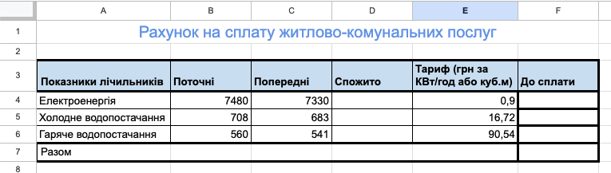

# Обчислення із числовими даними електронної таблиці

### Урок 46

---

## Що таке формула в електронних таблицях?

**Формула** – це спеціальний вираз, який виконує обчислення в комірках електронної таблиці. Вона завжди починається зі знака **"="**.

---

## 📌 Приклади формул
- `=5+3` → результат **8**
- `=A1+B1` → додає значення з комірок A1 і B1
- `=SUM(A1:A5)` → підсумовує числа в комірках **A1, A2, A3, A4, A5**

---

## Які математичні операції можна використовуваати у формулах?

| Арефметична операція  | Знак у формулі |
|-----------------------|----------------|
| Додавання             | `+`            |
| Віднімання            | `-`            |
| Множення              | `*`            |
| Ділення               | `/`            |
| Піднесення до степеня | `^`            |

---

## 🔹 Як працює формула?
1. Вписуємо формулу в комірку починаючи зі знаку **=**.
2. Намагаємось не робити помилок у записі.
3. Натискаємо **Enter** – і бачимо результат!

📌 Щоб швидко ввести адресу клітинки чи діапазон у формулу, просто клацніть на клітинці мишою, або оберіть діапазон!
📌 **Формули допомагають швидко рахувати без калькулятора!** 😊

---

## 📌 Як відредагувати формулу?

Щоб швидко відредагувати невірно введену формулу потрібно:

1. Двічі клацнути мишою на клітинці з формулою
2. Відредагувати формулу прямо в клітинці

---

# 🧮 Що таке функція в таблицях?

📌 **Функція** – це вбудована команда в **Google Таблицях** або **Excel**, яка допомагає швидко виконувати обчислення.

✅ **Формула** – це вираз, який починається зі знака **"="**, а **функція** – це спеціальна команда всередині формули.

---

### 📊 Як це працює?
- Функція має назву та дужки:
  `=ФУНКЦІЯ(аргументи)`
- Наприклад:
  `=SUM(A1:A5)` підсумовує числа в комірках **A1-A5**.

📝 **Функції спрощують роботу в таблицях і економлять час!** ⏳

---

# 🔝 5 найкорисніших функцій

| Функція        | Що робить?  | Приклад |
|---------------|------------|---------|
| **SUM**      | Додає числа в діапазоні | `=SUM(A1:A5)` |
| **AVERAGE**  | Обчислює середнє значення | `=AVERAGE(A1:A5)` |
| **MAX**      | Знаходить найбільше число | `=MAX(A1:A5)` |
| **MIN**      | Знаходить найменше число | `=MIN(A1:A5)` |
| **IF**       | Виконує перевірку умови | `=IF(A1>10, "Так", "Ні")` |

🎯 **Функції допомагають швидко рахувати та аналізувати дані!** 🚀

---

## 💎 Завдання на уроці 💎

Створи документ в Таблиці Google чи Microsoft Excel, що допоможе автоматизувати комунальні платежі.

  

    <h4>Інструкція</h4>
    <ol>
      <li>Створи новий документ в Таблиці Google чи Excel</li>
      <li>Збережи файл під назвою <code><ВАШЕ ІМʼЯ>-Комунальні платежі</code></li>
      <li>Створи та заповни таблицю за зразком праворуч</li>
      <li>Панель параментрів інструментів</li>
      <li>
        Задай формули для коллонки спожито. Для цього створи формулу, що віднімає значення в колонці <code>Поточні</code> від колонки <code>Попередні</code>
         💡 Ти можеш задати формулу один раз для клітинки <code>D4</code> а потім скопіювати її в клітинки <code>D5</code> та <code>D6</code>
      </li>
      <li>
        Задай формулу для стовпця <code>До сплати</code>. Для цього створи формулу, що помножить значення з колонки <code>Спожито</code> на значення з
        колонки <code>Тариф (грн за КВт/год або куб.м)</code>
         💡 Ти можеш задати формулу один раз для клітинки <code>F4</code> а потім скопіювати її в клітинки <code>F5</code> та <code>F6</code>
      </li>
      <li>
        Порахуй загальну вартість комунальних послуг. Для цього створи формулу, що знайде суму значень в діапазоні клітинок <code>F4:F6</code>.
        Запиши формулу в клітинку <code>F8</code>
         💡 Щоб легко порахувати суму чисел в діапазоні клітинок використай функцію <code>SUM(ДІАПАЗОН)</code>
      </li>
    </ol>
  

  

    <h4>Зразок</h4>
    
  

