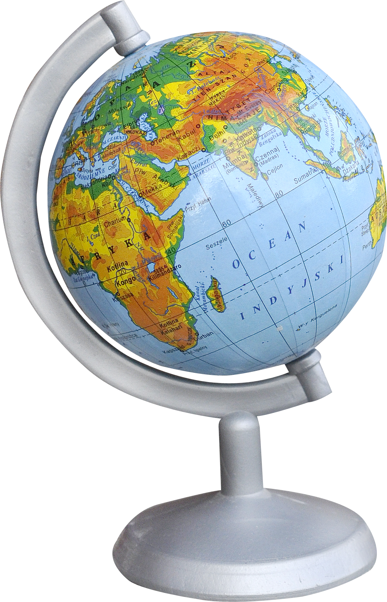
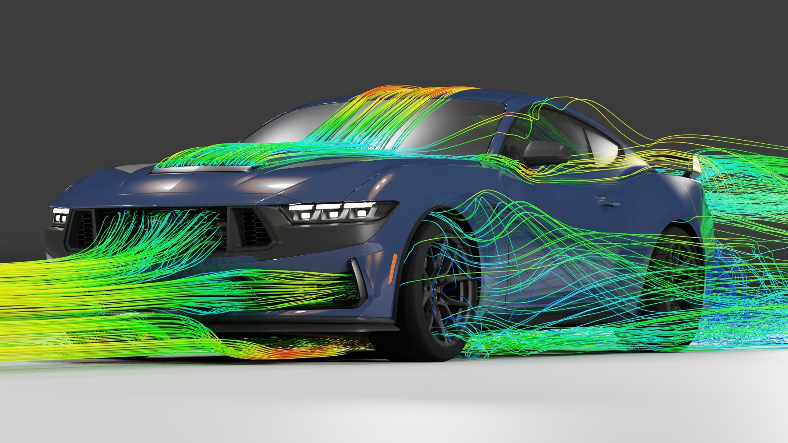
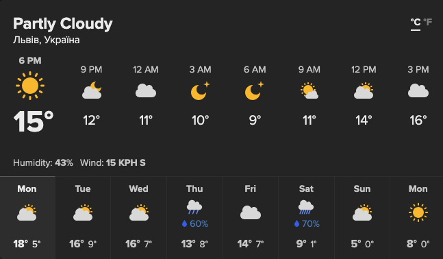
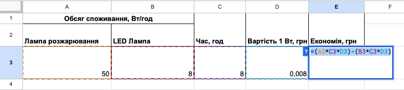

# 🏗️ Моделі та їхні види

## 📖 Урок 50

---

## 🎯 Сьогодні ми дізнаємося

- ℹ️ Що таке **модель** та які вони бувають
- 🛠️ Що таке процес **моделювання**
- 🎨 Побудуємо власну **компʼютерну модель**

---

## ❓ Що таке модель?

<section class="definition">

📝 **Модель** - спрощене подання предмета, істоти, явища чи процесу.

</section>

📌 Слово *модель* походить від латинського *modulus* й означає **копію або образ**.

---

## 🌍 Приклади моделей

  

🗺️ **Модель Землі**

  

  

🚗 **Аеродинамічна модель авто**

  

  

🌦️ **Модель прогнозу погоди**

  

---

## 🏷️ Види моделей

- 🏗️ **Матеріальна модель** - модель обʼєкта, подана у вигляді його предметної копії.
- 📝 **Інформаційна модель** - модель обʼєкта (чи явища), подана у вигляді його опису.
- 💻 **Компʼютерна модель** - це інформаційна модель, реалізована за допомогою компʼютера.

---

## Моделювання

<section class="definition">

📝 **Моделювання** - це процес дослідження властивостей обʼєкту на основі відповідної моделі.

</section>

---

## 🏆 Завдання на уроці

<section style="font-size: 20px">

💡 **Лампа розжарювання** споживає **50 Вт/год**.
💡 **LED лампа**, що світить так само, споживає **8 Вт/год**.

📊 **Побудуй та реалізуй** за допомогою табличного процесора **модель**, що дозволить визначити **економію** від заміни лампи розжарювання на LED-лампу.

### 📌 Вхідні дані:

- Встановіть час горіння: **8 год, 20 год, 100 год**.
- Як змінюється економія? 🤔 Чому?

</section>

