# Змінювання значень властивостей об’єкта в програмі

## 🏫 Урок **53**

---

## 🎯 Сьогодні ми дізнаємося

- ℹ️ Що таке **змінні** та як вони працюють у Scratch.
- 🔧 Як змінні керують **властивостями** спрайта.
- ✏️ Як створити мінігру та використати **рахунок** і **швидкість**.

---

## 🔁 Пригадаємо

  

  

**Спрайт** – персонаж або об’єкт на сцені Scratch.

  

  

**Властивості спрайта** – координати (x, y), розмір, напрям, образ, ефекти.

  

  

  

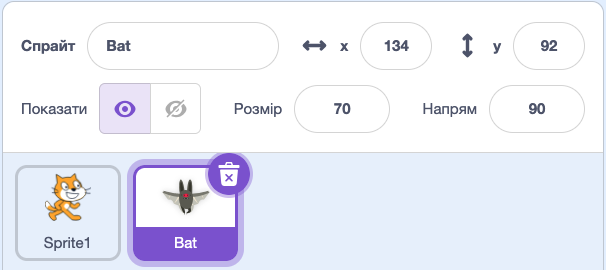

  

---

## 💡 Нова ідея: змінні

**Змінна** – це іменоване місце для збереження значення, яке може
змінюватися під час виконання програми.

Приклади змінних у грі:

- 🧮 `рахунок`
- 🏃 `швидкість`
- ❤️ `життя`
- ⏱️ `час`

---

## 🧰 Як створити змінну у Scratch

<section class="grid-container">

1. Відкрийте вкладку **Змінні**.
2. Натисніть **Створити змінну**.
3. Дайте ім’я, наприклад `швидкість`.
4. Оберіть: **для всіх спрайтів**.
5. Натисніть **Гаразд**

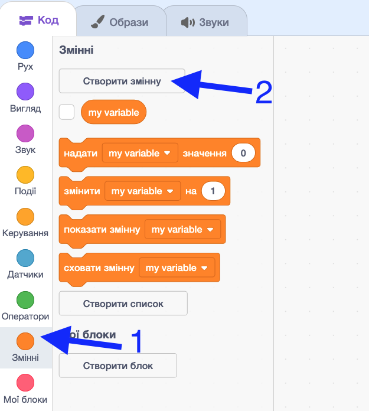

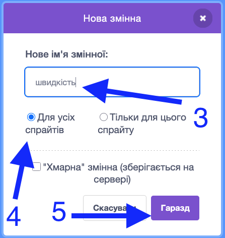

</section>

---

## 🧱 Основні блоки змінних

<section class="grid-container">

`надати [змінна] значення` – задаємо початкове значення змінної.

`змінити [змінна] на` – збільшуємо або зменшуємо значення змінної.

`показати/сховати змінну` – показати значення змінної на екрані (зручно для налагодження).

<!-- TODO: Screenshot: блоки змінних -->
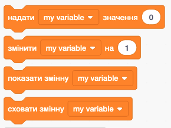

</section>

---

## 🧭 Як змінна керує властивістю

<section class="grid-container">

**Ідея:** ми підставляємо змінну в блок зміни властивості.

Приклад:

- **Надати `розмір` значення `70`** - Встановлюємо значення змінної.
- **Показати змінну `розмір`** - показати значення змінної `розмір` на екрані.
- **Оповістити `зміна розміру`** - відправляємо повідомлення іншим спрайтам, що значення змінної змінилося.
- **Задати розмір `розмір`** - використовуємо значення змінної `розмір`, щоб задати розмір спрайта.

<!-- TODO: Screenshot: приклад блоку з підставленою змінною -->
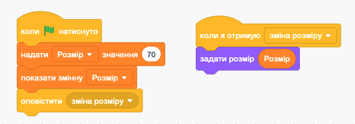

</section>

---

## ⚠ Важливо запам’ятати

<section class="important-to-remember">

- Змінним потрібно задати початкове значення на старті програми (**ініціалізувати**).
- Для налагодження скрипта зручно **показувати змінні** на сцені.

</section>

---

<section class="task text-small">

## 🖱️ Практичне завдання: мінігра “Збирач зірок”

Мета: навчитися керувати властивостями спрайта через змінні та
побудувати просту гру з рахунком.

</section>

---

## ✅ Очікуваний результат

- Ракета рухається стрілками зі **швидкістю**, яку задає змінна.
- Зірка з'являється у випадковому місці.
- Під час торкання зірки **рахунок** збільшується.

---

## 🧩 Крок 0: підготовка проєкту

1. Відкрийте новий проєкт Scratch.
2. Видаліть спрайт **Кіт** (Sprite1 / Cat).
3. Додайте спрайт **Ракета** (Rocketship) як гравця.
4. Додайте спрайт **Зірка** (Star) для збору.
5. Встановіть розмір спрайту **Ракета** 70 за допомогою панелі властивостей.
6. Змініть тло на **Космос** (Space) або **Зоряне небо** (Stars).

---

## 🧩 Очікуваний результат виконання кроку 0

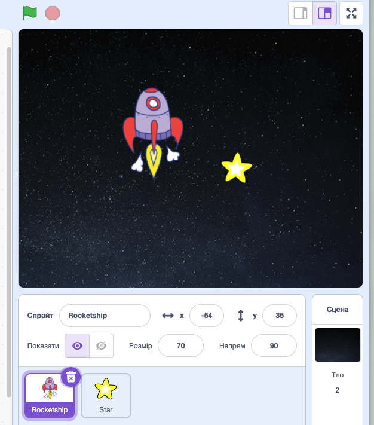

---

## 🧩 Крок 1: створюємо змінні

- `швидкість`
- `рахунок`
- `розмір`

На старті для спрайту **Ракета** (коли натиснуто зелений прапорець) задаємо наступні значення для цих змінних:

- `швидкість = 6`
- `рахунок = 0`
- `розмір = 70`

---

## 🧩 Очікуваний результат виконання кроку 1

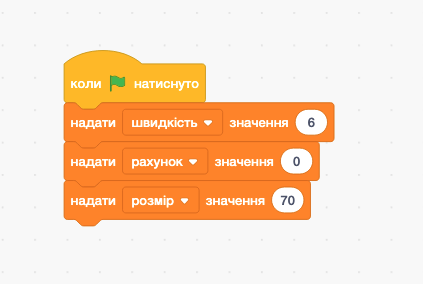

---

## 🧩 Крок 2: керування гравцем

Для спрайта **Гравець** створіть керування стрілками:

- коли натиснуто **→**, `змінити x на (швидкість)`
- коли натиснуто **←**, `змінити x на (0 - швидкість)`
- коли натиснуто **↑**, `змінити y на (швидкість)`
- коли натиснуто **↓**, `змінити y на (0 - швидкість)`

*`0 - швидкість`* можна порахувати за допомогою відповідного блоку на вкладці **Оператори**

---

## 🧩 Очікуваний результат виконання кроку 2

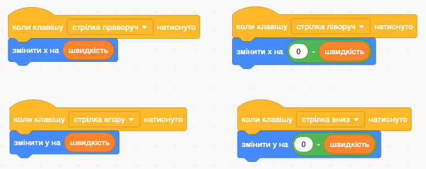

---

## 🧩 Крок 3: програмуємо зірку

<section class="text-medium">

Клікніть на спрайт **Зірка**, щоб програмувати саме її.

**3.1. Початкове розміщення зірки**

1. Додайте блок `коли натиснуто зелений прапорець`
2. Додайте блок `перейти в x: ... y: ...` (вкладка **Рух**)
3. У поля `x` і `y` вставте блок `випадкове число від ... до ...` (вкладка **Оператори**)
4. Для `x` встановіть від **-220** до **220**
5. Для `y` встановіть від **-160** до **160**
6. Після цього додайте блок `показати` (вкладка **Вигляд**)

</section>

---

## 🧩 Очікуваний результат виконання кроку 3.1

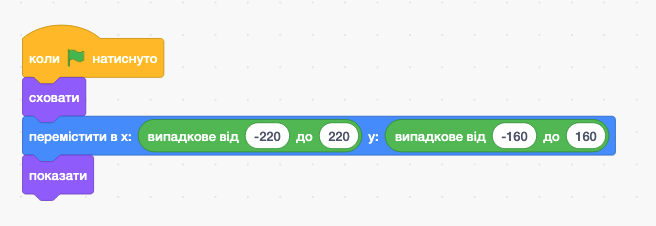

---

## 🧩 Крок 3.2: перевірка торкання

Під попередніми блоками додайте:

1. Блок `завжди` (вкладка **Керування**)
2. Всередину циклу додайте блок `якщо ... то` (вкладка **Керування**)
3. У умову вставте блок `торкається Rocketship?` (вкладка **Датчики**)

---

## 🧩 Очікуваний результат виконання кроку 3.2

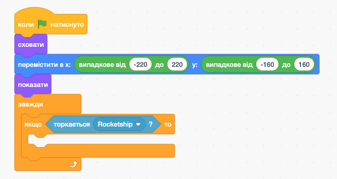

---

## 🧩 Крок 3.3: що робити при торканні

Всередину блоку `якщо ... то` додайте:

1. `змінити рахунок на 1` (вкладка **Змінні**)
2. `перейти в x: (випадкове число від -220 до 220) y: (випадкове число від -160 до 160)` (так само, як у кроці 3.1)
3. `наступний образ`

---

## 🧩 Очікуваний результат виконання кроку 3

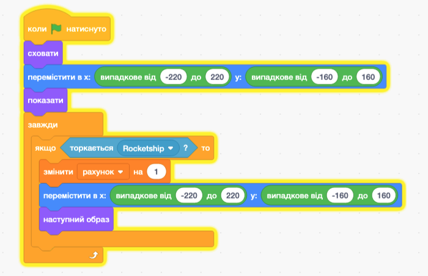

---

## ✅ Перевірка результату

Поставте собі питання:

- Чи змінюється `рахунок`?
- Чи впливає `швидкість` на рух?

---

## 🤔 Рефлексія

- Що таке змінна своїми словами?
- Де у вашій грі змінна **керує властивістю** спрайта?
- Яке значення ви б змінили, щоб ускладнити гру?

---

## 🏠 Домашнє завдання

Опрацювати **с. 213–217** з підручника.

---

## 🌐 Де потренуватися

- https://scratch.mit.edu
- Знайдіть приклади ігор, де змінюються властивості спрайтів.
