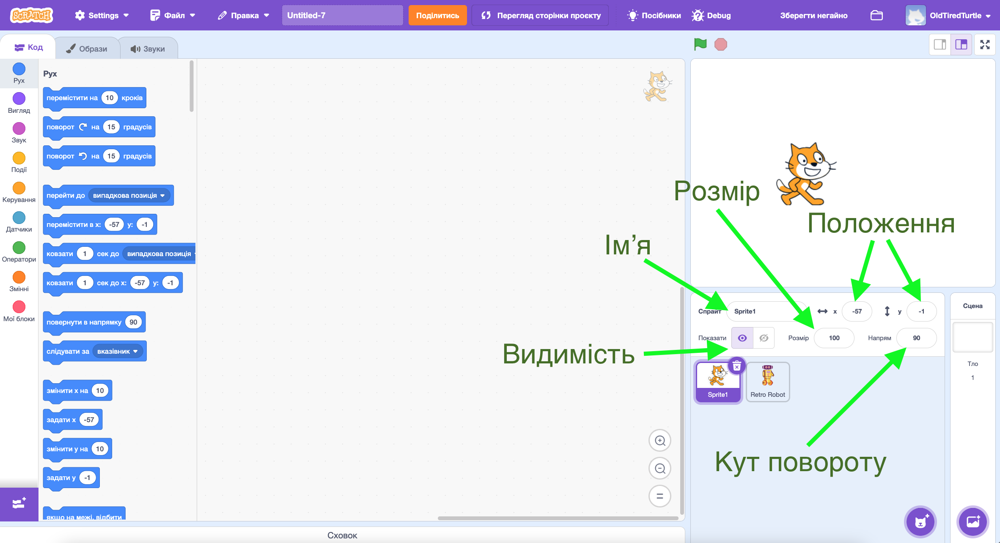
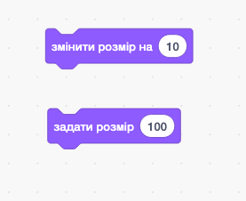
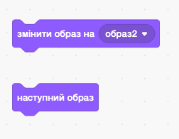
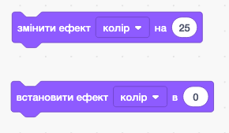
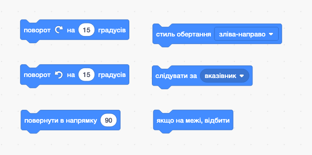
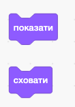
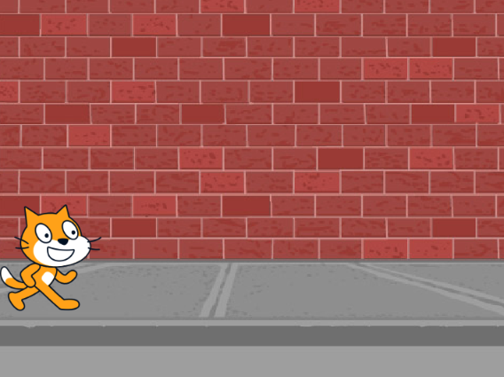

# Поняття об'єкта у програмуванні

## Властивості об'єкта (на прикладі Scratch)

### Урок 53

---

## 🎯 Мета уроку

- Зрозуміти, що таке **об'єкт** у програмуванні.
- Дізнатися, які **властивості** має об'єкт.
- Попрактикуватися у Scratch, змінюючи властивості об'єктів.

---

## ❓ Що таке об'єкт?

- Об'єкт — це щось, з чим працює програма.
- У **Scratch** це — **спрайт** (персонаж, предмет) або **фон**.

🟡 Уяви, що об'єкт — це котик. У нього є: ім’я, колір, розмір, положення.

---

## 🧩 Властивості об'єкта в Scratch

Об'єкти (спрайти) можуть мати:

- 🏷️ Ім’я
- 📏 Розмір
- 📍 Положення (координати X, Y)
- 👕 Образ
- 🎨 Колір
- ↩️ Кут повороту
- 👁️ Видимість

---

## Властивості спрайту в Scratch

---

## Блоки для керування розміром

---

## Блоки для керування положенням

---

## Блоки для керування образом

---

## Блоки для керування кольором

---

## Блоки для керування кутом повороту

---

## Блоки для керування видимістю

---

## 🖥️ Демонстрація в Scratch

🔹 Додаємо спрайт
🔹 Переглядаємо його властивості
🔹 Змінюємо положення, розмір, образ
🔹 Керуємо за допомогою блоків

---

## ✏️ Практичне завдання 1

🎯 **Створи анімацію в Scratch**

    

- Використай стандартний спрайт *Кіт*
  - Встанови початковий розмір `100`
  - Встанови початкове положення `x = -190`, `y = -65`
  - Встанови початковий напрям `90`
- Використай фон `Wall 1`
- Створи програму для кота, що буде працювати наступним чином, `коли натиснуто зеленений прапорець`
  - Встанови `Стиль обертання зліва-направо`
  - Використай блок `Завжди` для виконання наступних команд
    - `Перемістити на 10 кроків`
    - `Якщо на межі відбити`
    - `Наступний образ`
    - `Змінити ефект колір на 5`
    - `Чекати 0.1 секунд`

    

    

    

---

## 📋 Підсумок уроку

✅ Що таке об'єкт у програмуванні?
✅ Які властивості мають об'єкти?
✅ Що нового ти сьогодні навчився у Scratch?
