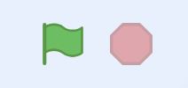
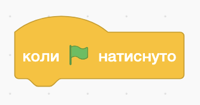
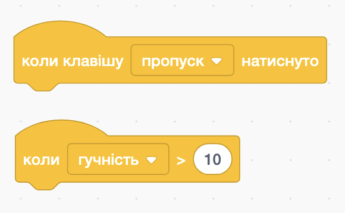
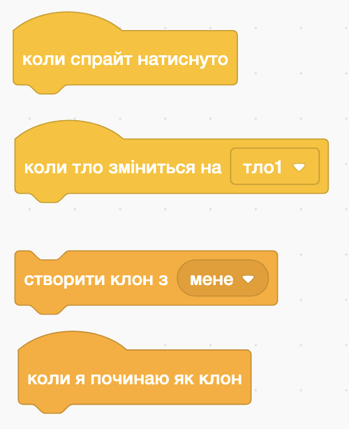
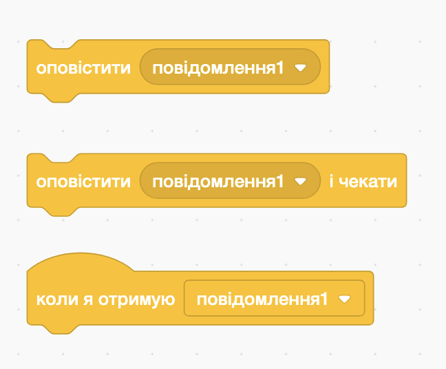

# 🎬 Події в Scratch
## та як на них реагувати

---

## 🎯 Сьогодні ми дізнаємось:

- 📌 Що таке подія
- 🧱 Які є типи подій у Scratch
- 🛠 Як об'єкти реагують на події

---

## ❓ Що таке подія?

Подія — це щось, що запускає дію.

🔔 **Аналогія з життя:**
Дзвонить будильник — це **подія**.
Ти прокидаєшся — це **реакція**.

🧩 У Scratch, наприклад:
Коли натискають зелений прапорець — об’єкт починає рухатись або говорити.

---

## 🧱 Які є типи подій у Scratch?

1. ⚙️ Події середовища (натискання кнопок)
2. ⌨️ Події пристроїв (клавіатура, мікрофон)
3. 🧍 Події об’єктів (спрайтів)
4. 💬 Події комунікації між об’єктами

---

## ⚙️ Події середовища Scratch

  

Такі події запускаються, коли користувач натискає:

- 🟢 **Зелений прапорець**
- 🟥 **Стоп**

📦 Блок: `Коли натиснуто зелений прапорець`

  

  

  

---

## ⌨️ Події пристроїв

  

Виникають при натисканні клавіш або зміні гучності.

📦 Блоки:

- `Коли клавішу ___ натиснуто`
- `Коли гучність > ___`

  

  

  

---

## 🧍 Події, пов’язані з об’єктами

  

Виникають при взаємодії з об’єктом або при створенні клону.

📦 Блоки:

- `Коли спрайт натиснуто`
- `Коли тло зміниться на ___`
- `Коли я починаю як клон`

  

  

  

---

## 💬 Події комунікації між об’єктами

  

Об’єкти можуть надсилати та отримувати повідомлення.

📦 Блоки:

- `надіслати ___`
- `Коли я отримую ___`

  

  

  

---

## 🧠 Запам’ятай!

🔹 Події — це сигнали, на які спрайти можуть реагувати
🔹 Scratch має різні типи подій: від натискань до повідомлень
🔹 Об’єкти можуть "спілкуватися" між собою через події

🎉 Тепер ти знаєш, як оживити свої проєкти у Scratch!

---

## Практичне завдання

- 🟢 Коли натискаєш зелений прапорець — герой говорить «Привіт!» протягом двох секунд
- ⌨️ Коли натиснути клавішу `стрілка вправо` — герой переміщується праворуч на 10 кроків.
- ⌨️ Коли натиснути клавішу `стрілка вліво` — герой переміщується ліворуч на 10 кроків.
- 🖱 Коли натиснути на героя мишкою — він змінює колір.
- \* Додай ще одного героя, який буде відповідати "Привіт", коли перший герой говорить "Привіт"
