# Вкладені структури розгалуження в Scratch

## 🏫 Урок **54**

---

## 🎯 Сьогодні ми дізнаємося

- ℹ️ Що таке **вкладена** структура розгалуження.
- 🔧 Як розмістити один блок `якщо` **всередині** іншого у Scratch.
- ✏️ Як реалізувати програму, яка перевіряє **кілька умов** послідовно.

---

## 🔁 Пригадаємо: структури розгалуження

<div class="grid-container">
<div class="grid-item text-left text-small">

<div class="card">

**`якщо ... то`** — виконує дії лише тоді, коли умова **істинна**.

</div>

<div class="card">

**`якщо ... то ... інакше`** — виконує одні дії, якщо умова **істинна**, і інші — якщо **хибна**.

</div>

<div class="card">

Обидва блоки знаходяться на вкладці **Керування** 🟡

</div>

</div>
<div class="grid-item image-center">

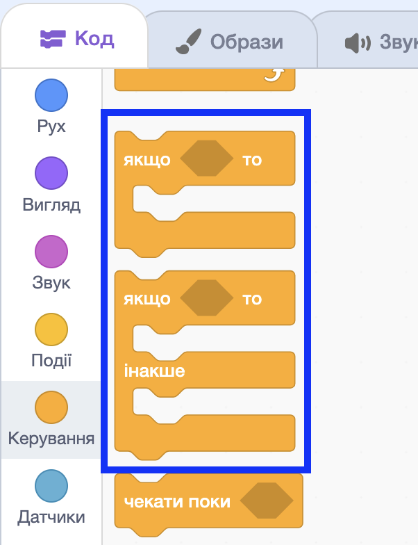
<!-- СКРІНШОТ: вкладка "Керування" у Scratch із виділеними блоками "якщо...то" та "якщо...то...інакше" -->

</div>
</div>

---

## 🤔 Задача: де знаходиться кіт?

<div class="grid-container">
<div class="grid-item text-left text-medium-small">

Кіт може бути в будь-якому місці сцени.

Як дізнатися, чи він у **правому верхньому** куті?

- Крок 1: перевірити `x > 0` (права половина)
- Крок 2: **лише якщо так** — перевірити `y > 0` (верхня половина)

Одна умова **не вистачає** — потрібна перевірка всередині перевірки!

</div>
<div class="grid-item image-center">

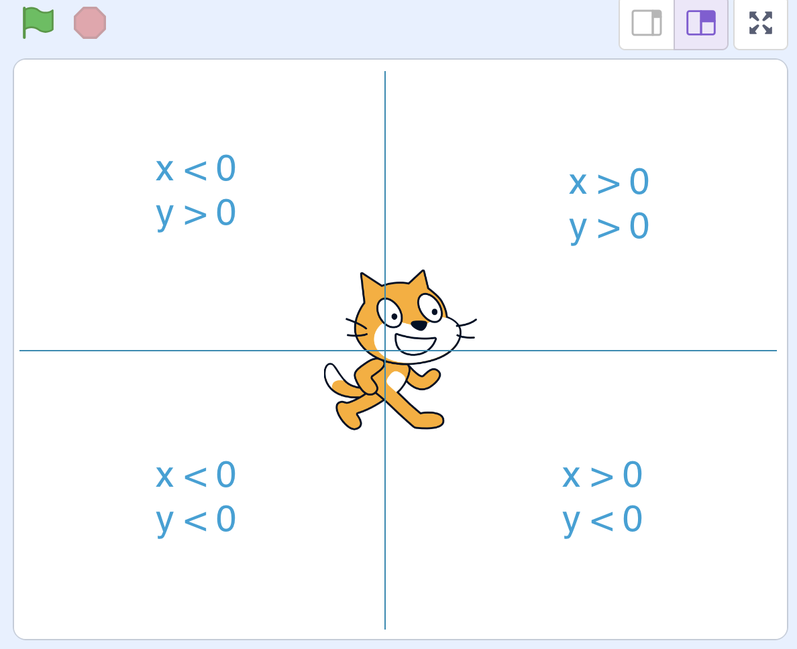
<!-- СКРІНШОТ або малюнок: сцена Scratch, розділена на 4 квадранти з підписами координат (x>0, x<0, y>0, y<0) -->

</div>
</div>

---

## 💡 Вкладена структура розгалуження

<div class="important-to-remember card text-small">

**Вкладена структура розгалуження** — це умовний блок, розміщений **усередині** іншого умовного блоку.

Внутрішній блок виконується лише тоді, коли **зовнішня умова виявилась істинною**.

</div>

Аналогія з життя:

> *«Якщо надворі дощ → якщо є парасоля: іду гуляти; інакше: залишаюся вдома»*

---

## 🧱 Як виглядає вкладення у Scratch

<div class="grid-container">
<div class="grid-item text-left text-medium-small">

1. Взяти зовнішній блок **`якщо...то...інакше`**
2. Всередину гілки **«якщо»** вставити ще один **`якщо...то...інакше`**
3. Всередину гілки **«інакше»** вставити ще один **`якщо...то...інакше`**
4. У кожну кінцеву гілку додати потрібну дію

</div>
<div class="grid-item image-center">

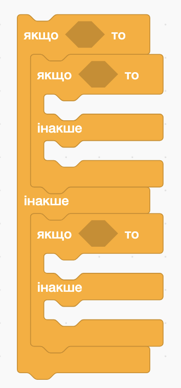
<!-- СКРІНШОТ: загальний вигляд вкладеної структури у Scratch — зовнішній "якщо...то...інакше" з двома внутрішніми "якщо...то...інакше" всередині кожної гілки (без тексту умов, тільки структура) -->

</div>
</div>

---

## 🗺️ Алгоритм детектора позиції

```
якщо (x позиція > 0):
    якщо (y позиція > 0):
        кажи "Правий верхній кут 🟢"
    інакше:
        кажи "Правий нижній кут 🔵"
інакше:
    якщо (y позиція > 0):
        кажи "Лівий верхній кут 🟡"
    інакше:
        кажи "Лівий нижній кут 🔴"
```

---

## ✅ Вкладена структура у Scratch

<div class="image-center">

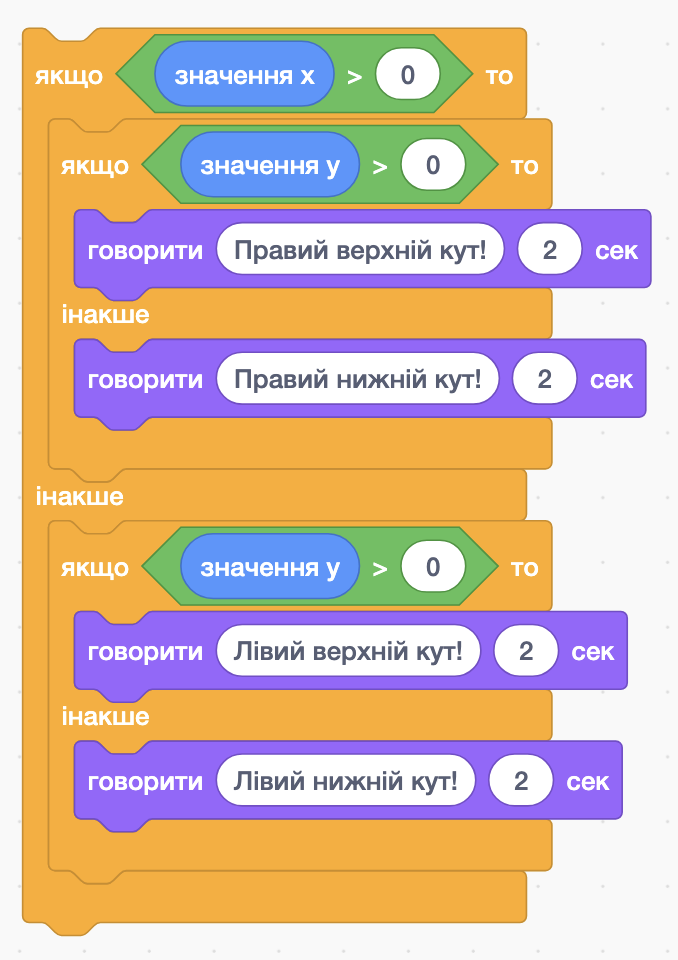
<!-- СКРІНШОТ: повна вкладена структура у Scratch для детектора позиції — зовнішня умова "x позиція > 0", всередині дві внутрішні умови з "y позиція > 0" та блоками "казати" у кожній гілці -->

</div>

---

## ⚠️ Типові помилки

<div class="grid-container">
<div class="grid-item text-left text-small">

❌ **Неправильно:** внутрішній блок стоїть **поруч** із зовнішнім

Обидва блоки виконуються незалежно — вкладення не відбувається!

✅ **Правильно:** внутрішній блок знаходиться **всередині** зовнішнього

</div>
<div class="grid-item image-center">

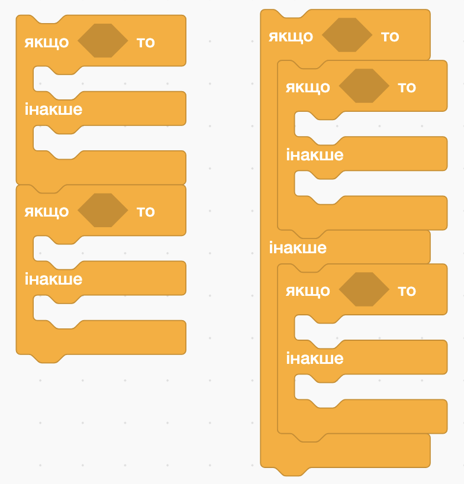
<!-- СКРІНШОТ: два варіанти поруч — ліворуч два окремих блоки "якщо" (неправильно), праворуч один блок всередині іншого (правильно) -->

</div>
</div>

---

<section class="task text-small">

## 🖱️ Практичне завдання: «Детектор позиції»

**Мета:** побудувати програму, де кіт рухається за курсором миші по екрану, а коли користувач натискає клавішу **"пропуск"** кіт каже, у якому куті сцени він знаходиться.

**Очікуваний результат:**

- 🐱 Кіт рухається за вказівником миші.
- 🖱️ При натисканні **ПРОПУСК** — він каже назву свого кута сцени.

</section>

---

## 🧩 Крок 1: підготовка

<div class="grid-container">
<div class="grid-item text-left text-medium-small">

1. Відкрийте **новий проєкт** Scratch.
2. Залиште спрайт **Кіт** (Cat) або оберіть будь-який інший.
3. За бажанням встановіть кольорове тло (наприклад, **Colorful City**).

</div>
<div class="grid-item image-center">

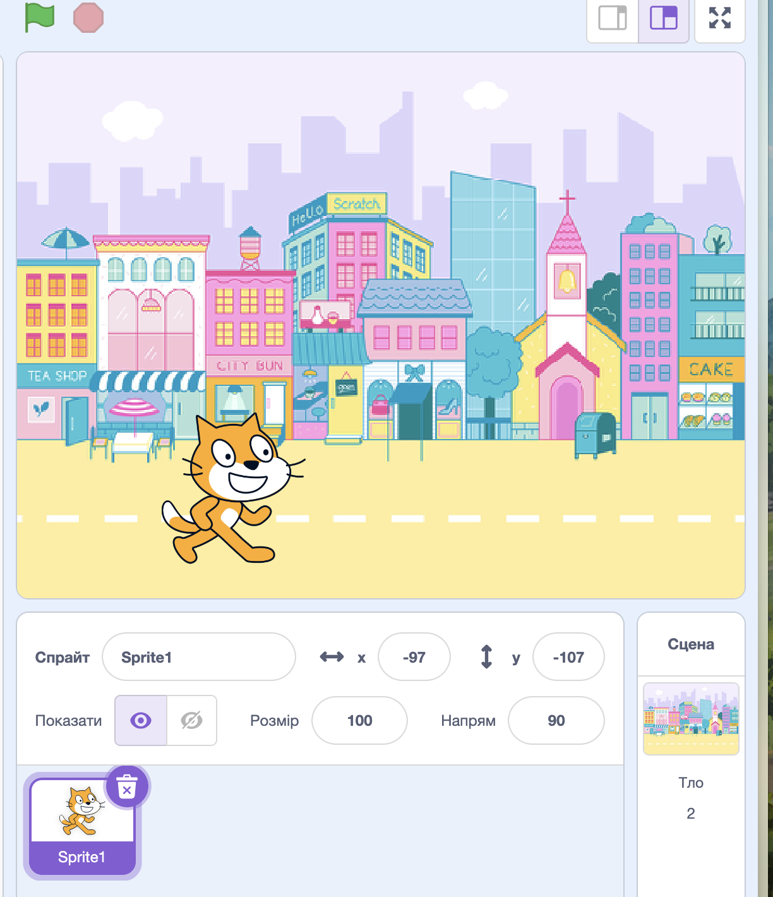
<!-- СКРІНШОТ: початковий вигляд сцени Scratch із котом і обраним тлом -->

</div>
</div>

---

## 🧩 Крок 2: кіт слідує за мишею

<div class="grid-container">
<div class="grid-item text-left text-medium-small">

Додайте скрипт для **постійного руху** кота за вказівником:

1. Блок `коли натиснуто зелений прапорець`
2. Цикл `завжди` (вкладка **Керування**)
3. Усередині циклу: `перейти до [вказівник миші ▼]` (вкладка **Рух**)

</div>
<div class="grid-item image-center">

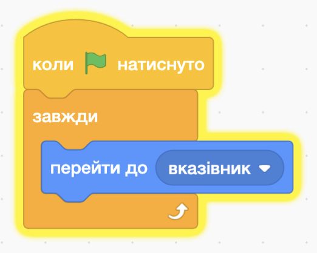
<!-- СКРІНШОТ: скрипт у Scratch — "коли натиснуто зелений прапорець" → "завжди" → "перейти до [вказівник миші]" -->

</div>
</div>

---

## 🧩 Крок 3: перевірка кута при натисканні клавіші

<div class="grid-container">
<div class="grid-item text-left text-medium-small">

Додайте **окремий скрипт** (не всередину циклу!):

1. Блок `коли клавішу **пропуск** натиснуто` (вкладка **Події**)
2. Зовнішній блок `якщо...то...інакше`, умова: **`значення x > 0`** (вкладка **Оператори** та вкладка **Рух**)

</div>
<div class="grid-item image-center">

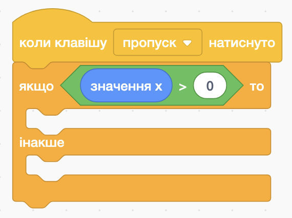
<!-- СКРІНШОТ: початок скрипта — "коли цей спрайт натиснуто" з порожнім зовнішнім "якщо x позиція > 0 то ... інакше ..." -->

</div>
</div>

---

## 🧩 Крок 3.1: гілка «правий бік» (x > 0)

<div class="grid-container">
<div class="grid-item text-left text-medium-small">

Усередину гілки **«якщо»** вставте блок `якщо...то...інакше`, умова: **`y позиція > 0`**:

- Гілка «якщо»: `казати "Правий верхній кут 🟢" 2 секунди`
- Гілка «інакше»: `казати "Правий нижній кут 🔵" 2 секунди`

</div>
<div class="grid-item image-center">

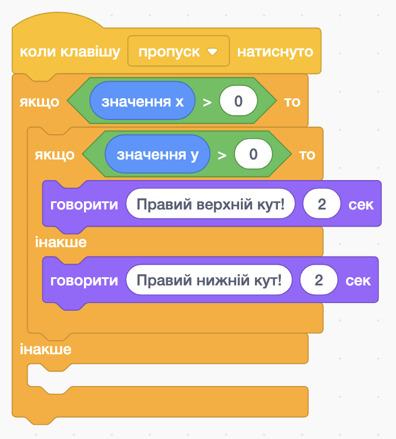
<!-- СКРІНШОТ: гілка "якщо x > 0" із вкладеним "якщо y > 0" та двома блоками "казати" у відповідних гілках -->

</div>
</div>

---

## 🧩 Крок 3.2: гілка «лівий бік» (x ≤ 0)

<div class="grid-container">
<div class="grid-item text-left text-medium-small">

Усередину гілки **«інакше»** вставте ще один блок `якщо...то...інакше`, умова: **`y позиція > 0`**:

- Гілка «якщо»: `казати "Лівий верхній кут 🟡" 2 секунди`
- Гілка «інакше»: `казати "Лівий нижній кут 🔴" 2 секунди`

</div>
<div class="grid-item image-center">

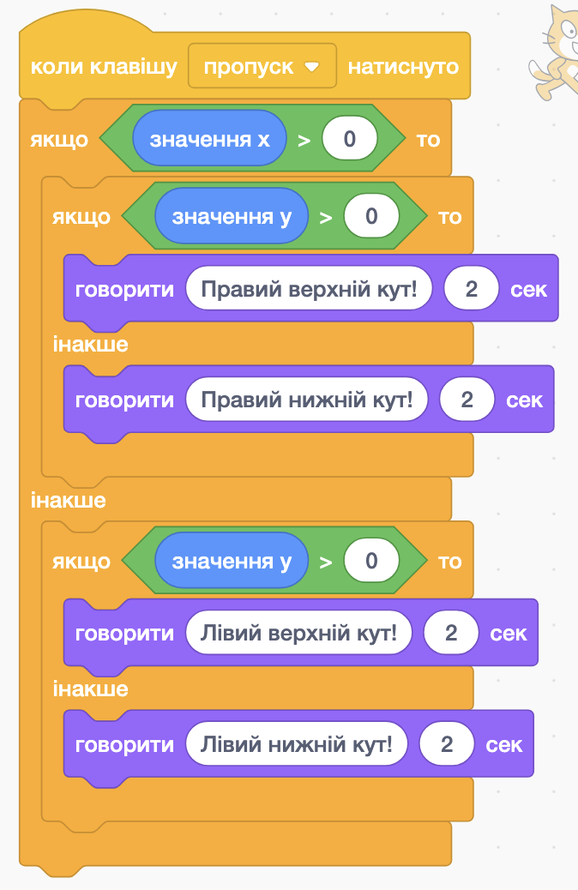
<!-- СКРІНШОТ: гілка "інакше" із вкладеним "якщо y > 0" та двома блоками "казати" у відповідних гілках -->

</div>
</div>

---

## 🧩 Повний скрипт

<div class="image-center">

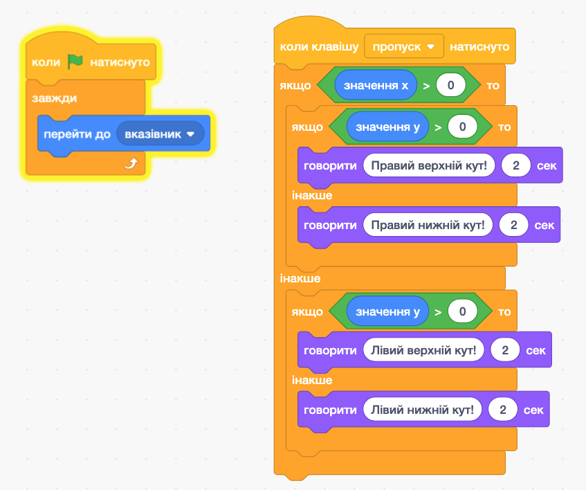
<!-- СКРІНШОТ: повний скрипт детектора позиції — "коли цей спрайт натиснуто" з повністю заповненою вкладеною структурою (усі 4 гілки з блоками "казати") -->

</div>

---

## 🤔 Рефлексія

- Що таке вкладена структура розгалуження **своїми словами**?
- Чому для визначення кута екрану потрібні **дві** умови, а не одна?
- Яку помилку найлегше допустити під час вкладення блоків?

---

## 🏠 Домашнє завдання

Опрацювати **с. 218–224** з підручника.

Придумати **власний приклад** задачі, де потрібна вкладена умова — записати її словами в зошиті (не в Scratch).

---

## 🌐 Де потренуватися

- https://scratch.mit.edu
- Знайдіть проєкти з кількома умовами і спробуйте розібрати їх логіку.
