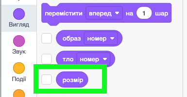

# 😊 Вкладені структури розгалуження: практика

## 🏫 Урок **55**

---

## 🎯 Сьогодні ми

- 🔁 Повторимо вкладені структури розгалуження з минулого уроку.
- 🛠️ Самостійно побудуємо програму **«Настрій спрайта»**.
- 🎨 Поєднаємо вкладені умови зі **зміною кольору** спрайта.

---

## 🔁 Пригадаємо: вкладена структура

**Вкладена структура розгалуження** — це умовний блок, розміщений **усередині** іншого умовного блоку.

Внутрішній блок перевіряється **лише тоді**, коли зовнішня умова виявилась **істинною**.

> *«Якщо надворі дощ → якщо є парасоля: іду гуляти; інакше: залишаюся вдома»*

---

## ❓ Бліц-опитування

1. Що таке вкладена структура розгалуження?

2. У якому випадку виконується **внутрішній** блок умови?

3. Яку задачу ми вирішували на минулому уроці?

4. Яку **помилку** найлегше допустити при вкладенні?

---

## 💡 Новий блок: `розмір`

Блок **`розмір`** (вкладка **Вигляд**) повертає поточний розмір спрайта у відсотках.

- `100` = стандартний розмір
- `200` = вдвічі більший
- `50` = вдвічі менший

Його можна використовувати **в умові**: `якщо (розмір > 100) то...`

<!-- СКРІНШОТ: вкладка "Вигляд" у Scratch із виділеним блоком "розмір" та прикладом умови "якщо розмір > 100" -->

---

<section class="task text-small">

## 🖱️ Практичне завдання: «Настрій спрайта»

**Мета:** клавіші `↑`/`↓` змінюють розмір спрайта. При натисканні **ПРОПУСК** вкладена умова визначає «настрій» та положення спрайта і виводить одне з 4 повідомлень.

**Рівні складності:**

- 🟡 **Середній** — керування розміром + вкладена перевірка з 4 повідомленнями
- 🟠 **Достатній** — + зміна кольору для кожного варіанта + скидання при старті
- 🔴 **Високий** — + звук / межі розміру / третій рівень вкладеності

</section>

---

## 🧩 Крок 1: керування розміром

Два окремих скрипти:

- `коли клавішу [стрілка вгору] натиснуто`
  → `змінити розмір на (10)`

- `коли клавішу [стрілка вниз] натиснуто`
  → `змінити розмір на (-10)`

Перевір: натисни `↑` і `↓` — спрайт росте і зменшується.

---

## 🧩 Крок 2: зовнішня умова — розмір

Окремий скрипт:

1. `коли клавішу [пропуск] натиснуто`
2. Зовнішній `якщо...то...інакше`
3. Умова: **`розмір > 100`**

   - Гілка «якщо» → спрайт **великий**
   - Гілка «інакше» → спрайт **маленький**

---

## 🗺️ Логіка настрою: де «радісно», де «сумно»?

Ми домовляємось:

- **Правий бік сцени** (значення x > 0) → сонячна сторона → **радісний 😊**
- **Лівий бік сцени** (значення x ≤ 0) → похмура сторона → **сумний 😢**

Можеш придумати **власну логіку** — головне, щоб кожна гілка казала щось різне!

---

## 🧩 Крок 3.1: гілка «великий» (розмір > 100)

Усередину гілки «якщо» вставте `якщо...то...інакше`, умова: **`значення x > 0`**:

- «якщо»: `казати "Я великий і радісний! 😊" 2 секунди`
- «інакше»: `казати "Я великий і сумний... 😢" 2 секунди`

---

## 🧩 Крок 3.2: гілка «маленький» (розмір ≤ 100)

Усередину гілки «інакше» вставте ще один `якщо...то...інакше`, умова: **`значення x > 0`**:

- «якщо»: `казати "Я маленький і радісний! 😊" 2 секунди`
- «інакше»: `казати "Я маленький і сумний... 😢" 2 секунди`

---

## 🎨 Достатній рівень: зміна кольору

Перед кожним `казати` додай:
`встановити ефект [колір] у значення [...]`

| Повідомлення | Ефект кольору |
|---|---|
| «Я великий і радісний! 😊» | `0` (оригінал) |
| «Я великий і сумний... 😢» | `30` (теплий) |
| «Я маленький і радісний! 😊» | `160` (зелений) |
| «Я маленький і сумний... 😢» | `200` (синій) |

І окремий скрипт: `коли натиснуто зелений прапорець` → `скасувати графічні ефекти` + `встановити розмір 100`

---

## 🚀 Високий рівень: творчі ідеї

Обери **хоча б дві** ідеї:

🔊 **Звук** — `відтворити звук [...]` для радісного/сумного варіанта

📏 **Межі розміру** — додай умову в скрипти `↑`/`↓`, щоб розмір не виходив за 50–200%

🖱️ **Порівняння з мишею** — замінити `значення x > 0` на `значення x > (мишка x)`

🔽 **3-й рівень вкладеності** — при великому + правому ще перевірити `значення y > 0` і щось сказати.

---

## 🔍 Типові помилки

❌ Внутрішній блок стоїть **поруч** із зовнішнім — вкладення не відбувається!

❌ В умові написано число `100` вручну замість блоку **`розмір`** з вкладки Вигляд.

❌ Внутрішня умова є лише в **одній** гілці — в іншій забули повторити перевірку `значення x > 0`.

✅ Перевір усі 4 варіанти: великий+правий, великий+лівий, маленький+правий, маленький+лівий!

---

## 🤔 Рефлексія

- Чим задача «Настрій спрайта» схожа на «Детектор позиції» з минулого уроку? Чим відрізняється?
- Яка умова є **зовнішньою**, а яка — **внутрішньою**? Чому саме так?
- Що відбудеться, якщо поміняти зовнішню і внутрішню умови місцями?
