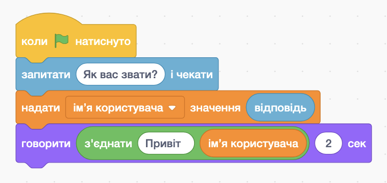
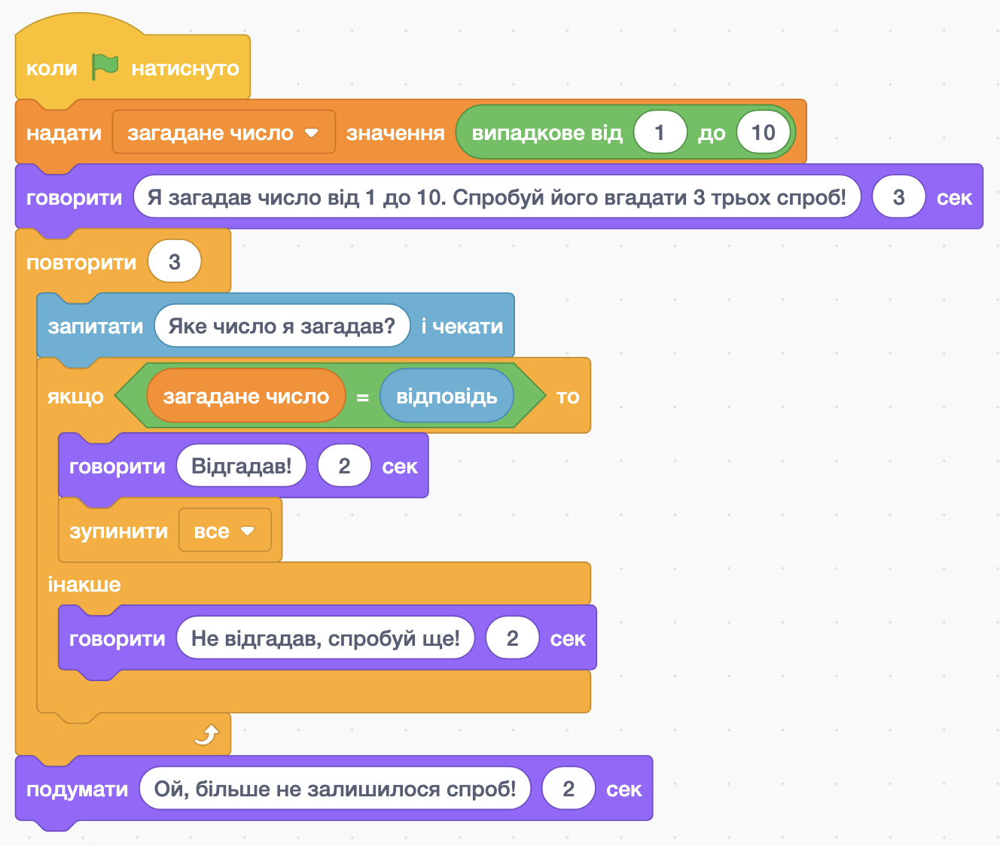

# Змінні в середовищі Scratch

## Урок 55

---

## 🎯 Сьогодні ми дізнаємося

- ℹ️ Що таке змінні в Scratch.
- 🔧 Для чого використовуються змінні.
- ✏️ Спробуємо змінні в Scratch на практиці.

---

## Змінна

Змінну можна уявити я будинок з адресою, в який можна "заселити" конкретне значення (наприклад число, чи рядок).
Потім значення змінної можна використовувати та змінювати за потреби використовуючи назву змінної ("адресу").

---

## Приклад 1: Скажи привіт

  

Програма ліворуч виконує наступні дії:

- Запитує користувача його імʼя та зберігає його відповідь у автоматично створеній змінній, що має імʼя `відповідь`
- Записує відповідь користувача у змінну, що має назву `імʼя користувача`
- Викоистовує змінну `імʼя користувача`, щоб привітати користувача персоналізованим привітанням

Спробуй відтворити програму у Scratch.

  

  

  

---

## Приклад 2: Вгадай число

  

Програма ліворуч виконує наступні дії:

1. Обирає випадкове число від 1 до 10 і записує його у змінну `загадане число`
2. Розказує користувачу правила гри.
3. 3 рази просить користувача відгадати число, та порівнює його відповідь з загаданим числом.
4. Якщо число, яке ввів коистувач співпадає з загаданим, то гра вітає користувача, та зупиняє все виконання.
5. Якщо користувач не вгадав число з трьох спроб, гра повідомляє йому, що спроб більше не залишилося і зупиняється.

  

  

  

---

## Завдання

  

Зміни програму, що вітає копистувача (див. малюнок праворуч), щоб вона також запитувала в якому класі він/вона вчиться.

Для цього, зміни фразу привітання, щоб воно виглядало так `Привіт, <імʼя, що ввів користувач> з <клас, що ввів користувач> класу. Приємно познайомитись.`

Тобто, якщо користувач ввів імʼя `Юра`, і клас `7`, то привітання має виглядати так: `Привіт, Юра з 7 класу. Приємно познайомитись!`

  

  

  

