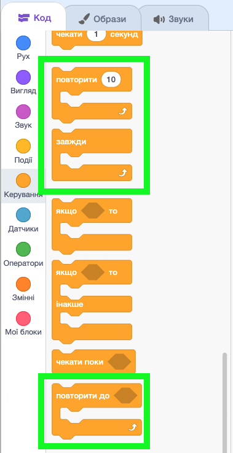
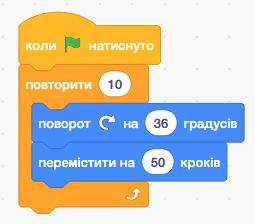
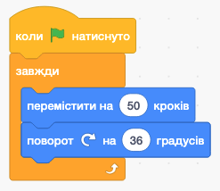
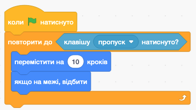

# 🔁 Структури повторення у Scratch

## 🏫 Урок **56**

---

## 🎯 Сьогодні ми

- 🔁 Пригадаємо три блоки повторення у Scratch.
- 🧠 Зрозуміємо, коли використовувати кожен з них.
- 🛠️ Побудуємо програму **«Казковий танець»** у Scratch.

---

## ❓ Бліц-опитування

1. Що таке цикл у програмуванні?

2. Які три блоки повторення є у Scratch?

3. Коли використовуємо «повторити N разів»?

4. Що буде, якщо запустити «повторювати завжди» і не зупинити?

5. Чим «повторювати поки» відрізняється від «повторити N разів»?

---

## 🗂️ Де знайти блоки повторення?

**Категорія «Керування»** — помаранчеві блоки

1. Відкрий Scratch
2. Натисни **«Керування»** у лівому меню
3. Знайди три блоки зі словом **«повторити»** або **«повторювати»**

<!-- 📸 ЗНІМОК ЕКРАНУ: ліве меню Scratch з виділеною категорією «Керування» та видимими трьома блоками повторення -->

---

## 🔢 Блок 1: «Повторити N разів»

**Коли використовувати:**
знаємо **точну кількість** повторень

**Аналогія з життя:**
> *«Зроби 10 присідань»*

Після N повторень — **зупиняється** сам.

<!-- 📸 ЗНІМОК ЕКРАНУ: блок «повторити (10) разів» у Scratch з вкладеними блоками всередині -->

---

## ♾️ Блок 2: «Повторювати завжди»

**Коли використовувати:**
потрібне **нескінченне** повторення

**Аналогія з життя:**
> *«Серце б'ється без зупину»*

Зупинити можна лише кнопкою 🛑

<!-- 📸 ЗНІМОК ЕКРАНУ: блок «повторювати завжди» у Scratch з вкладеними блоками всередині -->

---

## 🛑 Блок 3: «Повторювати поки»

**Коли використовувати:**
знаємо **умову зупинки**, але не кількість

**Аналогія з життя:**
> *«Іди вперед, поки не дійдеш до стіни»*

Зупиняється, коли умова стає **істинною**.

<!-- 📸 ЗНІМОК ЕКРАНУ: блок «повторювати поки не ( )» у Scratch з умовою та вкладеними блоками -->

---

## 📊 Порівняння трьох циклів

| Блок | Кількість повторень | Зупинка |
| --- | --- | --- |
| `повторити (N) разів` | Відома заздалегідь | Після N разів |
| `повторювати завжди` | Нескінченна | Лише кнопкою 🛑 |
| `повторювати поки` | Невідома | Коли умова → ✅ |

---

<section class="task text-small">

## 🖱️ Практична робота: «Казковий танець»

**Підготовка:** відкрити Scratch, обрати спрайт із кількома образами
*(кіт, Ballerina, Avery, Dinosaur1 — будь-який)*
⚠️ Перевір вкладку **«Образи»** — має бути **мінімум 2**, інакше анімації не буде видно!

**Рівні складності:**

- 🟡 **Середній** — анімація 8 разів із «повторити N разів»
- 🟠 **Достатній** — + безперервний рух із «повторювати завжди»
- 🔴 **Високий** — + рух до фінішу з «повторювати поки»

</section>

---

## 🟡 Середній: «повторити N разів»

Скрипт на зелений прапорець:

1. `коли натиснуто зелений прапорець`
2. `повторити (8) разів`
   - `наступний образ`
   - `зачекати (0.3) секунди`
3. `казати "Танець завершено! 💃" 2 секунди`

> 💡 Спрайт зробить рівно 8 кроків анімації і **зупиниться**. Фраза з'явиться лише **після** циклу!

---

## 🟠 Достатній: «повторювати завжди»

Новий скрипт на клавішу **[Пропуск]**:

1. `коли натиснуто клавішу [пропуск]`
2. `повторювати завжди`
   - `перемістити на (10) кроків`
   - `якщо на межі, відбити`
   - `наступний образ`
   - `зачекати (0.1) секунди`

> 💡 Натисни лише **Пропуск** — спрайт танцює **без зупину**. Зупини кнопкою 🛑!
> ⚠️ Не натискай зелений прапорець одночасно — він запускає попередній скрипт і образи змінюватимуться хаотично.

---

## 🔴 Високий: «повторювати поки»

Новий скрипт на клавішу **[G]**:

1. `коли натиснуто клавішу [G]`
2. `перейти в позицію (-200, 0)`
3. `дивитись у напрямку (90)`
4. `повторювати поки не (значення x > 150)`
   - `перемістити на (10) кроків`
   - `наступний образ`
   - `зачекати (0.1) секунди`
5. `казати "Дійшов до фінішу! 🏁" 2 секунди`

> 💡 Спрайт стартує з лівого краю і **сам зупиняється** на правому!

---

## ❌ Типові помилки

❌ «Повторювати завжди» зависло — **натисни 🛑**, це нормально!

❌ У «повторювати поки» вставили умову **продовження**, а не зупинки — умова має бути *коли треба зупинитись*.

❌ «Повторити 0 разів» — цикл **не виконується** жодного разу.

❌ Забули `зачекати` — анімація миттєва, нічого не видно.

✅ Перевіряй кожен скрипт одразу після написання!

---

## 🤔 Рефлексія

- Яка різниця між «повторити N разів» і «повторювати завжди»?
- Коли «повторювати поки» зручніше за «повторити N разів»?
- Наведи свій приклад із реального життя для кожного типу циклу.

---

## 🏠 Домашнє завдання

Опрацювати матеріали підручника **с. 224–228**.
