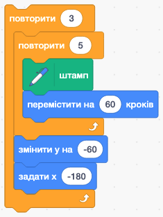
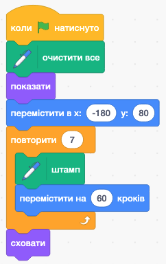
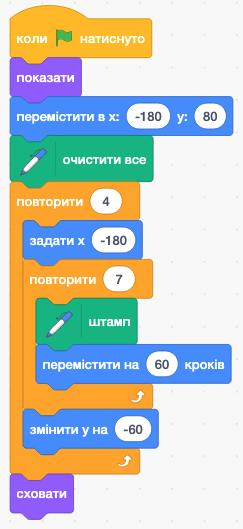
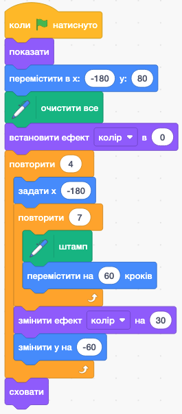

# 🔁🔁 Вкладені структури повторення

## 🏫 Урок **57**

---

## 🎯 Сьогодні ми

- 🧠 Дізнаємося, що таке **вкладений цикл**.
- 🔍 Зрозуміємо, як комп'ютер виконує цикл усередині циклу.
- 🌸 Побудуємо **«Квіткове поле»** у Scratch, використовуючи вкладені цикли.

---

## ⚡ Пам'ятаємо: три цикли у Scratch

| Блок | Коли зупиняється |
| --- | --- |
| `повторити (N) разів` | Після рівно N ітерацій |
| `повторювати завжди` | Лише кнопкою 🛑 |
| `повторювати поки` | Коли умова → ✅ |

> 💡 Сьогодні вкладатимемо «`повторити N разів`» в інший «`повторити N разів`»

---

## 🌍 Вкладені повторення навколо нас

**Годинник:**

⏱️ Хвилинна стрілка робить **60 кроків** — це **внутрішній цикл**.

За кожну годину (зовнішній цикл) внутрішній виконується **повністю**.

**Книжкова полиця:**

📚 На кожній полиці (зовнішній цикл) стоять книжки (внутрішній цикл).

5 полиць × 8 книжок = **40 книжок**

---

## 📖 Що таке вкладений цикл?

**Вкладений цикл** — це цикл, *всередині* якого знаходиться інший цикл.

- **Зовнішній цикл** — визначає кількість «великих кроків» (наприклад, рядків).
- **Внутрішній цикл** — виконується **повністю** на кожному «великому кроці» (наприклад, квітки у рядку).

⚠️ Якщо зовнішній повторює **3 рази**, а внутрішній — **5 разів**, то тіло внутрішнього виконається **3 × 5 = 15 разів**.

---

## 🔢 Як комп'ютер виконує вкладений цикл

**Зовнішній: крок 1**
→ Внутрішній: 5 разів (штамп + рух)
→ Перейти на наступний рядок

**Зовнішній: крок 2**
→ Внутрішній: 5 разів (штамп + рух)
→ Перейти на наступний рядок

**Зовнішній: крок 3**
→ Внутрішній: 5 разів (штамп + рух)
→ Завершено ✅ Разом: **15 штампів**

<!-- 📸 ЗНІМОК ЕКРАНУ: вкладений цикл у Scratch — блоки «повторити (3) разів» з «повторити (5) разів» всередині -->

---

<section class="task text-small">

## 🌸 Завдання: «Квіткове поле»

**Підготовка:** відкрити Scratch, обрати маленький спрайт (квітка, зірка — будь-який).
Додати розширення **«Олівець»** (кнопка «+» внизу ліворуч) → знайти блок **«штамп»**.

**Три кроки (продовжуємо один скрипт):**

1. 🌼 Намалювати **один рядок** квіток — внутрішній цикл
2. 🌻 Додати **зовнішній цикл** → кілька рядків
3. 🎨 Зробити кожен рядок **іншого кольору**

</section>

---

## 🌼 Крок 1: Один рядок (внутрішній цикл)

1. Додати спрайт `Банан`, видалити спрайт `Кіт`
2. `коли натиснуто зелений прапорець` *(Події)*
3. `очистити все` *(Олівець)*
4. `показати` *(Вигляд)*
5. `перемістити в x(-180) y(80)` *(Рух)*
6. **`повторити (7) разів`** *(Керування)*
   - `штамп` *(Олівець)*
   - `перемістити на (60) кроків` *(Рух)*
7. `Сховати` *(Вигляд)*

> 💡 Запусти — побачиш **7 квіток** в один рядок!

<!-- 📸 ЗНІМОК ЕКРАНУ: результат — 5 штампів спрайту в рядок на сцені Scratch -->

---

## 🌻 Крок 2: Кілька рядків (зовнішній цикл)

*Продовжуємо скрипт із Кроку 1 — нічого не видаляємо.*

1. Обгорнути внутрішній цикл у **зовнішній**:
   - **`повторити (4) рази`** ← *зовнішній*
     - `задати x (-180)`
     - `повторити (4) рази` ← *внутрішній*
       - `штамп`
       - `перемістити на (60) кроків`
     - `змінити y на (-60)`

<!-- 📸 ЗНІМОК ЕКРАНУ: результат — 3 рядки по 5 штампів (поле 3×5) на сцені Scratch -->

---

## 🎨 Крок 3: Кольорові рядки

*Продовжуємо скрипт із Кроку 2 — лише додаємо два блоки.*

Перед зовнішнім циклом:
- `встановити ефект [колір] у значення (0)`

Після внутрішнього циклу (всередині зовнішнього):
- `змінити ефект [колір] на (30)`

> 💡 Зовнішній цикл змінює ефект **після кожного рядка** — кожен рядок матиме свій колір!

<!-- 📸 ЗНІМОК ЕКРАНУ: результат — 3 кольорові рядки квіток на сцені Scratch -->

---

## ❌ Типові помилки

❌ Внутрішній цикл **не вкладений**, а стоїть після зовнішнього — перевір, що він знаходиться *всередині*.

❌ Забули **`очистити все`** — старі штампи накладаються на нові.

❌ Забули **`встановити x (-150)`** у зовнішньому — кожен рядок починається там, де закінчився попередній.

❌ Блок **«штамп»** відсутній — потрібно додати розширення «Олівець»!

✅ Перевіряй результат після кожного кроку!

---

## 🤔 Рефлексія

- Якщо зовнішній цикл повторює **4 рази**, а внутрішній — **6**, скільки разів спрацює «штамп»?
- Що зміниться у «Квітковому полі», якщо поміняти зовнішній і внутрішній цикли місцями?
- Де ще в реальному житті зустрічаються вкладені повторення?

---

## 🏠 Домашнє завдання

Опрацювати матеріали підручника **с. 224–228**.

У зошиті описати **словами** один алгоритм із реального життя, де є вкладені повторення *(без Scratch)*.

Приклад: *«Для кожного поверху будинку — для кожної квартири — зателефонувати»*
