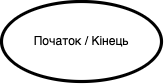
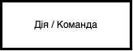
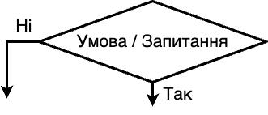
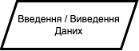

# **Алгоритми**

## Aлгоритм. Блок-схеми. Баpові структури алгоритмів.

## Урок **58**

---

## Пригадай: Що таке алгоритм?

🙋‍♀️

---

# 🔁 Повторення: Що таке алгоритм?

- **Алгоритм** — це послідовність дій (команд), які потрібно виконати, щоб досягти результату.

- Кожен з нас щодня виконує алгоритми:
  - **Чистимо зуби**
  - **Готуємо сніданок**
  - **Переходимо дорогу**

---

## 🔄 Базові структури алгоритмів

ℹ️ Будь-який алгоритм складається з однієї або кількох базовий структур.

---

## 1. **Слідування**
Команди виконуються одна за одною.

📥 Наприклад, щоб відкрити сайт, ми виконуємо наступні дії послідовно:

1. Увімкнути комп’ютер
2. Відкрити браузер
3. Перейти на сайт

---

## 2. **Розгалуження**

Виконання залежить від **умови**.

📥 Наприклад, як ми вірішуємо чи брати парасольку:

- Якщо на вулиці дощ,
- тоді взяти парасольку,
- інакше — йти без неї.

---

## 3. **Повторення (цикл)**

Дія повторюється декілька разів.

📥 Наприклад, як ви виконуєте домашнє завдання:

Для кожного предмету, що є в розкладі на завтра:

1. Переглянути ДЗ в НІТ для предмету
2. Виконати домашнє завдання
3. Перейти до наступного предмету (до п. 1)

---

## Пригадай: Що таке блок-схема?

🙋‍♀️

---

## 🧩 Що таке блок-схема?

Блок-схема — це графічне зображення алгоритму.

---

## 🔷 Елементи блок-схеми

| Позначення | Опис |
| ---------- | ---- |
|  | Початок або кінець алгоритму |
|  | Дія або команда |
|  | Перевірка умови |
|  | Ввід або вивід даних |
|  | Напрямок виконання |

---

## ✏️ Завдання 1: Визнач структуру

Прочитай алгоритм і скажи, яка структура в ньому використовується:

📌 «Вимити руки. Якщо є рушник — витерти руки. Інакше — висушити на повітрі.»

---

## ✏️ Завдання 2: Створи блок-схему

🔹 Алгоритм: *"Як визначити, чи число парне"*

---

## 🧠 Узагальнення

**Міні-гра “Так / Ні”**

Покажи картку або підніми руку, якщо твердження **правдиве**.

1. У блок-схемі ромб означає дію ❌
2. Структура «повторення» — це коли щось робимо багато разів ✅
3. Блок-схема — це малюнок-комікс ❌
4. Алгоритм — це набір команд ✅

---

## 🏠 Домашнє завдання

🔹 Створи блок-схему на тему:
**"Як скласти ранець в школу?"**

Використай базові структури (слідування, повторення та розгалуження)
Намалюй блок-схему в зошиті та покажи вчителю.
