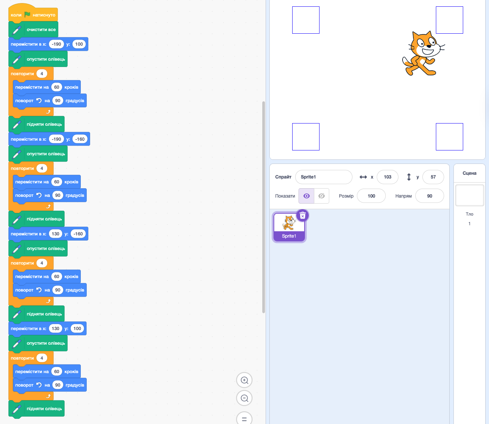
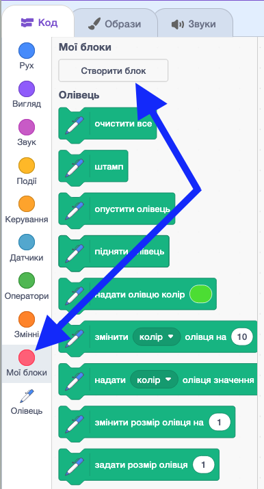
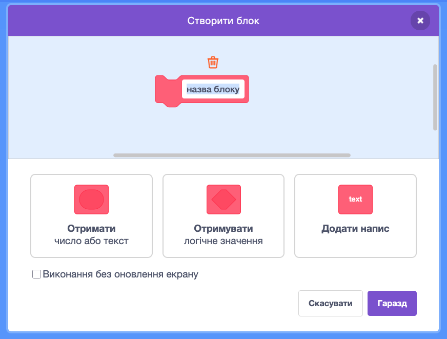
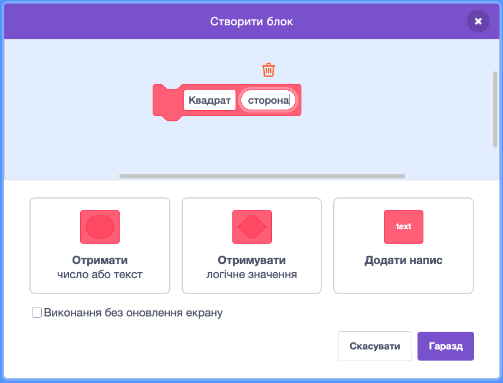
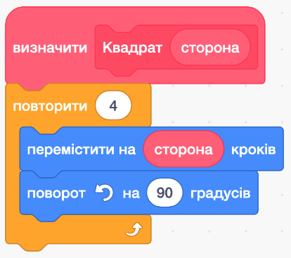
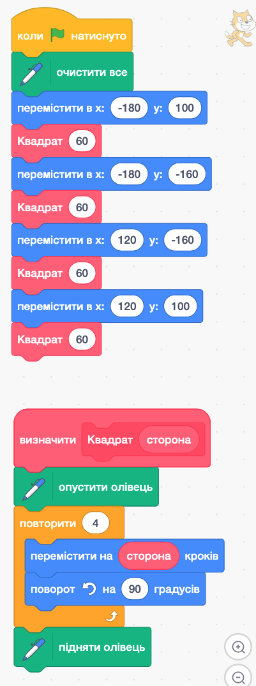
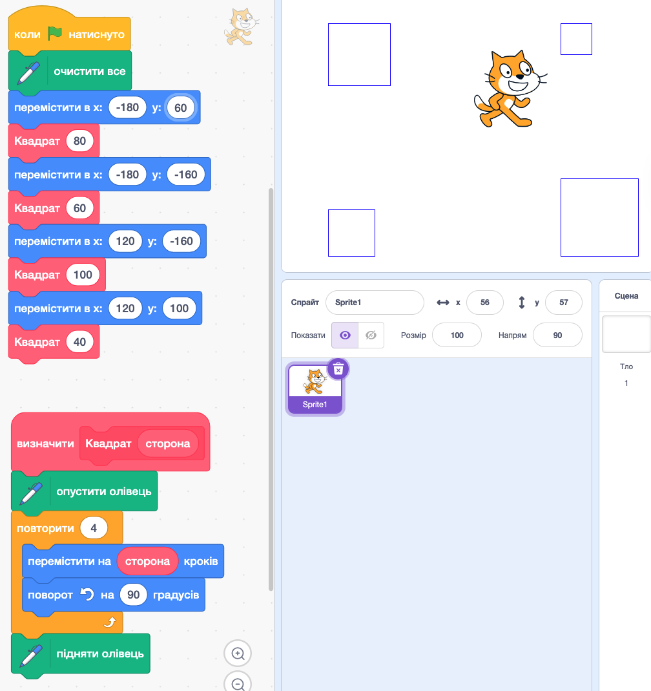

# 🧩 Власні блоки у Scratch

## 🏫 Урок **58**

---

## 🎯 Сьогодні ми

- ℹ️ Дізнаємося, що таке **декомпозиція** — метод поділу задачі на підзадачі.
- 🔧 Навчимося створювати **власні блоки з параметрами** у Scratch.
- ✏️ Побудуємо проєкт **«Чотири квадрати»**, використовуючи власний блок.

---

## ⚡ Пригадаємо: що ми вже вміємо

<div class="text-medium-small">

| Структура | Що робить |
|-----------|-----------|
| 🔁 Цикл `повторити N разів` | Виконує дії рівно N разів |
| 🔀 Розгалуження `якщо` | Вибирає один із двох шляхів |
| 🔁🔁 Вкладений цикл | Цикл всередині іншого циклу |

</div>

---

## 🤔 Проблема: багато однакового коду

<section class="grid-container">
<div class="text-left text-medium-small">

Треба намалювати **4 однакових будинки** в різних місцях.

Без власних блоків:
- Копіюємо ті самі 10+ блоків 4 рази 😰
- Зробили помилку → виправляємо в 4 місцях
- Код стає **величезним** і **незрозумілим**

</div>
<div class="image-center">



</div>
</section>

---

## 💡 Рішення: декомпозиція

<div class="card">

**Декомпозиція** — спосіб розв'язання складної задачі шляхом поділу її на менші, простіші **підзадачі**.

</div>

Кожну підзадачу вирішуємо **окремо**, а потім поєднуємо результати.

---

## 🌍 Декомпозиція в реальному житті

<section class="grid-container">
<div class="text-left text-medium-small">

🍝 **Приготувати вечерю**
→ купити продукти
→ нарізати
→ зварити
→ подати

</div>
<div class="text-left text-medium-small">

🏠 **Відремонтувати кімнату**
→ фарбування стін
→ нова підлога
→ розставити меблі

</div>
</section>

<div class="important-to-remember">

💻 У програмуванні підзадача — це **процедура** (власний блок).

</div>

---

## 🧩 Власні блоки у Scratch

<section class="grid-container">
<div class="text-left text-medium-small">

Категорія **«Мої блоки»** дозволяє створити власну команду:

- Пишемо алгоритм **один раз**
- Даємо йому **назву**
- Викликаємо **скільки завгодно разів**

**Переваги:**
✅ Коротший код
✅ Легше читати
✅ Виправляємо в одному місці

</div>
<div class="image-center">



</div>
</section>

---

## 🛠️ Крок 1: Відкрити «Мої блоки»

<section class="grid-container">
<div class="text-left text-medium-small">

1. Натисніть категорію **«Мої блоки»** на панелі зліва.
2. Натисніть кнопку **«Створити блок»**.
3. З'явиться діалогове вікно.

</div>
<div class="image-center">



</div>
</section>

---

## 🛠️ Крок 2: Назва та параметр

<section class="grid-container">
<div class="text-left text-medium-small">

1. Введіть назву блока: **`квадрат`**
2. Натисніть **«Додати вхідне значення числа або тексту»**
3. Назвіть параметр: **`сторона`**
4. Натисніть **«Гаразд»**

</div>
<div class="image-center">



</div>
</section>

---

## 🛠️ Крок 3: Тіло блока (визначення)

<section class="grid-container">
<div class="text-left text-medium-small">

З'явився блок **`визначити [квадрат (сторона)]`**.

Під ним будуємо алгоритм малювання квадрата:

```
опустити олівець
повторити (4) разів
  перемістити на (сторона) кроків
  повернути на 90° вправо
підняти олівець
```

⚠️ Параметр `(сторона)` — це **змінна** блока. Замість числа — вона!

</div>
<div class="image-center">



</div>
</section>

---

## 🛠️ Крок 4: Виклик власного блока

<section class="grid-container">
<div class="text-left text-medium-small">

У головному скрипті (`коли натиснуто 🏴`):

```
очистити все
перемістити в x(-120) y(80)
квадрат (80)
перемістити в x(20) y(80)
квадрат (60)
перемістити в x(-120) y(-60)
квадрат (100)
перемістити в x(20) y(-60)
квадрат (40)
```

💡 `опустити олівець` і `підняти олівець` — всередині блока!

</div>
<div class="image-center">



</div>
</section>

---

## ✅ Результат: 4 квадрати різних розмірів

<section class="grid-container">
<div class="image-center">



</div>
<div class="text-left text-medium-small">

Блок `квадрат` записаний **один раз**, але:

- `квадрат (80)` → сторона 80
- `квадрат (60)` → сторона 60
- `квадрат (100)` → сторона 100
- `квадрат (40)` → сторона 40

💡 Змінити форму всіх квадратів? Редагуємо лише **визначення** блока!

</div>
</section>

---

<section class="task text-medium">

## ⌨️ Практична робота: «Чотири квадрати»

**Крок 1** *(5 хв)* — Власний блок з параметром:
1. Відкрити Scratch, додати розширення **«Олівець»**
2. «Мої блоки» → «Створити блок» → назвати `квадрат` → додати параметр `сторона` → Гаразд
3. Тіло блоку: `опустити олівець` → `повторити (4) разів` → `перемістити на (сторона) кроків` → `повернути на 90°` → `підняти олівець`
4. Двічі клацнути `квадрат (80)` → переконатися, що малюється квадрат

</section>

---

<section class="task text-medium">

## ⌨️ Практична робота: «Чотири квадрати»

**Крок 2** *(6 хв)* — Чотири квадрати різних розмірів:

1. Подія `коли натиснуто зелений прапорець` → `очистити все`
2. Чотири рази: перемістити в координати → викликати `квадрат (розмір)`:
   - x(-120) y(80) → `квадрат (80)`
   - x(20) y(80) → `квадрат (60)`
   - x(-120) y(-60) → `квадрат (100)`
   - x(20) y(-60) → `квадрат (40)`
3. Запустити проєкт — блок сам опускає і піднімає олівець!

</section>

---

<section class="task text-medium">

## 🎨 Практична робота: «Чотири квадрати»

**Крок 3** *(4 хв)* — Кольорові квадрати:

Перед кожним викликом `квадрат (...)` додати блок:
**`встановити колір олівця на (...)`**

Задайте різні кольори для кожного квадрата.

🏆 **Результат:** чотири різнобарвні квадрати різних розмірів!

</section>

---

## 👁️ Релаксація для очей

<span class="emoji-large">👀</span>

Відірвіться від екрана.
Подивіться у вікно на **далекі предмети** — 30 секунд.
Потім поморгайте очима — 10 разів.

---

## 🤔 Рефлексія

- Що таке **декомпозиція**? Наведи приклад із реального життя.
- Яка різниця між звичайним скриптом і **власним блоком**?
- Навіщо блоку потрібен **параметр** `сторона`? Що змінилося б без нього?
- Де ще у Scratch ти міг би використати власний блок?

---

## 🏠 Домашнє завдання

Опрацювати підручник — відповідний параграф.

**У зошиті:**
Обери будь-яку задачу з повсякденного життя (наприклад, «зібратися до школи», «приготувати сніданок»).
Запиши її назву та виділи **3–5 підзадач**.

_Scratch не потрібен — лише слова!_ ✏️
