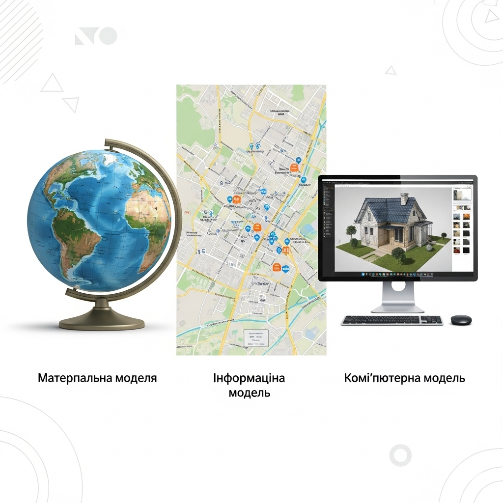

# Поняття про модель. Види моделей
## 🏫 Урок **58**

---

## 🎯 Сьогодні ми дізнаємося

- ℹ️ Що таке **об'єкт** та **модель**.
- 🗂️ Які існують **види моделей** за способом подання.
- 📐 У яких формах можуть подаватися інформаційні моделі.
- 🛠️ Як обирати правильну модель для вирішення конкретної задачі.
- 💻 Як створювати комп'ютерні моделі для розрахунків.

---

## 🤔 Поміркуймо разом...

🌍
Чому ми не можемо вивчати справжню планету Земля, просто тримаючи її в руках чи розглядаючи з усіх боків одночасно?

🚗
Як конструктори перевіряють безпеку автомобіля під час аварії, не розбиваючи щоразу справжню дорогу машину?

**Висновок:** Для дослідження складних, великих, дорогих або небезпечних об'єктів ми використовуємо їхні спрощені замінники — **моделі**!

---

## 📌 Головні поняття уроку

- **Об'єкт** — це те, на що спрямована дія або увага (предмет, істота, явище, процес).
- **Модель** — спрощене подання предмета, істоти, явища чи процесу.
- **Моделювання** — процес створення та подальшого дослідження моделей.

---

## 🗂️ Класифікація моделей

За способом подання всі моделі можна поділити на три основні групи:

🧱 **1. Матеріальні (натурні)**
Відтворюють фізичні або геометричні властивості об'єктів (іграшки, глобуси, макети будівель, манекени).

📝 **2. Інформаційні**
Це сукупність відомостей про об'єкт (описи, формули, схеми, карти, креслення).

💻 **3. Комп’ютерні**
Інформаційні моделі, що реалізовані та досліджуються за допомогою комп'ютерних програм.

---

## 🗂️ Класифікація моделей (приклад)

<section class="image-center">

</section>

---

## 📝 Форми подання інформаційних моделей

Інформацію про об'єкт можна подати по-різному:

- 🗣️ **Словесні** (усні або письмові описи, правила).
- 🗺️ **Графічні** (карти, креслення, діаграми, графіки, схеми).
- 🧮 **Математичні** (формули, рівняння, нерівності).
- 📊 **Табличні** (розклади уроків, таблиці характеристик, списки).

---

## 💻 Практична частина

### Завдання 1. «Вибір моделі» ⭐️

Оберіть найбільш відповідний тип моделі для розв’язання задачі та обґрунтуйте свій вибір:

1. Перевірити правильність закладання фундаменту будинку.
2. Пошити одяг, який пасуватиме людині за розміром.
3. Знайти потрібну адресу в незнайомому місті.
4. Визначити, який шлях проїде авто із заданою швидкістю за певний час.

---

## 💻 Практична частина

### Завдання 2. «Аналіз властивостей» ⭐️⭐️

Створіть математичну модель для задачі: *«Визначити відстань, яку проїде авто за певний час»*.

- Випишіть змінні: швидкість ($V$), час ($t$), відстань ($S$).
- Запишіть формулу для відстані.
- **Подумайте:** Які властивості автомобіля (колір, марка, тип пального, кількість місць) є **несуттєвими** для цієї моделі і чому?

---

## 💻 Практична частина

### Завдання 3. «Комп’ютерне моделювання» ⭐️⭐️⭐️

Створіть розрахункову модель у Google Таблицях або MS Excel:

1. Створіть таблицю з 3 стовпцями: "Швидкість", "Час", "Відстань".
2. Введіть значення: Швидкість = 70, Час = 3.
3. У комірці "Відстань" використайте формулу для множення (наприклад, `=A2*B2`).
4. Змініть значення часу на 5. Як автоматично змінився результат? У чому перевага такої моделі?

---

## 🏠 Домашнє завдання

1. 📖 Вивчити конспект (визначення понять «модель», «об'єкт», види моделей).
2. ✍️ **У зошиті:** Наведіть приклад одного об’єкта та трьох його різних моделей (наприклад: матеріальна, графічна та словесна).
3. 🌟 **Додаткове завдання:** Знайдіть вдома будь-яку модель (іграшкову машинку, карту міста, інструкцію до LEGO тощо) та підготуйте усне пояснення: які саме властивості оригіналу вона спрощує.

