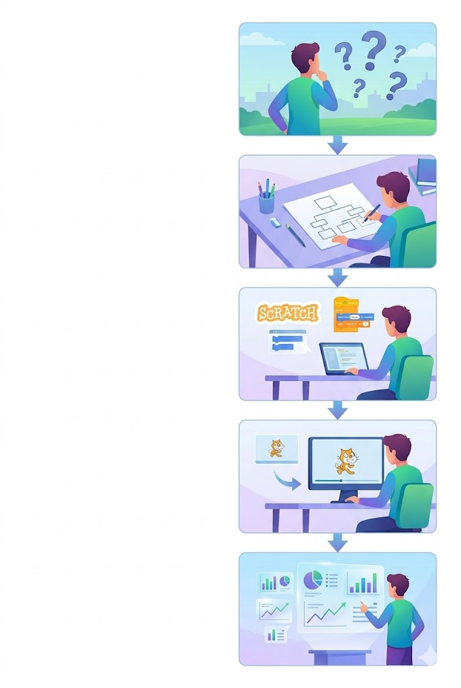
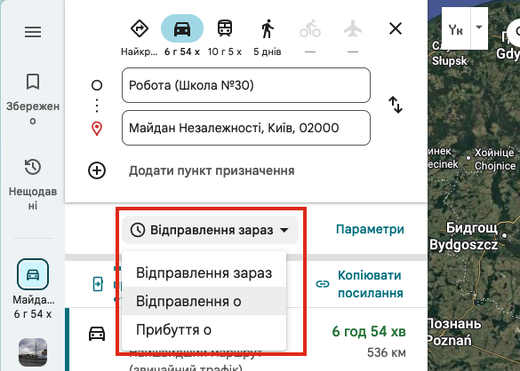
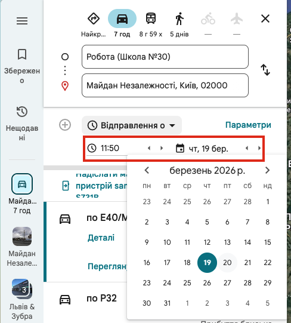

# Етапи побудови комп’ютерної моделі. Проведення експерименту

## 🏫 Урок **59**

---

## 🎯 Сьогодні ми дізнаємося

- 🧪 Що таке «комп'ютерний експеримент».
- 🗺️ Як використовувати готові онлайн-сервіси (Google Карти) як комп'ютерну модель.
- 🔍 Як аналізувати результати та робити висновки.

---

## 🧪 Що таке комп'ютерний експеримент?

**Комп'ютерний експеримент** — це процес дослідження моделі за допомогою комп'ютера.

Під час експерименту ми постійно **змінюємо вхідні дані** (умови) та спостерігаємо, як **змінюється результат**. Це дозволяє передбачати майбутнє без реальних витрат і ризиків!

---

## 🏗️ Як провести компʼютерний експеримент?

Не можна просто сісти за комп'ютер і почати "щось робити". Потрібен чіткий план!

 

**5 етапів компʼютерного експерименту:**

1. **Постановка задачі** (Що ми хочемо дізнатися?).
2. **Побудова інформаційної моделі** (Які дані нам потрібні?).
3. **Створення комп’ютерної моделі** (Робота в програмі або сервісі).
4. **Проведення комп’ютерного експерименту** (Тестування моделі).
5. **Аналіз результатів** (Робимо висновки).

  

  

  

---

## 💻 Практична частина (Етапи 1–2)

**Експеримент: Найшвидший шлях до столиці 🇺🇦**

*Уявіть, що ми плануємо подорож зі своєї школи до Майдану Незалежності в Києві. Наша мета — провести комп'ютерний експеримент у Google Картах, щоб визначити, як різні види транспорту та час відбуття впливають на час у дорозі.*

**Етапи 1–2 (Підготовка):**

- **Точка старту:** Ваша школа.
- **Точка фінішу:** Майдан Незалежності, Київ.
- **Змінні (те, що будемо міняти):** Вид транспорту, Час відбуття.
- **Що шукаємо:** Час у дорозі.

---

## 🚀 Хід експерименту (Етапи 3–4)

1. Відкрийте **[Google Карти](https://www.google.com/maps)** (maps.google.com).
2. У пошуку введіть "Майдан Незалежності".
3. Натисніть **"Маршрути"**. Введіть точку відправлення "Школа 30, Львів".
4. Створіть у зошиті таблицю результатів:

| Транспорт | Час (зараз) | Час (завтра, 8:00) | Час (завтра, 23:00) |
|---|---|---|---|
| Автомобіль |  |  |  |
| Громадський |  |  |  |

5. **Експериментуйте!** Змінюйте вид транспорту та час відправлення ("Відправлення в..."). Записуйте результати.
6. Дайте відповіді на запитання на наступному слайді.

1. Змініть час відправлення

  

2. Оберіть дату і час відправлення

  

---

## 🔍 Аналіз результатів (Етап 5)

Подивіться на свою заповнену таблицю і дайте відповіді:

1. Який вид транспорту є найшвидшим *зараз*?
2. Як змінюється час у дорозі на автомобілі вранці (о 8:00) та вночі (о 23:00)? **Чому так відбувається?**
3. Чи вдалося нам за допомогою комп'ютерної моделі (Google Карт) виконати поставлену задачу та знайти найшвидший шлях?

