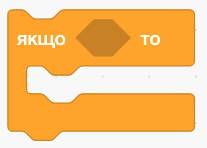
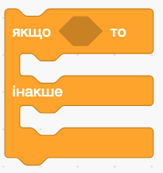
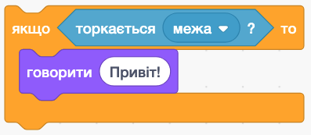
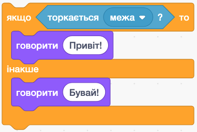
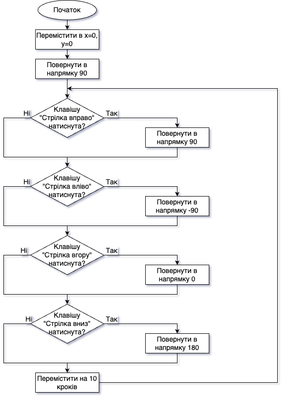
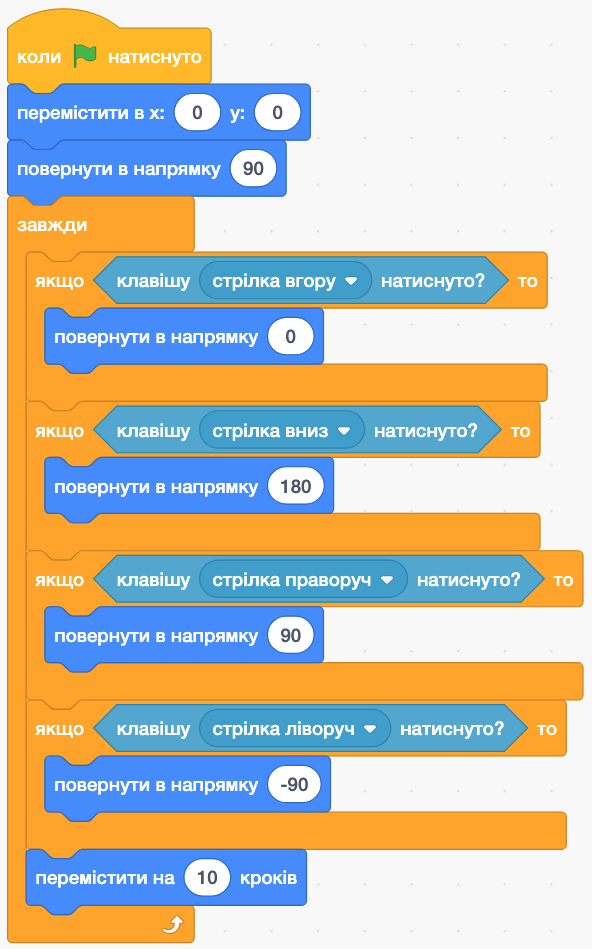
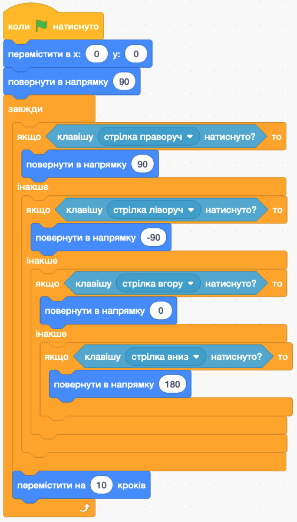

# **🔀 Алгоритми з вкладеними розгалуженнями**

## Урок **59**

---

## 🎯 Сьогодні ми дізнаємося

- 🧱 Які блоки надає Scratch для реалізації алгоритмів з розгалуженнями
- 🧩 Як створювати алгоритми з розгалуженнями в Scratch
- 🌀 Як реалізувати алгоритми з **вкладеними** розгалуженнями

---

## 🧱 Блоки Scratch для розгалужень

Для реалізації алгоритмів з розгалуженням Scratch надає блоки з розділу `Керування`:

🔸 **Блок `Якщо...то`**  
Виконує дії лише **якщо** умова істинна. Інакше — нічого не відбувається.

🔸 **Блок `Якщо...то...інакше`**  
Дає вибір: якщо умова істинна — виконається перша частина, інакше — друга.

---

## 🧪 Приклад використання блоків

🧱 Якщо спрайт торкається межі — скаже "Привіт!".  
Інакше — **нічого** не скаже.

🧱 Якщо торкається межі — скаже "Привіт!",  
інакше — скаже "Бувай!".

---

## ❓ Який алгоритм подано на екрані?

🔍 Розглянь уважно блок-схему та пригадай, як працюють умови.

---

## 💬 Пояснення

Це алгоритм з **розгалуженнями**, який дозволяє спрайту рухатись по екрану, коли натиснута відповідна стрілка на клавіатурі.

---

## 🧠 Алгоритм з вкладеними розгалуженнями

Це удосконалений варіант алгоритму, який використовує **вкладені** блоки `Якщо...то...інакше`.

---

## 📝 Домашнє завдання

📖 Прочитати параграф **Відкриття 42**, с. 218–224  
🧪 Виконати вправу 1 на с. 222  
📹 Зняти відео роботи своєї програми та показати в класі!
