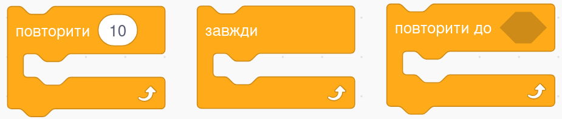
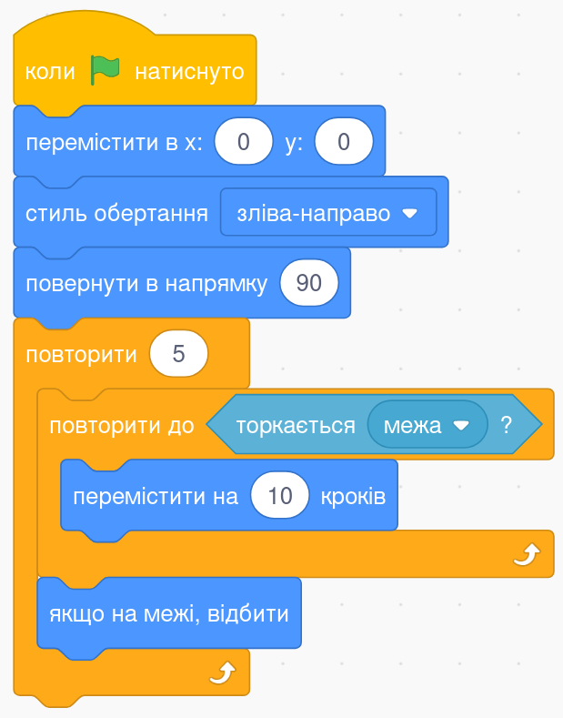
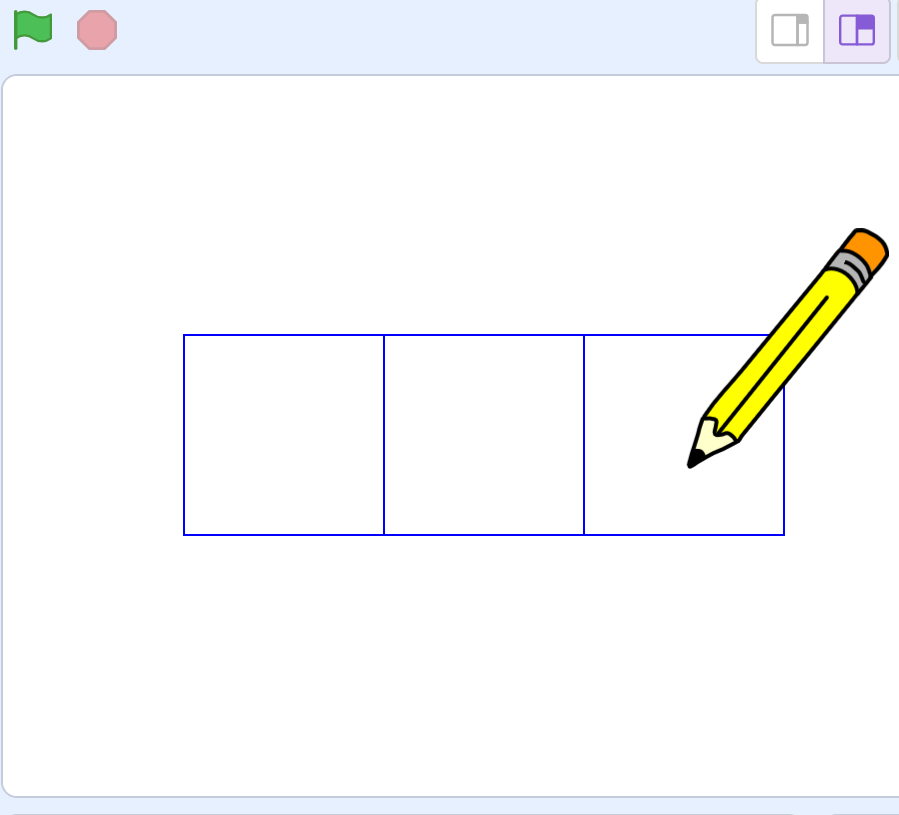
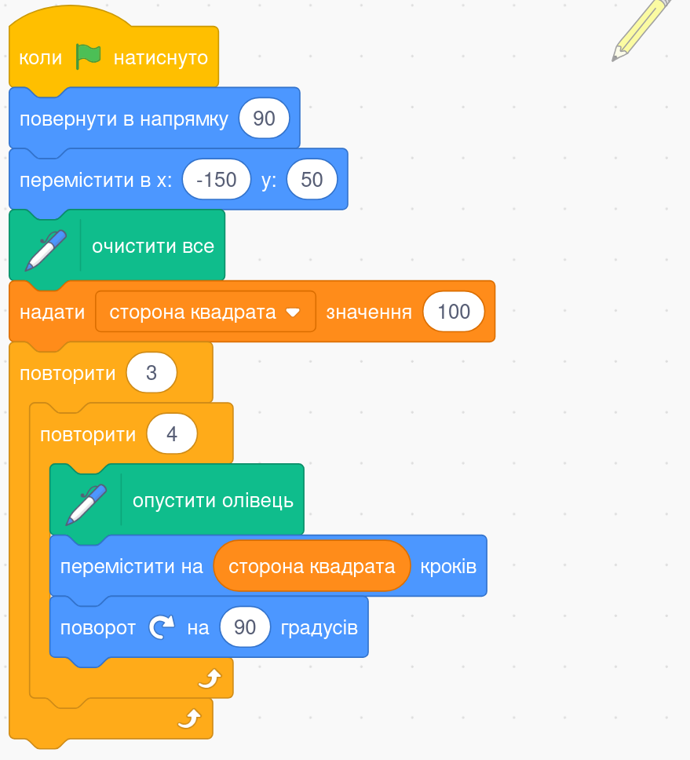

# **🔁 Вкладені повторення у Scratch**

## Урок **60**

---

## 🎯 Сьогодні ми дізнаємося

- ℹ️ Які блоки надає Scratch для повторень
- 🔧 Що таке **вкладені повторення**
- ✏️ Переглянемо приклад програми з вкладеними повтореннями

---

## 🔷 Блоки для реалізації повторень

Scratch має спеціальні блоки для повторення дій:

- 🔵 `Повторити __` — повторити дію певну кількість разів
- ♾️ `Завжди` — нескінченне повторення
- 🛑 `Повторити до __` — повторення до виконання умови

---

## 🧩 Вкладені повторення

**Вкладені повторення** — це коли один блок повторення знаходиться всередині іншого.

➡️ Спочатку виконується **внутрішній цикл** (`Повторити до "Торкається межа"`),  
а потім продовжується **зовнішній цикл** (`Повторити 5`).

---

## ✏️ Завдання: Намалюй квадрати

🖌️ Намалюй три квадрати зі стороною **50 кроків**, як показано праворуч.

✅ Використай **2 вкладені цикли**:
- Внутрішній цикл 🔁 4 рази — малює один квадрат
- Зовнішній цикл ➡️ малює квадрат і переміщує спрайт праворуч на 50 кроків

---

## 💡 Підказка до завдання

Ось приклад алгоритму для малювання одного квадрата.

🛠️ Зміни його так, щоб після малювання квадрата спрайт рухався праворуч та починав малювати наступний квадрат.

🔵 Пам'ятай про **вкладені цикли**!

