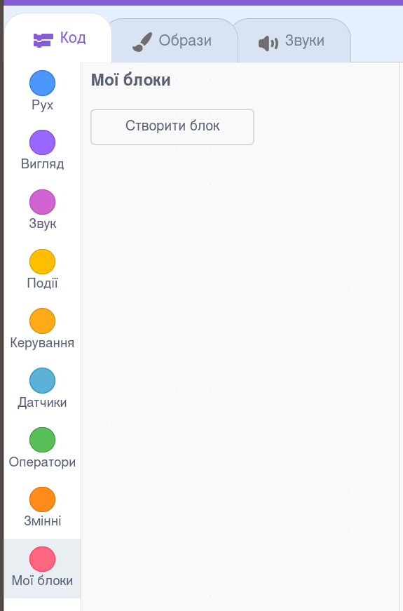
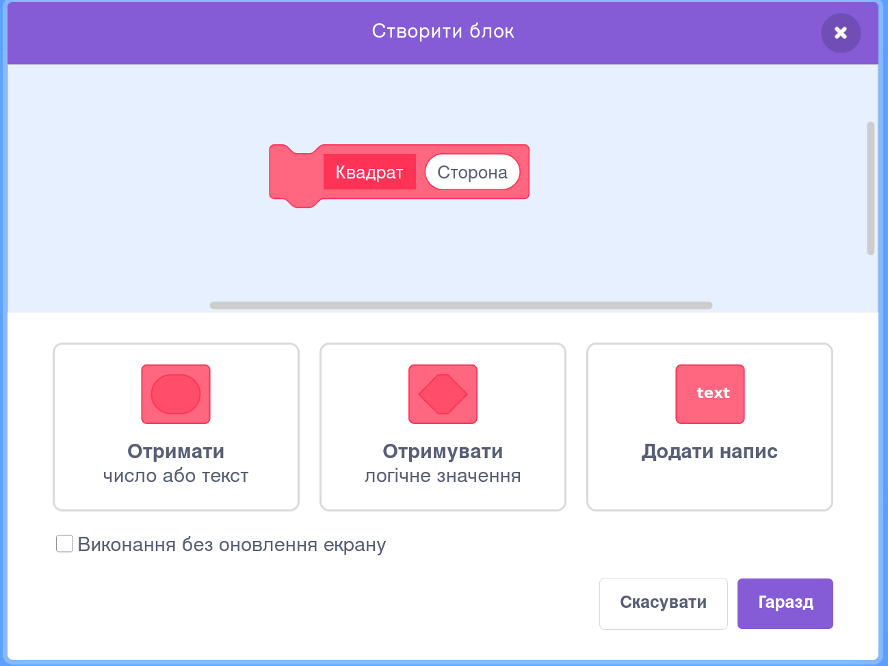
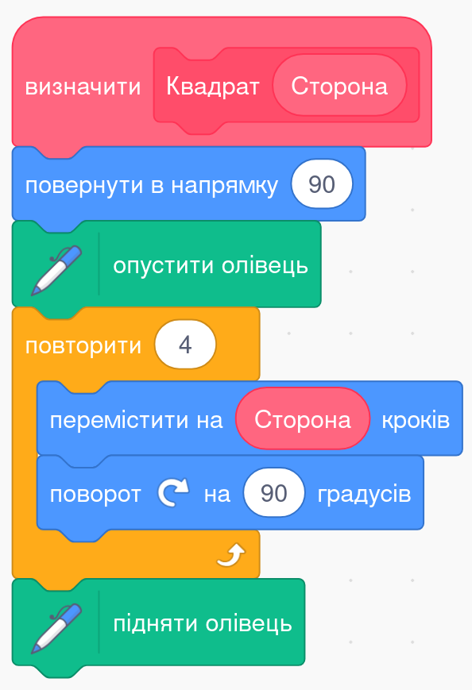
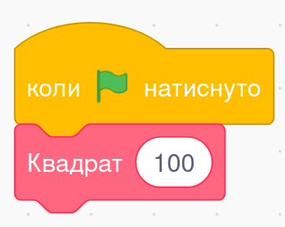
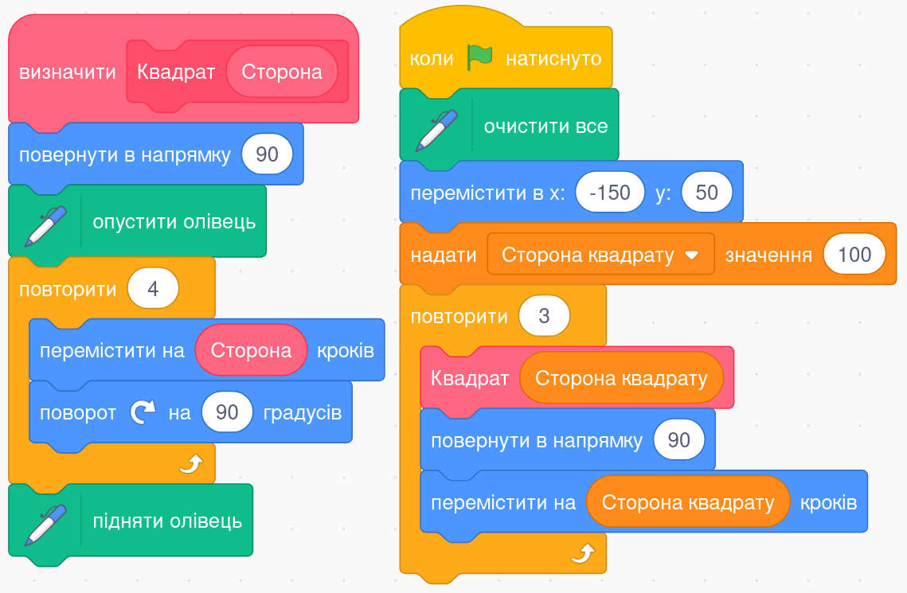
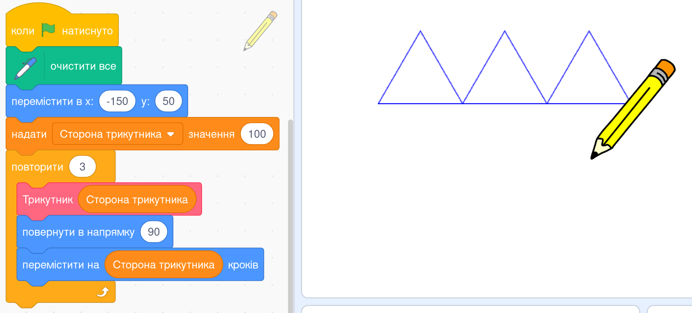

# 🧩 **Декомпозиція задачі та власні блоки в Scratch**

## Урок **61**

---

## 🎯 Сьогодні на уроці

- 🧠 Дізнаємося, що таке **декомпозиція задачі**
- 🛠 Навчимося створювати **власні блоки** в Scratch
- ✏️ Спробуємо використати їх на практиці

---

## 🔍 Що таке декомпозиція?

**Декомпозиція** — це розбиття складного завдання на простіші частини.

📚 **Приклад з життя:**  
Коли вчиш вірш, ти розбиваєш його на строфи, щоб легше запам’ятати.  
Це і є **декомпозиція**.

---

## 🧱 Навіщо створювати власні блоки?

- 👨‍🔧 Власні блоки допомагають **організувати програму**
- 🔁 Їх можна **використовувати багато разів**
- 🎨 Наприклад, можна створити блок **"Квадрат"** і малювати з його допомогою багато квадратів

---

## 🧰 Як створити власний блок (крок 1)

  

🔹 Відкрий розділ `Мої блоки`  
🔹 Натисни кнопку `Створити блок`

  

  

  

---

## ⚙️ Як створити власний блок (крок 2)

  

🔸 Обери, чи матиме блок параметри:  
- 🔢 **Число або текст**  
- ❓ **Логічне значення (умова)**  
- 🏷 **Напис**

  

  

  

---

## 🧩 Додай команди до свого блоку

  

📌 Всередині блоку розмісти команди, які він має виконувати.

🟢 Ці команди будуть виконуватися **кожного разу**, коли блок буде викликано.

  

  

  

---

## 🚀 Використай блок у програмі

✅ Тепер твій блок зʼявився в списку і ти можеш використовувати його в будь-якому місці програми.

---

## 🧪 Завдання — Рівень 1 (до 8 балів)

  

🔹 Створи програму, яка малює **три квадрати**  
🔹 Поясни, як програма малює квадрат  
🔹 А як змінити програму, щоб вона малювала **2** або **4 квадрати**?

  

  

  

---

## 🧠 Завдання — Рівень 2 (до 12 балів)

  

🔹 Створи власний блок `Трикутник`  
🔹 Блок має приймати параметр — розмір сторони  
🔹 Блок має малювати **рівносторонній трикутник**  
🔹 В програмі використай цей блок тричі, як на малюнку

  

  

  

