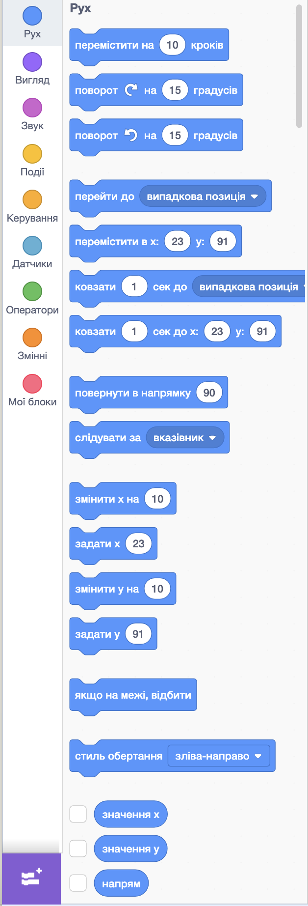
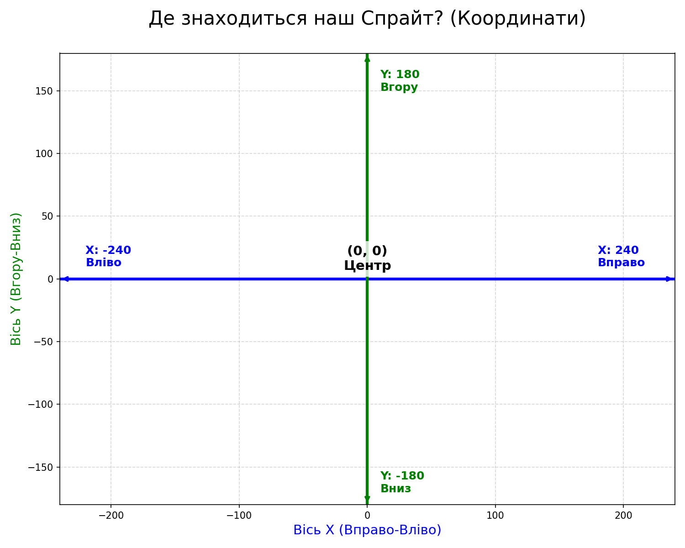
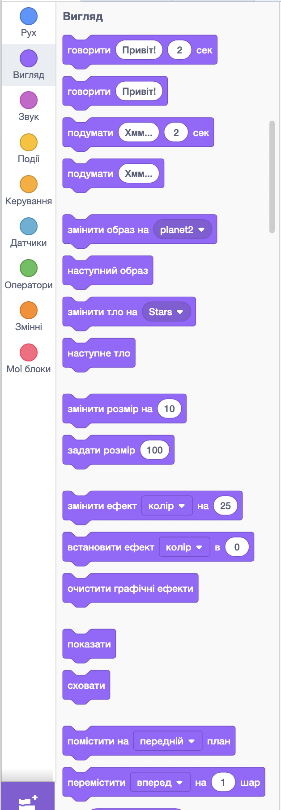

# 🚀 Інтерактивні об’єкти у Scratch

## 🏫 Урок **61**

---

## 🎯 Сьогодні ми навчимося

- 🆕 **Створювати** нові спрайти (об'єкти) різними способами.
- ⚡ **Керувати** властивостями через **події**.
- 🎮 **Змінювати** розмір, колір та положення за допомогою клавіш.
- 🛠️ **Працювати** зі спрайтами Planet2, Rocketship та Star.

---

## ⚡ Що таке подія?

Подія — це те, що змушує скрипт працювати.

<section class="grid-container">

🟢

При натисканні зеленого прапорця (Старт).

⌨️

При натисканні певної клавіші на клавіатурі.

🖱️

При натисканні мишкою на сам спрайт.

</section>

---

## 🔵 Блоки категорії «Рух»

<section class="grid-container">

*Ці блоки допомагають рухати спрайт по сцені.*

- **Перемістити на 10 кроків** — робимо крок вперед.
- **Поворот ↻/↺** — крутимо спрайт праворуч або ліворуч.
- **Перейти до...** — «телепортація» у випадкове місце або до мишки.
- **Перейти в x: ... y: ...** — миттєво переносимо спрайт у точку за координатами.
- **Ковзати...** — плавно «пливемо» до цілі (не миттєво).
- **Повернути в напрямку** — задаємо кут, куди дивиться спрайт (наприклад, 90 - праворуч).
- **Змінити x або y** — рухаємо по осі X (вліво/вправо) або по осі Y (вгору/вниз).
- **Якщо на межі, відбити** — щоб спрайт не «втікав» за екран.
- **Стиль обертання** — чи буде спрайт перевертатися догори ногами при повороті.

</section>

---

## 🗺️ Де знаходиться наш Спрайт?

<section class="grid-container">

### 📍 Координати — це «адреса» об'єкта

- **↔️ Вісь X (Вправо-Вліво):**
  - **Плюс (+)** ➡️ вправо.
  - **Мінус (-)** ⬅️ вліво.
- **↕️ Вісь Y (Вгору-Вниз):**
  - **Плюс (+)** ⬆️ вгору.
  - **Мінус (-)** ⬇️ вниз.

**Точка (0, 0)** — самий центр сцени! 🚩

</section>

---

## 🟣 Блоки категорії «Вигляд»

<section class="grid-container">

*Ці блоки змінюють зовнішній вигляд спрайта та сцени.*

- **Говорити/Подумати** — з'являється «хмарка» з текстом, як у коміксі.
- **Змінити образ** — змінюємо костюм спрайта (це створює анімацію).
- **Змінити тло** — змінюємо картинку на задньому плані.
- **Змінити розмір** — робимо спрайт більшим або меншим.
- **Ефекти (колір тощо)** — змінюємо колір, робимо спрайт прозорим або «закрученим».
- **Очистити ефекти** — скасовуємо всі зміни кольору чи прозорості.
- **Показати/Сховати** — робимо спрайт видимим або «невидимкою».
- **План та шари** — вибираємо, хто стоїть попереду, а хто за іншими спрайтами.

</section>

---

## 🖱️ Практичне завдання «Космічна лабораторія»

<section class="task text-medium-small">

**Середній рівень (4-6 балів):**
1. Видаліть Кота. Додайте спрайт **Rocketship**.
2. Змініть його назву на **Мій_Корабель**.
3. Складіть скрипт: Коли натиснуто 🟢:
   - `задати розмір 120`
   - `повернути в напрямку 45`
   - `перемістити в x: -150 y: -100`

</section>

---

## ⭐ Оживляємо Зірку

<section class="task text-medium-small">

**Достатній рівень (7-9 балів):**
1. Додайте спрайт **Star** та тло **Stars**.
2. Скрипти для Зірки:
   - При натисканні на саму Зірку: `змінити ефект колір на 25`, `говорити "Привіт!" 2 сек`.
   - При натисканні клавіші **"стрілка вгору"**: `змінити розмір на 10`.

</section>

---

## 🌌 Керування планетою (Високий рівень)

<section class="task text-medium-small">

**Високий рівень (10-12 балів):**
1. Додайте спрайт **Planet2**.
2. Додайте скрипти для Планети:
  - Клавіша **"пропуск"** ➡️ `наступний образ`.
  - Клавіша **"стрілка праворуч"** ➡️ `повернути на 15 градусів`.
  - Клавіша **"a"** (англійська) ➡️ `перейти до випадкової позиції`.

</section>

---

## 🗣️ Рефлексія

- Чи зручніше керувати спрайтом за допомогою клавіш?
- Які ще клавіші можна використати для керування?
- Яка властивість змінювалася при натисканні на Зірку?

---

## 🏠 Домашнє завдання

- Повторити властивості об’єктів (с. 203-208).
