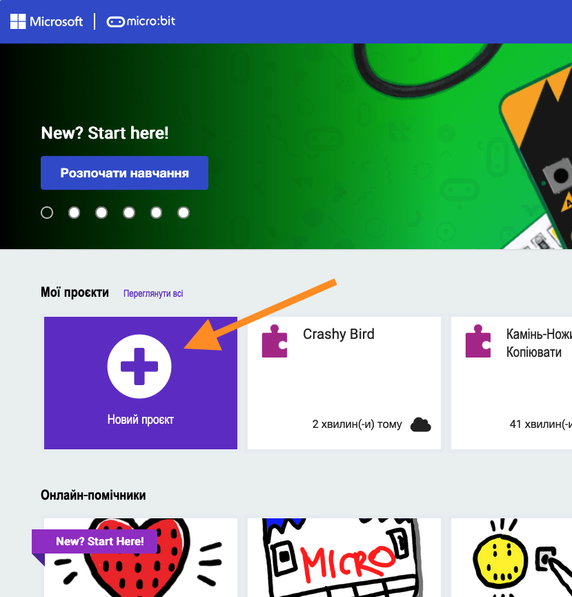
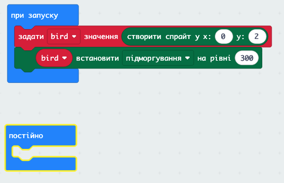
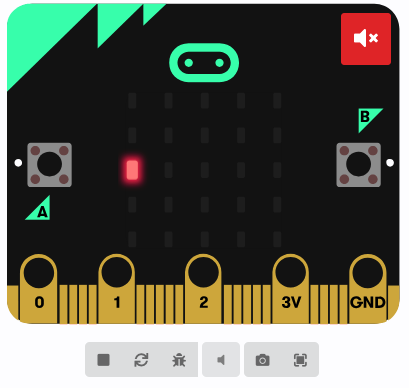
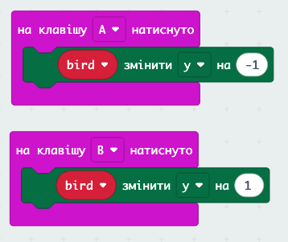
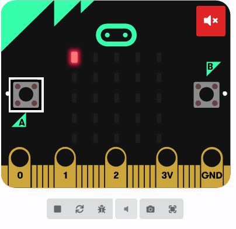

# Crashy Bird на Micro:Bit 🐦

## 🏫 Урок **62**

---

## 🎮 Що таке Crashy Bird?

<section class="grid-container">

Це гра схожа на **Flappy Bird**!

- 🐦 Ти керуєш птахом
- 🧱 Летять перешкоди
- ⬆️⬇️ Кнопки A і B — вгору і вниз
- 💀 Вдарився — гра закінчилась

Сьогодні ми запрограмуємо її **самі**!

</section>

---

## 🎯 Сьогодні ми навчимося

- 🐦 Створювати спрайти та керувати ними кнопками
- 🧱 Генерувати перешкоди за допомогою циклів і масивів
- ➡️ Рухати об'єкти та видаляти їх зі сцени
- 💡 Використовувати лічильник і залишок від ділення
- 💀 Перевіряти зіткнення та завершувати гру

---

## 🚀 Починаємо! Відкриваємо MakeCode

<section class="grid-container text-medium-small">
  

    

## ⌨️ Підготовка до роботи

1. Відкрий браузер і перейди на сайт:
   **https://makecode.microbit.org**
2. Натисни кнопку **«Новий проект»**
3. Введи назву проекту: **Crashy Bird**
4. Натисни **«Створити»**

    

  

</section>

---

## 🐦 Крок 1 — Додаємо птаха

<section class="grid-container text-small">

1. Обери категорію **Змінні** та натисни **Створити змінну**
2. Назви змінну **bird**
3. З категорі **Змінні** Перетягни блок **Задати _bird_ значення _0_** всередину блоку **при запуску**
4. Відкрий категорію **Гра** (можливо потрібно буде натиснути **Додатково**)
5. Перетягни блок **«створити спрайт в x:0 y:2»** у блок **залати _bird_ значення _0_** (замість _0_)
6. З категорі **Гра** перетягни **_sprite_ встановити _x_ на рівні _0_** в кінець блоку **при запуску**
7. Заміни в цьому блоці **sprite** на **bird**, а **x** на **підморгування**. Також заміни **0** на **300**.

</section>

<section class="block-info text-small">

🟩 **«створити спрайт в x:0 y:2»** — створює точку на LED-екрані. **x** — стовпець (0–4), **y** — рядок (0–4).
🟩 **«встановити мигання на 300»** — птах блимає кожні 300 мс, щоб його було видно.

</section>

---

## ✅ Перевірка: Крок 1

<section class="grid-container">

<section class="task text-medium">

### 🖥️ Подивись на симулятор зліва

- На екрані Micro:Bit має блимати **одна точка** в лівому центрі
- Якщо точки не видно — перевір, чи правильно задав координати: **x = 0, y = 2**

</section>

</section>

---

## ⬆️⬇️ Крок 2 — Птах літає

<section class="grid-container">

Підключаємо кнопки A і B до руху птаха.

1. З категорії **Вхідіні дані** перетягни **«на клавішу A натиснуто»** на порожнє місце на екрані
2. З категорії **"Гра"** перетягни всередину цього блоку **«sprite змінити x на 1»**.
3. Заміни **sprite** на **bird**, **x** на **н**, а **1** заміни на **-1**
4. З категорії **Вхідіні дані** знову перетягни ще один блок **«на клавішу A натиснуто»** на порожнє місце на екрані.
5. Заміни **A** на **B**
6. З категорії **"Гра"** перетягни всередину цього блоку **«sprite змінити x на 1»**.
7. Заміни **sprite** на **bird**, а **x** на **y**.

</section>

<section class="block-info text-small">

⬆️ **Кнопка A → y − 1** — птах летить вгору (менше y = вище на екрані).
⬇️ **Кнопка B → y + 1** — птах летить вниз.

</section>

---

## ✅ Перевірка: Крок 2

<section class="grid-container text-medium-small">

<section class="task">

### 🖥️ Протестуй у симуляторі

- Натисни кнопку **A** у симуляторі — птах має рухатися **вгору**
- Натисни кнопку **B** — птах має рухатися **вниз**
- Переконайся, що птах не вилітає за межі екрану

</section>

</section>

---

## 🧱 Крок 3 — Перешкоди (Частина 1)

<section class="grid-container text-small">

Створюємо список для перешкод і функцію для їх генерації.

1. З категорії **Змінні** натисни **Створити змінну** → назви її **obstacles**
2. З категорії **Змінні** перетягни **«Задати _obstacles_ значення _0_»** у блок **«при запуску»**
3. З категорії **Масиви** перетягни порожній список **«[ ]»** замість **_0_**
4. Натисни **Розширені** → **Функції** → **Зробити функцію**
5. Назви функцію **createObstacle** і натисни **Готово**

</section>

<section class="block-info text-small">

📋 **Масив (список)** — це як коробка, де зберігається кілька спрайтів одразу. Нам потрібно зберігати всі перешкоди, щоб керувати ними разом.

</section>

---

## 🧱 Крок 3 — Перешкоди (Частина 2)

<section class="grid-container text-small">

Всередину функції **createObstacle**:

1. З **Змінні** натисни **Створити змінну** → назви її **gap**
2. Перетягни **«Задати _gap_ значення _0_»** у функцію
3. З **Математика** перетягни **«вибрати випадкове від _0_ до _10_»** замість **_0_**. Заміни **_10_** на **_4_**
4. З **Цикли** перетягни **«для _index_ від _0_ до _4_»** після кроку 2
5. Всередині циклу: з **Логіка** перетягни **«якщо _true_ то»**
6. Замість **_true_**: з **Логіка** постав **«_0_ ≠ _0_»**. Ліве **_0_** заміни на **_index_**, праве — на **_gap_**
7. Всередині «якщо»: з **Гра** перетягни **«створити спрайт в x:_0_ y:_0_»**. Заміни **x** на **_4_**, **y** — на **_index_**. Збережи результат у нову змінну **sprite**
8. З **Масиви** перетягни **«obstacles додати _значення_ в кінець»** — замість **_значення_** постав **_sprite_**

</section>

<section class="block-info text-small">

🎲 **«вибрати випадкове від 0 до 4»** — обирає випадковий рядок для «дірки».
🔁 **«для _index_ від 0 до 4»** — пробігає по всіх 5 рядках і ставить точку скрізь, крім рядка **gap**.

</section>

---

## ✅ Перевірка: Крок 3

<section class="grid-container">

Перед перевіркою: у блоці **«при запуску»** додай виклик **«createObstacle»** (з **Розширені** → **Функції**).

<section class="task text-medium">

### 🖥️ Що маєш побачити

- Праворуч на екрані (стовпець 4) з'явиться **вертикальна смуга точок**
- В одному рядку буде **пропуск** — через нього птах пролетить
- При кожному перезапуску дірка буде в **іншому місці**

</section>

</section>

---

## ➡️ Крок 4 — Перешкоди рухаються

<section class="grid-container text-small">

Блок **«постійно»** вже є на екрані — працюємо всередині нього.

1. З категорії **Масиви** перетягни **«для кожного _value_ у _list_»** всередину **«постійно»**. Заміни **_list_** на **_obstacles_**
2. З категорії **Гра** перетягни **«_sprite_ змінити _x_ на _1_»** всередину циклу. Заміни **_sprite_** на **_value_**, а **_1_** на **_-1_**
3. З категорії **Основні** перетягни **«пауза (мс) _100_»** після циклу (але всередині **«постійно»**). Заміни **_100_** на **_1000_**

</section>

<section class="block-info text-small">

🔁 **«для кожного _value_ у _obstacles_»** — пробігає по кожній перешкоді зі списку.
⬅️ **«змінити x на -1»** — зсуває перешкоду на один стовпець вліво щосекунди.

</section>

---

## ✅ Перевірка: Крок 4

<section class="grid-container">

<section class="task text-medium">

### 🖥️ Перевір симулятор

- Перешкода повільно **рухається вліво** через весь екран
- Натискай A/B — птах рухається, щоб уникнути удару

</section>

<section class="important-to-remember">

⚠️ **Увага!** Поки що перешкода зникає з екрану, але залишається в пам'яті. Це виправимо на наступному кроці.

</section>

</section>

---

## 🧹 Крок 5 — Прибираємо старі перешкоди

<section class="grid-container text-small">

У блоці **«постійно»**, після циклу руху, додай:

1. З **Цикли** перетягни **«поки _true_ виконати»**
2. Замість **_true_**: з **Логіка** постав **«_0_ = _0_»**. Ліворуч постав **«_sprite_ x»** (з **Гра**), заміни **_sprite_** на **«obstacles [_0_]»** (з **Масиви**). Праворуч залиш **_0_**
3. Всередині «поки»: з **Гра** перетягни **«_sprite_ видалити»** — замість **_sprite_** постав **«obstacles [_0_]»**
4. З **Масиви** перетягни **«obstacles видалити за індексом _0_»** після попереднього блоку

</section>

<section class="block-info text-small">

🗑️ **«_sprite_ видалити»** — вимикає точку на екрані.
📋 **«видалити за індексом 0»** — прибирає першу перешкоду зі списку, щоб він не переповнювався.

</section>

---

## ♾️ Крок 6 — Нові перешкоди постійно

<section class="grid-container text-small">

1. З **Змінні** натисни **Створити змінну** → назви її **ticks**
2. Перетягни **«Задати _ticks_ значення _0_»** у блок **«при запуску»**
3. На самому початку блоку **«постійно»** додай **«змінити _ticks_ на _1_»** (з **Змінні**)
4. З **Логіка** перетягни **«якщо _true_ то»** після кроку 3
5. Замість **_true_**: з **Математика** обери **«_0_ = _0_»**. Ліворуч постав **«_0_ залишок від ділення на _3_»** (з **Математика**) і заміни ліве **_0_** на **_ticks_**. Праворуч залиш **_0_**
6. Всередині «якщо»: з **Розширені** → **Функції** перетягни **«виклик createObstacle»**

</section>

<section class="block-info text-small">

🔢 **залишок від ділення на 3** дорівнює 0 тільки при ticks = 3, 6, 9… Так нові перешкоди з'являються не одразу одна за одною, а через рівні проміжки.

</section>

---

## ✅ Перевірка: Крок 6

<section class="grid-container">

<section class="task text-medium">

### 🖥️ Нові перешкоди з'являються?

- Перешкоди з'являються **одна за одною** з правого краю
- Між появами нових перешкод є **пауза**
- Дірки у кожної перешкоди **в різних місцях**

</section>

</section>

---

## 💀 Крок 7 — Кінець гри

<section class="grid-container text-small">

У блоці **«постійно»**, перед **«пауза 1000 мс»**, додай:

1. З **Масиви** перетягни **«для кожного _value_ у _obstacles_»**
2. Всередині: з **Логіка** перетягни **«якщо _true_ то»**
3. Замість **_true_**: з **Логіка** постав **«і»**. Додай дві умови рівності:
   - **«_sprite_ x = _sprite_ x»** (з **Гра**): ліве **_sprite_** → **_value_**, праве **_sprite_** → **_bird_**
   - **«_sprite_ y = _sprite_ y»**: аналогічно
4. Всередині «якщо»: з **Гра** перетягни **«кінець гри»**

</section>

<section class="block-info text-small">

💥 **Зіткнення** — це коли x і y птаха збігаються з x і y перешкоди одночасно.
🏁 **«кінець гри»** (категорія **Гра**) — зупиняє гру та показує рахунок.

</section>

---

## ✅ Перевірка: Крок 7

<section class="grid-container">

<section class="task text-medium">

### 🖥️ Фінальне тестування

1. Запусти гру в симуляторі
2. Спробуй **уникнути** перешкод кнопками A і B
3. Навмисно **вдарся** об перешкоду — з'явиться екран «Game Over»
4. Перевір, що гра правильно **перезапускається**

</section>

</section>

---

## 🎉 Вітаємо! Гра готова!

<section class="grid-container">

Ти запрограмував справжню гру! Ось що ти використав:

- 🐦 **Спрайти** — об'єкти на LED-екрані
- 📋 **Масив** — список спрайтів-перешкод
- 🔁 **Цикли** — для руху та перевірки
- 🎲 **Випадковість** — для дірок у перешкодах
- 🔢 **Залишок від ділення** — для ритму появи
- 💥 **Перевірка координат** — для зіткнень

🎮

**Ти — розробник ігор!**

</section>

---

## 🤔 Рефлексія

<section class="grid-container">

Обговоримо разом:

- 💬 Який крок був **найважчим**?
- 💬 Яку помилку ти **допустив і виправив**?
- 💬 Навіщо потрібен **масив** у цій грі?
- 💬 Що означає **`ticks % 3 = 0`**?

Підніми руку, якщо:

- ✋ Виконав усі 7 кроків
- ✋ Виконав хоча б кроки 1–5
- ✋ Хочеш показати свою гру класу

</section>

---

## 🏠 Домашнє завдання

<section class="task">

## 📝 Придумай вдосконалення для Crashy Bird

Обери **одну ідею** (або придумай свою) та **опиши словами або схемою**, як її реалізувати:

- ⭐ **Підрахунок очок** — додавати 1 очко кожен раз, коли перешкода минає
- ⭐ **Прискорення** — після кожних 5 перешкод зменшувати паузу
- ⭐ **Перешкоди зверху і знизу** — бар'єр з двох боків і вузьким проходом

**За бажанням:** реалізуй свою ідею в MakeCode!

</section>

🔗 makecode.microbit.org → проект **Crashy Bird**
