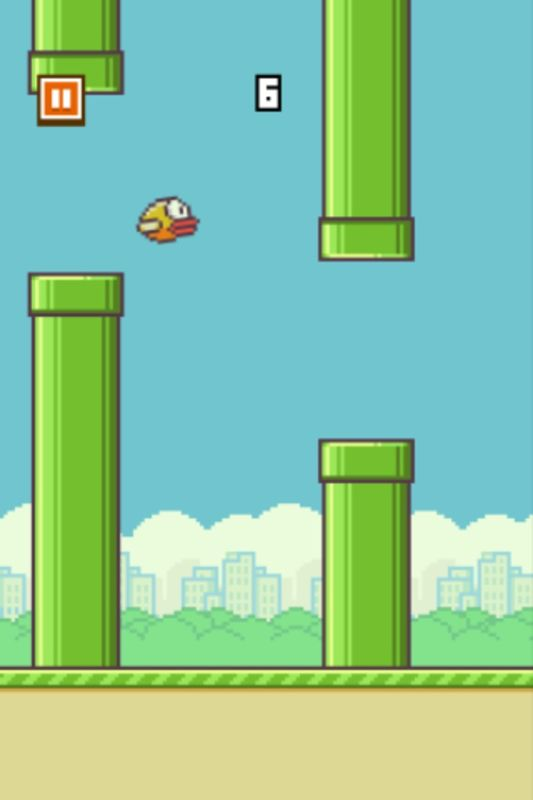

# Crashy Bird на Micro:Bit 🐦

## 🏫 Урок **62**

---

## 🎮 Що таке Crashy Bird?

<section class="grid-container">

Це гра схожа на **Flappy Bird**!

- 🐦 Ти керуєш птахом
- 🧱 Летять перешкоди
- ⬆️⬇️ Кнопки A і B — вгору і вниз
- 💀 Вдарився — гра закінчилась

Сьогодні ми запрограмуємо її **самі**!

</section>

---

## 🎯 Сьогодні ми навчимося

- 🐦 Створювати спрайти та керувати ними кнопками
- 🧱 Генерувати перешкоди за допомогою циклів і масивів
- ➡️ Рухати об'єкти та видаляти їх зі сцени
- 💡 Використовувати лічильник і залишок від ділення
- 💀 Перевіряти зіткнення та завершувати гру

---

## 🚀 Починаємо! Відкриваємо MakeCode

<section class="task text-medium">

## ⌨️ Підготовка до роботи

1. Відкрий браузер і перейди на сайт:
   **https://makecode.microbit.org**
2. Натисни кнопку **«Новий проект»**
3. Введи назву проекту: **Crashy Bird**
4. Натисни **«Створити»**

</section>

---

## 🎬 Дивись відео та будуй разом

<section class="grid-container">

Відео покаже всі **7 кроків** від початку до кінця:

1. 🐦 Додаємо птаха
2. ⬆️⬇️ Птах літає
3. 🧱 Перешкоди
4. ➡️ Перешкоди рухаються
5. 🧹 Прибираємо перешкоди
6. ♾️ Нові перешкоди постійно
7. 💀 Кінець гри

🔗 [**https://youtu.be/4JxKdH1i2t8**](https://youtu.be/4JxKdH1i2t8)

</section>

---

## 🎉 Вітаємо! Гра готова!

<section class="grid-container">

Ти запрограмував справжню гру! Ось що ти використав:

- 🐦 **Спрайти** — об'єкти на LED-екрані
- 📋 **Масив** — список спрайтів-перешкод
- 🔁 **Цикли** — для руху та перевірки
- 🎲 **Випадковість** — для дірок у перешкодах
- 🔢 **Залишок від ділення** — для ритму появи
- 💥 **Перевірка координат** — для зіткнень

🎮

**Ти — розробник ігор!**

</section>

---

## 🤔 Рефлексія

<section class="grid-container">

Обговоримо разом:

- 💬 Який крок був **найважчим**?
- 💬 Яку помилку ти **допустив і виправив**?
- 💬 Навіщо потрібен **масив** у цій грі?
- 💬 Що означає **`ticks % 3 = 0`**?

Підніми руку, якщо:

- ✋ Виконав усі 7 кроків
- ✋ Виконав хоча б кроки 1–5
- ✋ Хочеш показати свою гру класу

</section>

---

## 🏠 Домашнє завдання

<section class="task text-medium">

## 📝 Для тих, хто не встиг завершити гру на уроці

1. Відкрий [**makecode.microbit.org**](https://makecode.microbit.org)
2. Знайди або створи проект **Crashy Bird**
3. Переглянь відео та дороби кроки, які залишилися

🔗 [https://youtu.be/4JxKdH1i2t8](https://youtu.be/4JxKdH1i2t8)

</section>
