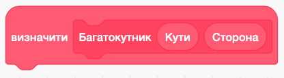
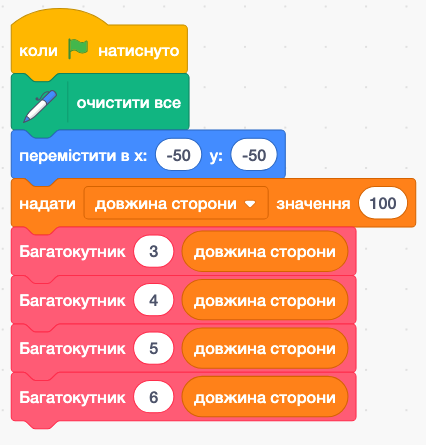
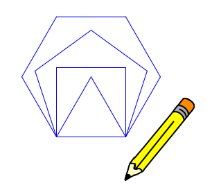

# **Поділ на підзадачі в середовищі Scratch з використанням власних блоків**

## Практична частина 👷

## Урок **62**

---

## Завдання

  

1. Створи [власний блок Scratch](https://ysenko.github.io/it-lessons-materials/6/61-decomposition-and-custom-blocks.html#5) - **Багатокутник**, який дозволяє намалювати будь-який багатокутник (3 або більше сторони).
2. Блок має отримувати 2 числа:
   1. Кількість кутів багатокутника
   2. Довжина сторони багатокутника
   
3. Створи програму (див малюнок праворуч 👉), що використовує твій блок, щоб намалювати трикутник, квадрат пʼятикутник і шестикутник (див. приклад малюнку на наступному слайді).

💡 **Підказка** щоб визначити кут повороту, для малювання багатокутника скористайся формулою `кут = 360 / кількість сторін`
  

  

  

  

---

## Приклад малюнку, що створює програму

