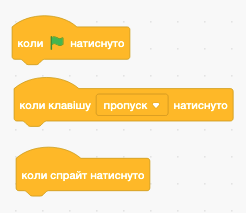
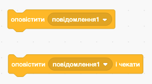
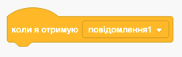

# Події у Scratch 🚀

*Організація взаємодії між об’єктами*

## 🏫 Урок **62**

---

## 🎯 Сьогодні ми дізнаємося

- ❓ Що таке **подія** в програмуванні.
- ⌨️ Як керувати героями за допомогою клавіш та мишки.
- 📱 Як об'єкти спілкуються між собою за допомогою **повідомлень**.
- 🛠️ Як створити справжню командну роботу спрайтів.

---

## 🧠 Пригадаймо!

  

### 🐱 Спрайт

Це об'єкт (герой), який виконує команди.

  

  

### 🛠️ Властивості

Розмір, колір, напрямок, координати X та Y.

  

  

### 📜 Скрипт

Послідовність блоків, що задають дії.

  

---

## ⚡ Що таке подія?

**Подія** — це сигнал для комп'ютера, що пора запускати певний скрипт. Без події жодна програма не почне працювати!

  

### Основні події:

- 🟢 Зелений прапорець
- ⌨️ Клавіша клавіатури
- 🖱️ Натиснуто на спрайт

  

  

  

---

## 💬 Аналогія: Чат класу

Уявіть, що ваші спрайти — це учні в групі Viber або Telegram.

- 👩‍🏫 **Вчитель** (один спрайт) пише: *"Завтра всі принесіть змінне взуття!"*
  (Це блок **«Оповістити»**)
- 🔔 **Учні** (інші спрайти) отримують сповіщення.
  (Це блок **«Коли я отримаю»**)
- 👟 **Кожен реагує по-своєму**: хтось іде чистити кросівки, хтось шукає пакет для взуття, а хтось ігнорує.

---

## 🛠️ Блоки повідомлень

**Оповістити [повідомлення]**

Надсилає сигнал усім об'єктам.

**Коли я отримаю [повідомлення]**

Чекає на свій сигнал і запускає скрипт.

> 💡 **Порада**: Давай повідомленням зрозумілі назви, наприклад: `старт_гри`, `день`, `ніч`, `вогонь`.

---

## 🧪 Демонстрація: «Магічна кнопка»

Спробуємо створити таку взаємодію:

1. 🔘 **Спрайт Кнопка**:
   - При натисканні на неї — оповістити `танцюй`.
2. 🐻 **Спрайт Ведмідь**:
   - Коли отримає `танцюй` — повторити 5 разів:
     - змінити ефект колір на 25
     - змінити розмір на 10
     - чекати 0.5 сек
     - змінити розмір на -10
     - чекати 0.5 сек

**Результат**: ведмідь «пульсує» та змінює колір після кожного натискання! ✨

---

## 💻 Практичне завдання (на вибір)

### 📘 Рівень 1: Діалог 🗣️

1. **Кіт** (`Cat`):
   - **Коли натиснуто 🟢** $\rightarrow$ Каже "Привіт!" $\rightarrow$ Оповіщає `вітання`.
2. **Собака** (`Dog`):
   - **Коли я отримую** `вітання`:
   - Чекає 1 сек $\rightarrow$ Каже "Гав! Радий бачити!".

### 🌟 Рівень 2: Лабораторія ✨

1. **Чарівник** (`Wizard`):
   - **Коли спрайт натиснуто** $\rightarrow$ Оповіщає `магія`.
2. **Предмет** (`Star` або `Crystal`):
   - **Коли я отримую** `магія`:
   - **Повторити 10 разів**:
     - Повернути на 36°
     - Змінити ефект колір на 25

**Результат**: предмет обертається і переливається кольорами! 🌈

---

## ❓ Питання для роздумів

1. Чи може один спрайт надіслати повідомлення сам собі? 🤔
2. Що станеться, якщо два спрайти будуть чекати на одне і те саме повідомлення? 👥
3. Чому блоки повідомлень кращі, ніж блок "чекати 2 секунди"? ⏳

---

## 🏠 Домашнє завдання

- 📖 Прочитати розділ підручника про події та оповіщення (с. 209-213).
- 📝 Записати в зошит 3 приклади подій із реального життя (наприклад: дзвінок у двері → ви йдете відчиняти).
