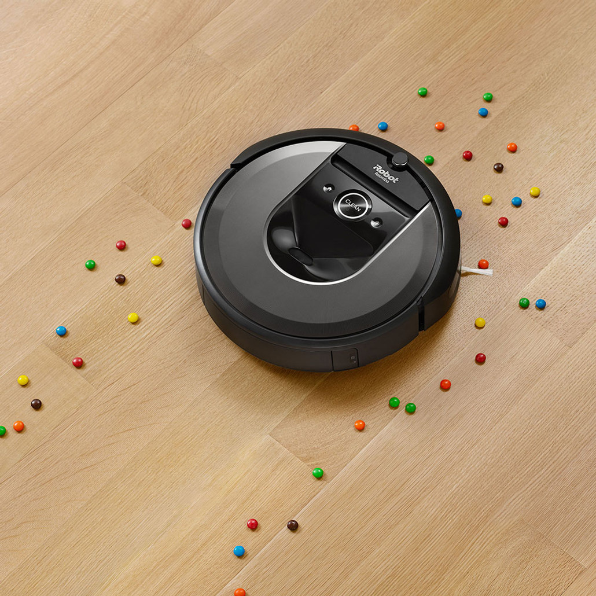
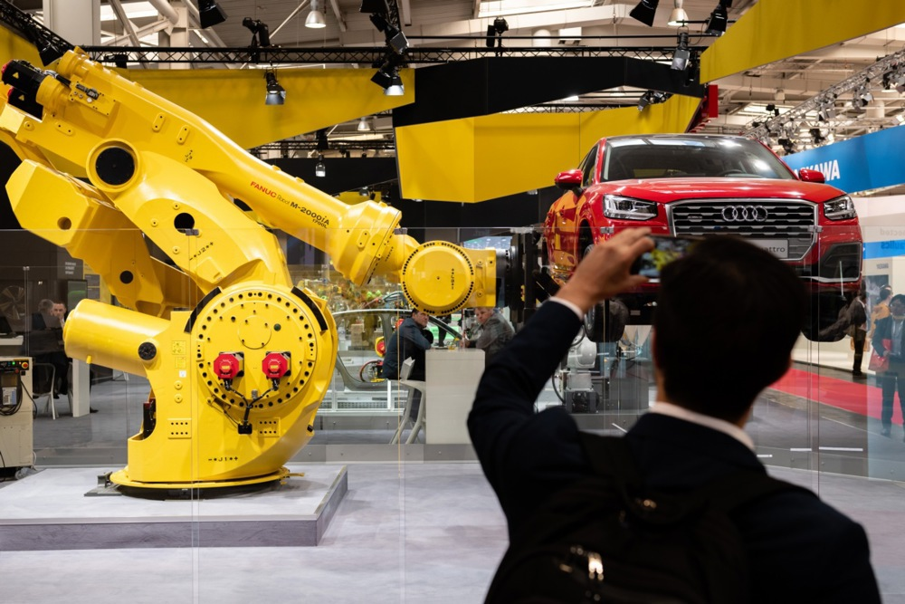
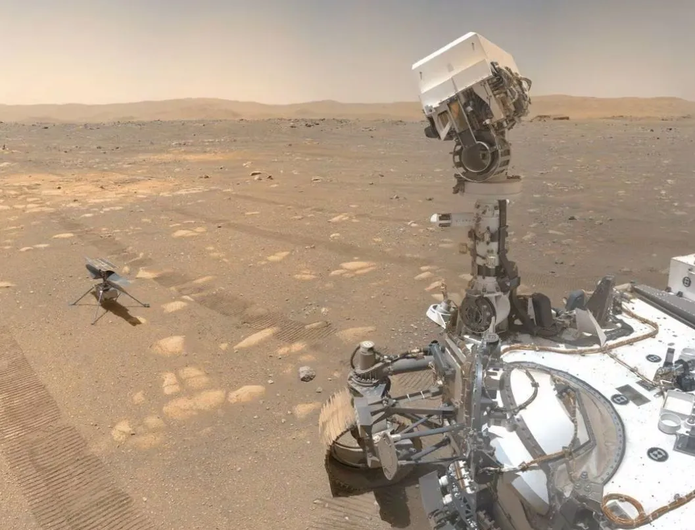
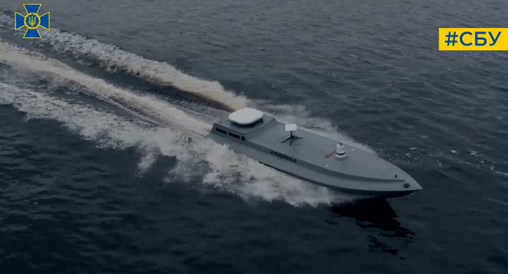

# 🤖 Роботи, типи роботів та їх призначення

## Урок **64**  
Інформатика | 6 клас

---

## 🎯 Мета уроку

- Дізнатися, що таке робот
- Розглянути типи роботів і приклади їх застосування
- Зрозуміти, навіщо люди створюють роботів

---

## ❓ Що таке робот?

**Робот** — це автоматизований пристрій, який  
виконує дії самостійно або за командою людини.

📌 Роботи можуть рухатись, говорити, захоплювати предмети, вимірювати температуру тощо.

---

## ⚙️ Основні частини робота

- 🔌 **Джерело живлення** — акумулятор або батарея  
- 🧠 **Контролер** — «мозок» робота  
- 👂 **Датчики** — «вуха» й «очі»  
- 🦾 **Виконавчі механізми** — «руки» і «ноги»

---

## 🏠 Побутові роботи

  

- 🤖 Робот-пилосос  
- 🪟 Робот для миття вікон  
- 🗣️ Голосовий асистент (наприклад, Alexa, Google Assistant)

**Призначення:** допомога вдома, прибирання, голосове керування технікою

  

  

  

---

## 🏭 Промислові роботи

  

- 🦾 Робот-маніпулятор на заводі  
- 🤖 Роботи для складання авто або упаковки товарів

**Призначення:** автоматизація виробництва, точність і швидкість

  

  

  

---

## 🏥 Медичні роботи

  

- 🤖 Хірургічні роботи (наприклад, Da Vinci)  
- 🦿 Роботи-протези

**Призначення:** допомога лікарям і пацієнтам

  

  

  

---

## 🔬 Цікаві факти про робота Da Vinci

- 🤖 **Робот, яким керує лікар!**  
   Ним керують хірурги через спеціальний пульт.
- 👀 **Бачить краще, ніж людина**  
   Дає зображення в 3D і з великою точністю.
- 🪛 **Рухи точніші за людські пальці**  
   «Руки» робота можуть обертатися на 360°!
- 🧵 **Може шити всередині тіла**  
   Використовує надтонкі нитки для внутрішніх швів.

---

## 🚀 Дослідницькі роботи

  

- 🛸 Марсоходи  
- 🌊 Підводні дрони

**Призначення:** дослідження космосу, океанів і важкодоступних місць

  

  

  

---

## 🔭 Марсохід Perseverance

1. 🚀 Приземлився на Марс 18 лютого 2021 року, у кратері Єзеро  
2. 🔍 Досліджує, чи було життя на Марсі  
3. 🧪 Має "лабораторію на колесах" із камерами, лазером і мікрофонами  
4. 🧠 Має штучний інтелект — обирає маршрут і уникає каміння  
5. 📦 Збирає зразки ґрунту для повернення на Землю

---

## 🚁 Гелікоптер Ingenuity

1. 🚁 Перший політ на іншій планеті — 19 квітня 2021  
2. ⚖️ Важить лише 1,8 кг — як ноутбук!  
3. 🌬️ Летить навіть у тонкій атмосфері Марса  
4. 🔄 Планували 5 польотів, а він зробив понад 70  
5. 🧭 Допомагає Perseverance шукати безпечний маршрут

---

## 🎮 Розважальні роботи

- 🤖 Іграшкові роботи  
- 🕹️ Аніматроніка

**Призначення:** розваги, навчання, шоу

---

## 🛡️ Військові та рятувальні роботи

  

- 🚁 Дрони-розвідники  
- 🤖 Роботи-сапери  
- 🚒 Роботи-рятувальники

**Призначення:** виконання небезпечних завдань

  

  

  

---

## 🌊 Морський дрон Sea Baby

- 🚤 **Sea Baby** — український безпілотний морський дрон, розроблений Службою безпеки України (СБУ) для виконання спеціальних завдань у Чорному морі.

- 💥 **Вантажопідйомність:** може нести до **850 кг** вибухівки, що дозволяє ефективно уражати ворожі цілі.

- 🛰️ **Керування:** оснащений системами зв'язку, включаючи супутниковий зв'язок, що забезпечує точне дистанційне керування.

- ⚙️ **Універсальність:** Sea Baby може бути оснащений різними видами озброєння.

- 🧠 **Розвиток:** постійно вдосконалюється, включаючи встановлення додаткових систем озброєння та покращення технічних характеристик.

---

## 🧠 Для чого створюють роботів?

- Полегшення праці людини  
- Виконання небезпечних або нудних завдань  
- Автоматизація процесів  
- Дослідження та інновації

---

## 🏠 Домашнє завдання

Переглянь [відео про те чому зник Марсіанський гелікоптер Ingenuity](https://youtu.be/ADf8OFqNdpc?si=KtzprsTG1NFtIPPS)

