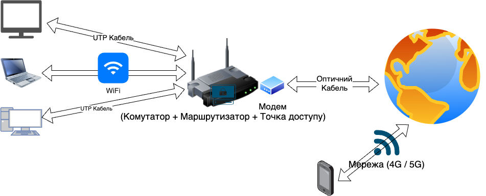

# 🌐 Комп’ютерні мережі

## Урок **01**

---

# 🎯 Ми дізнаємося

- Що таке **комп’ютерна мережа**
- Які бувають **типи мереж**: LAN (локальна), MAN (регіональна), WAN (глобальна), PAN (персональна), корпоративна
- Вивчимо основне **мережеве обладнання**
- Вивчимо **топології мереж**
- Дізнаємося, що таке **IP-адреса** і навіщо вона потрібна

---

# 🔎 Що таке комп’ютерна мережа?

> **Комп’ютерна мережа** — це з’єднання пристроїв (комп’ютерів, смартфонів, принтерів тощо), щоб **обмінюватися даними** і спільно користуватися ресурсами (Інтернет, файли, принтери).

- Домашній Wi-Fi → телефон, ноутбук, телевізор
- Шкільний комп’ютерний клас → спільний принтер, файли
- Мобільний Інтернет → вихід у мережу з будь-якого місця

---

# 🧭 Типи мереж (огляд)

- **LAN** (локальна): приміщення/будівля (школа, офіс, дім)
- **MAN** (регіональна): місто, район
- **WAN** (глобальна): країни та континенти, **Інтернет**
- **PAN** (персональна): навушники Bluetooth + смартфон
- **Корпоративна мережа**: мережа організації з філіями

---

# 🧩 Застосування типів мереж

**LAN** (локальна)

- Школа/офіс/дім: спільний принтер, файловий сервер
- Висока швидкість у межах будівлі

**MAN** (регіональна)

- Міські служби, університетські кампуси
- Об’єднання кількох LAN у межах міста

**WAN** (глобальна)

- Зв’язок між країнами, дата-центрами
- Доступ до Інтернет-ресурсів

**PAN**  (персональна)

- Телефон ↔ навушники/смарт-годинник
- Дуже мала відстань, бездротово

**Корпоративна**

- Компанія з кількома офісами
- VPN, захищений обмін даними

---

# 🧰 Обладнання мережі

- **Кабель Ethernet (UTP)** — з’єднання пристроїв
- **Комутатор (Switch)** — поєднує багато пристроїв у LAN
- **Маршрутизатор (Router)** — з’єднує мережі між собою, вихід в Інтернет
- **Точка доступу Wi-Fi (AP)** — бездротове підключення
- **Модем** — перетворює сигнал провайдера (оптика/DSL/4G/5G)

---

# 🗺️ Топології мереж

- **Шина** / **Ланцюг** — усі на одному спільному каналі
- **Зірка** — усі до центрального вузла (часто: комутатор)
- **Кільце** — з’єднання по колу, передача «по черзі»
- **Комбінована (гібридна)** — поєднання кількох підходів

---

# 🧮 Що таке IP-адреса?

- **IP-адреса** — унікальна адреса (або номер) пристрою в мережі
- Потрібна, щоб знати куди відправляти дані
- Приклад IPv4: `192.168.1.5`
- У домашніх та шкільних мережах часто використовують **приватні** адреси (`192.168.x.x`, `10.x.x.x`)
- Кожен пристрій у мережі має **унікальну** IP-адресу

---

# 🧠 Міні-вікторина (перевір себе)

1) Яка мережа використовується в межах школи?
2) Для чого потрібен **маршрутизатор**?
3) Як називається «номер пристрою» у мережі?
4) Назвіть будь-яку **топологію**.
5) Для чого застосовують **точку доступу Wi-Fi**?

---

# 📚 Підсумок

- Мережа = **з’єднання пристроїв** для обміну даними
- Типи: **LAN, MAN, WAN, PAN, корпоративна**
- Обладнання: **кабель, switch, router, Wi-Fi AP, модем**
- Топології: **шина, зірка, кільце, гібрид**
- **IP-адреса** = адреса пристрою в мережі

---

# 🛠️ Домашнє завдання

1. Прочитати с. 5-11 (Крок 1-8)
2. (Виконати в зошиті) Вкажіть **тип мережі** для кожної ситуації:
   - Місто підключає школи між собою → ?
   - Телефон з’єднується з навушниками → ?
   - Підрозділи компанії у різних країнах → ?
   - Підключають телефон до мережі Wifi Вдома → ?
