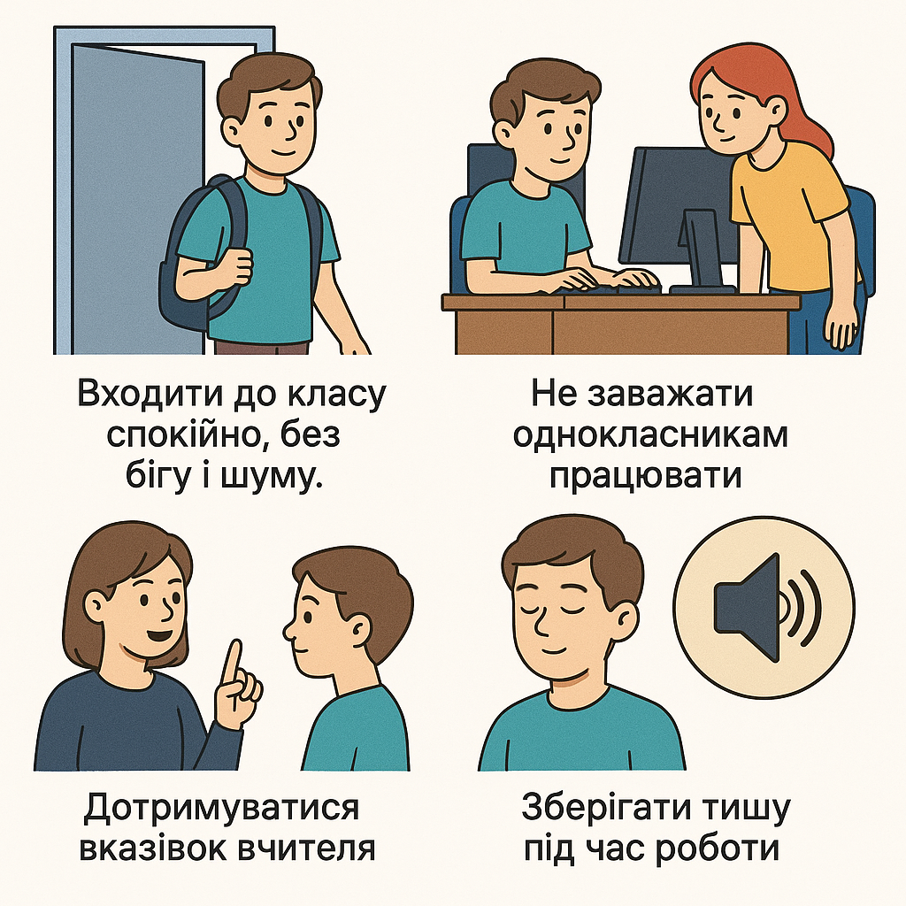
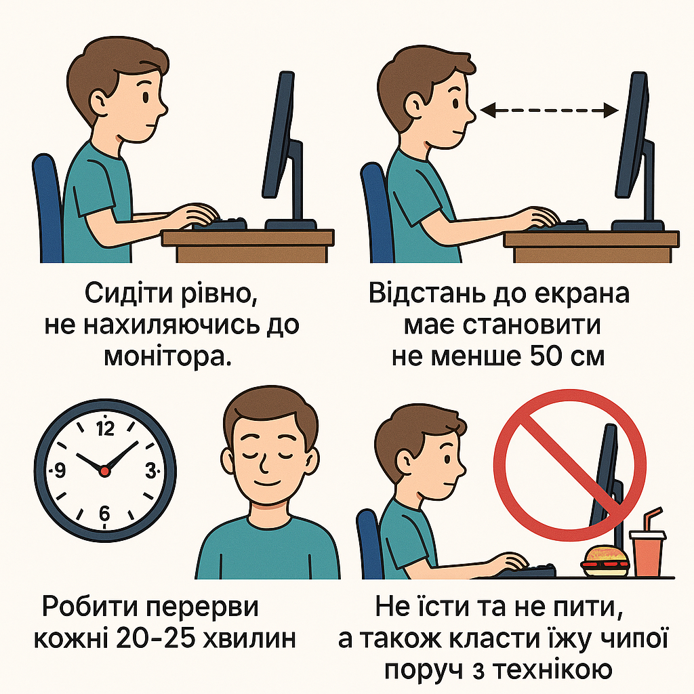

# Правила безпеки в кабінеті інформатики

## Урок **01**

---

## 🎯 Сьогодні ми дізнаємося про

- Основні правила техніки безпеки в кабінеті інформатики
- Правила роботи за комп’ютером для учнів
- Правила поведінки у кабінеті інформатики
- Правила поведінки на уроці інформатики

---

## Основні правила техніки безпеки в кабінеті інформатики

<section class="centered-content">

</section>

---

## Основні правила техніки безпеки в кабінеті інформатики

<section class="centered-content">

</section>

---

## Правила роботи за комп’ютером для учнів

<section class="centered-content">

</section>

---

## Суворо заборонено!

  

1. Чіпати розʼєми кабелів, торкатися до проводів живлення і пристроїв заземлення.
2. Доторкатися до екрана з тильного боку монітора
3. Вимикати і вмикати апаратуру без вказівчи вчителя
4. Працювати з вологими руками
5. Класти речі або одяг на монітор, системний блок та інші компоненти компʼютера

  

  

  

