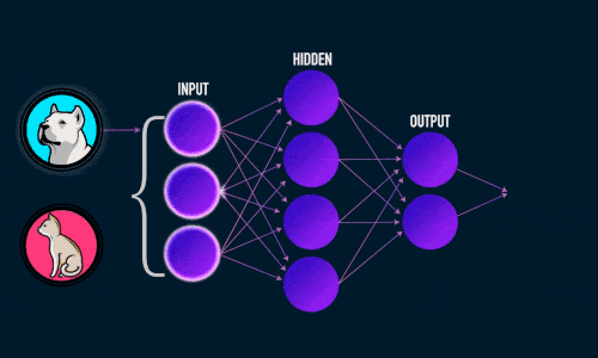
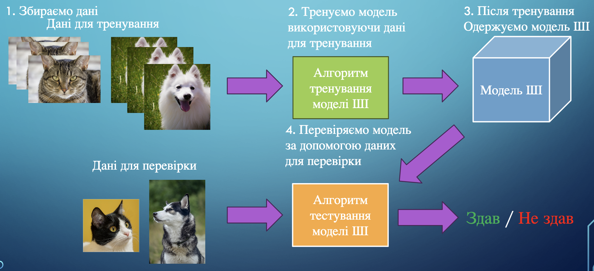

# 🤖✨ Поняття про штучний інтелект

## 🏫📘 Урок **02**

---

## 🎯 Сьогодні ми дізнаємося

- 🤖 Що таке **штучний інтелект**
- 🧠 Що таке **нейронна мережа**
- 🎨 Що таке **генеративний штучний інтелект**
- 🏋️‍♂️ Як навчають штучний інтелект

---

## 🤖 Що таке штучний інтелект

**Штучний інтелект (ШІ)** — це комп'ютерна система, яка може виконувати завдання, що зазвичай потребують людського інтелекту: 🗣️ розпізнавання мови, 🖼️ аналіз зображень, 🧩 прийняття рішень тощо.

---

## 🧠 Що таке нейронна мережа

  

**Нейронна мережа** — це математична модель, яка імітує роботу мозку 🧠. Вона допомагає вирішувати різноманітні задачі: 📊 класифікацію, 📈 прогнозування, 🎨 генерацію.

  

  

  

---

## 🎨🖌️ Що таке генеративний штучний інтелект

**Генеративний ШІ** — це системи штучного інтелекту, що здатні створювати новий контент: 📝 текст, 🖼️ малюнки, 🔊 звуки, 🎬 відео тощо, з мінімальною участю людини.

---

## 🏋️‍♂️📚 Як навчають штучний інтелект

<section class="image-center">

</section>

---

## 🌍🤖 Де використовується штучний інтелект?

- 📱 У смартфонах (розпізнавання обличчя, голосові помічники)
- 🚗 В автомобілях (автопілот, допомога водію)
- 🏥 У медицині (діагностика, аналіз знімків)
- 🎮 В іграх (розумні суперники)
- 🛒 В інтернет-магазинах (рекомендації товарів)
- 📷 В соцмережах (фільтри, модерація контенту)

---

## ⚠️🛡️ Етичні питання та ризики ШІ

- 🔒 Захист персональних даних
- 🤔 Чи може ШІ приймати важливі рішення замість людини?
- 🧑‍💻 Вплив на ринок праці (автоматизація)
- 🦾 Чи може ШІ бути упередженим?
- 🛡️ Як контролювати використання ШІ?

---

## 📝🎲 Завдання

1. 💡 Скористайтеся ШІ-сервісами для генерації зображень:
   - 🖼️ [craiyon.com](https://www.craiyon.com/en)
   - 🖌️ [perchance.org/ai-drawing-generator](https://perchance.org/ai-drawing-generator)
   - 🎨 [aicomicfactory.com/playground](https://aicomicfactory.com/playground)

Відповідь на запитання:
- ⭐ Який із сервісів створює найкраще зображення?
- 🔍 Як можна покращити якість зображення, щоб воно більше відповідало вашим запитам?
