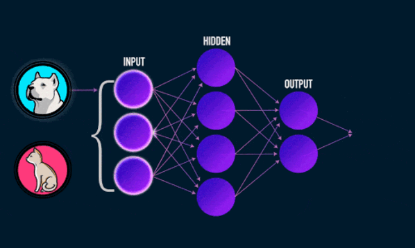
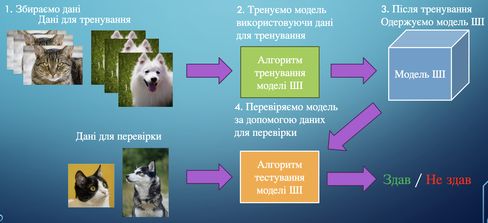

# 🤖✨ Поняття про штучний інтелект

## 🏫 Урок **02**

---

## 🛡️ Пригадуємо: техніка безпеки

- 🖥️ Сідаємо рівно, відстань до екрана — довжина витягнутої руки.
- 🚫 Без їжі, напоїв та верхнього одягу в кабінеті інформатики.
- 🔌 Не чіпаємо кабелі, роз'єми, задню панель монітора чи системного блока.
- ⚡ Не вмикаємо/вимикаємо комп'ютер самостійно, не відкриваємо системний блок.
- 🔥 Побачили дим, почули незвичний звук або сталася помилка — одразу повідомляємо вчителя.

---

## 🎯 Сьогодні ми дізнаємося

- 🤖 Що таке **штучний інтелект**
- 🧠 Що таке **нейронна мережа**
- 🎨 Що таке **генеративний штучний інтелект**
- 🏋️‍♂️ Як навчають штучний інтелект

---

## 🤖 Що таке штучний інтелект

**Штучний інтелект (ШІ)** — це комп'ютерна система, яка може виконувати завдання, що зазвичай потребують людського інтелекту: 🗣️ розпізнавання мови, 🖼️ аналіз зображень, 🧩 прийняття рішень тощо.

---

## 🧠 Що таке нейронна мережа

  

**Нейронна мережа** — це математична модель, яка імітує роботу мозку 🧠. Вона допомагає вирішувати різноманітні задачі: 📊 класифікацію, 📈 прогнозування, 🎨 генерацію.

Свою назву вона отримала від штучних «нейронів» — маленьких «будівельних блоків», які, подібно до нейронів мозку, приймають інформацію, обробляють її та передають далі через з'єднання між собою. 🔗

  

  

  

---

## 🎨🖌️ Що таке генеративний штучний інтелект

**Генеративний ШІ** — це системи штучного інтелекту, що здатні створювати новий контент: 📝 текст, 🖼️ малюнки, 🔊 звуки, 🎬 відео тощо, з мінімальною участю людини.

---

## ️‍️📚 Як навчають штучний інтелект

<section class="image-center">

</section>

---

## 🔎 Вхідні дані → результат

🚗 **Безпілотний автомобіль**
Вхідні дані: карти, дані датчиків (швидкість, відстань, камери), дорожній рух, погода
Результат: безпечний маршрут руху

🎧 **Персональний ді-джей**
Вхідні дані: пісні, які ви слухали, вподобали чи пропустили
Результат: підбірка музики під ваш смак

---

## 🌍🤖 Де використовується штучний інтелект?

- 📱 У смартфонах (розпізнавання обличчя, голосові помічники)
- 🚗 В автомобілях (автопілот, допомога водію)
- 🏥 У медицині (діагностика, аналіз знімків)
- 🎮 В іграх (розумні суперники)
- 🛒 В інтернет-магазинах (рекомендації товарів)
- 📷 В соцмережах (фільтри, модерація контенту)

---

## ⚠️🛡️ Етичні питання та ризики ШІ

- 🔒 Захист персональних даних
- 🤔 Чи може ШІ приймати важливі рішення замість людини?
- 🧑‍💻 Вплив на ринок праці (автоматизація)
- 🦾 Чи може ШІ бути упередженим?
- 🛡️ Як контролювати використання ШІ?

---

## ⁉️ Користь чи ризик? Обговорюємо в парах

<section class="task text-medium-small">

Оцініть кожен приклад: це **користь** ✅ чи **ризик** ⚠️ від штучного інтелекту?

1. 📰 Створення переконливих фальшивих новин і зображень
2. 🎨 Створення якісного творчого контенту (музика, малюнки, тексти)
3. ©️ Використання чужих даних без згоди автора
4. ⚡ Допомога людям бути продуктивнішими в роботі
5. 🎭 Видавання себе за іншу людину (дипфейки)
6. 📚 Допомога в навчанні та здобутті нових навичок

</section>

---

## ✏️🧠 Практична робота: намалюй, а ШІ вгадає

<section class="task text-medium">

1. ⌨️ Відкрийте [quickdraw.withgoogle.com](https://quickdraw.withgoogle.com)
2. 🖱️ Малюйте запропоноване слово — нейронна мережа намагається вгадати його за лічені секунди
3. 🔁 Зіграйте кілька раундів у парі

Обговоріть:
- 📥 Що тут є **вхідними даними**, а що — **результатом**?
- 🆚 Чим це відрізняється від генеративного ШІ?

</section>

---

## 🏠📝 Домашнє завдання

1. 📖 Прочитати с. 11-15 підручника (Кроки 7-10)
2. ✅ **Обов'язково:** завдання 15-16 підручника (с. 16) — визначте, які вхідні дані потрібні ШІ для рекомендацій відео на YouTube і персоналізованої реклами, обґрунтуйте письмово
3. 🌟 **За бажанням:** скористайтеся ШІ-сервісами для генерації зображень:
   - 🖼️ [craiyon.com](https://www.craiyon.com/en)
   - 🖌️ [perchance.org/ai-drawing-generator](https://perchance.org/ai-drawing-generator)
   - 🎨 [aicomicfactory.com/playground](https://aicomicfactory.com/playground)
