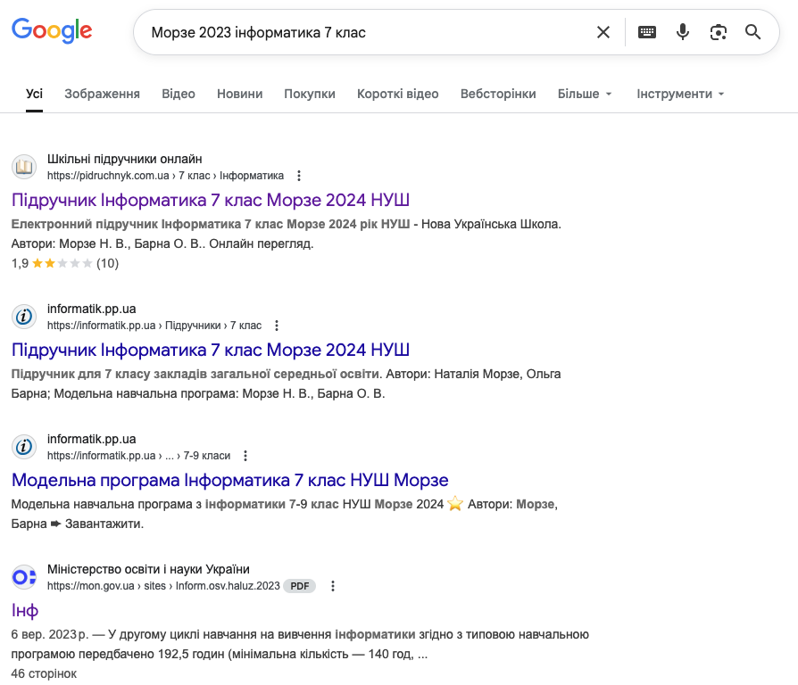
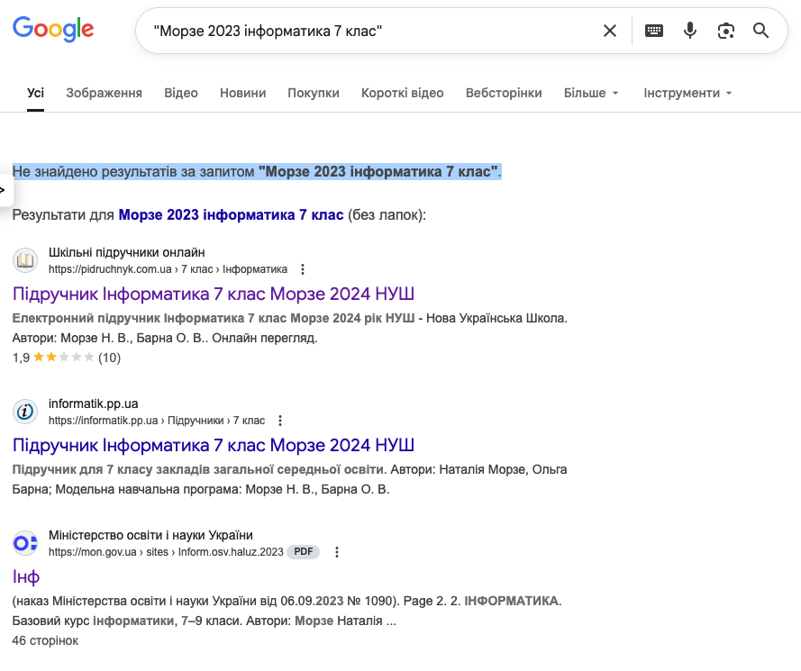
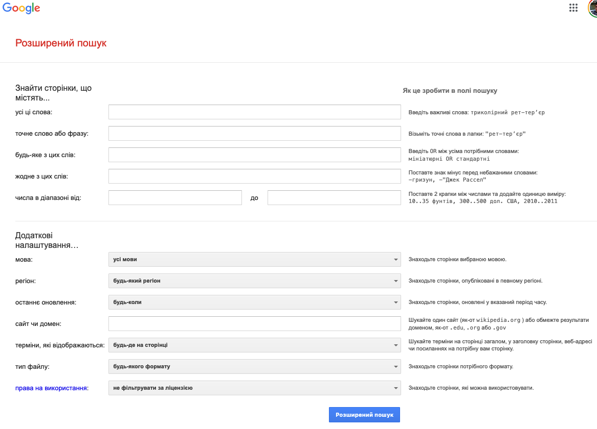

# 🔎🌐 Пошук інформації в інтернеті

## 🏫📘 Урок **03**

---

## 🎯 Сьогодні ми дізнаємося

- 🔍 Які бувають види пошуку
- 🧩 Оператори мови запитів Google
- 🛠️ Розширений пошук Google

---

## 🗂️ Які бувають види пошуку?

- 📝 Простий
- 🧠 Контекстний
- ⚙️ Розширений

---

## 📝 Простий пошук

  

Простий пошук знаходить сторінки, що містять будь-яке слово з пошукового запиту.

  

  

  

---

## 🧠 Контекстний пошук

  

Контекстний пошук знаходить сторінки, що **точно** відповідають пошуковому запиту. 
Для контекстного пошуку фразу, зазвичай, беруть у лапки.

  

  

  

---

## ⚙️ Розширений пошук

  

[Розширений пошук Google](https://www.google.com/advanced_search) дозволяє точно налаштувати параметри пошукового запиту.

Щоб скористатися розширеним пошуком, перейдіть на сторінку [https://www.google.com/advanced_search](https://www.google.com/advanced_search) або використовуйте оператори мови пошукового запиту.

  

  

  

---

## 🧩 Корисні оператори мови пошукового запиту Google

<section class="text-small">

| Оператор | Призначення | Приклад |
| -------- | ----------- | ------- |
| " "      | 🔎 Пошук точного вислову (контекстний пошук) | "інформатика 7 клас" |
| * | ✨ Будь-яке слово замість зірочки | Інформатика * клас |
| & | 🔗 Слова ліворуч і праворуч мають бути в одному реченні | інформатика 7 & клас|
| + | ➕ Сторінка має містити точне слово (плюс не відокремлюється пробілом) | ігри онлайн +і |
| - | ➖ Сторінка не має містити слово (мінус не відокремлюється пробілом) | ігри -онлайн |
| site: | 🌍 Пошук на конкретному сайті | site:rozetka.com.ua "iphone 16" |

</section>

---

## 📝 Практичне завдання (5 хв)

<section class="text-medium">

1. Знайдіть у Google інформацію про "найбільше озеро України" так, щоб у результатах були тільки сторінки з сайту wikipedia.org.
   - Використайте оператор: `site:wikipedia.org "найбільше озеро України"`
2. Знайдіть у Google рецепти піци, але виключіть сторінки, де згадується слово "гриби".
   - Використайте оператор: `рецепт піци -гриби`
3. Спробуйте розширений пошук Google, щоб знайти зображення кота, які можна використовувати безкоштовно (з ліцензією для повторного використання).

</section>

---

## 🏠 Домашнє завдання

1. 🔎 Знайдіть у Google інформацію про "найвища гора України" лише на сайті wikipedia.org.
2. ➖ Знайдіть у Google цікаві факти про космос, але виключіть сторінки, де згадується слово "NASA".
3. 🔗 Знайдіть у Google сторінки, де слова "інформатика" і "цікаві факти" зустрічаються в одному реченні.
