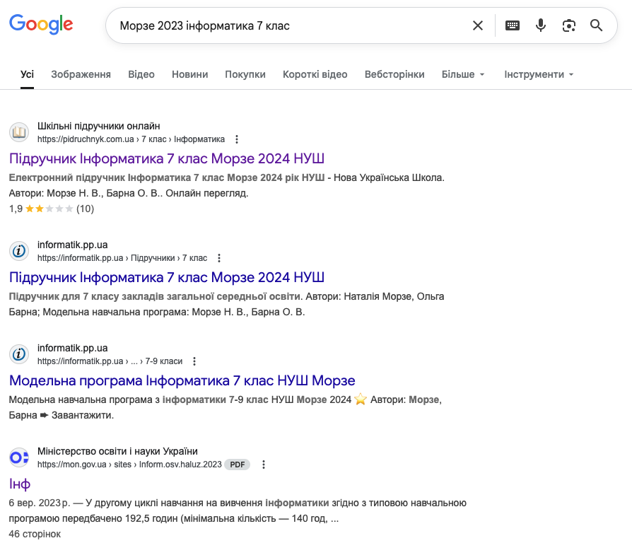
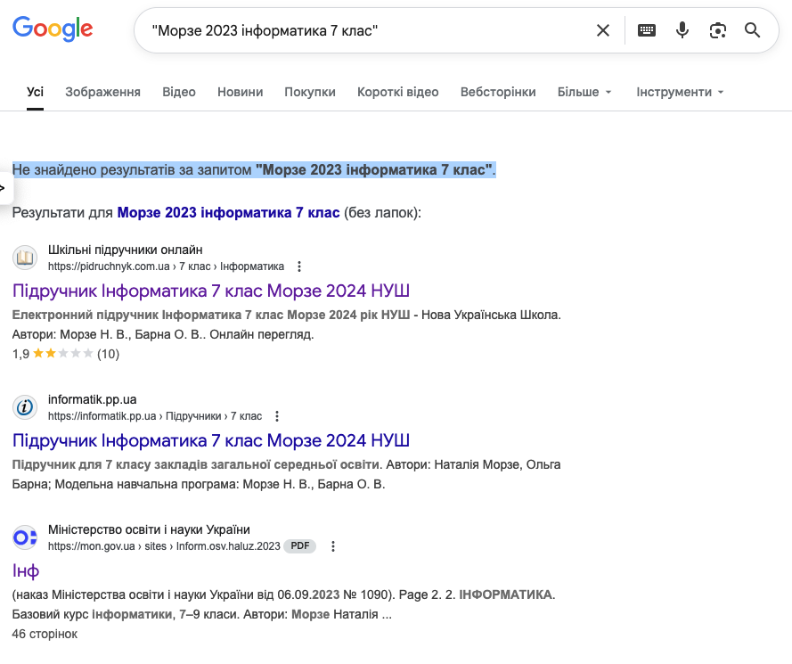
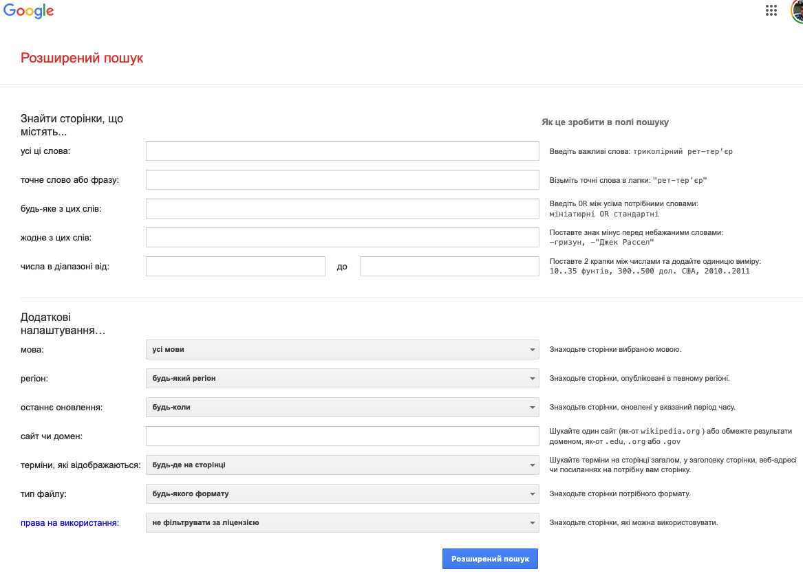

# 🔎🌐 Пошук інформації в інтернеті

## 🏫 Урок **03**

---

## 🛡️ Пригадуємо: техніка безпеки

- 🖥️ Сідаємо рівно, відстань до екрана — довжина витягнутої руки.
- 🚫 Без їжі, напоїв та верхнього одягу в кабінеті інформатики.
- 🔌 Не чіпаємо кабелі, роз'єми, задню панель монітора чи системного блока.
- ⚡ Не вмикаємо/вимикаємо комп'ютер самостійно, не відкриваємо системний блок.
- 🔥 Побачили дим, почули незвичний звук або сталася помилка — одразу повідомляємо вчителя.

---

## 🎯 Сьогодні ми дізнаємося

- 🔍 Які бувають види пошуку в інтернеті
- 🧩 Чинні оператори мови запитів Google
- 🛠️ Стратегію ефективного розширеного пошуку
- ✏️ Як застосувати оператори пошуку на практиці

---

## 🗣️ Актуалізація знань

Опитування та перевірка домашнього завдання.

---

## 💡 «Хто володіє інформацією, той володіє світом»

В інтернеті — мільярди сторінок.

❓ Як серед них швидко знайти саме те, що потрібно?

---

## 🗂️ Які бувають види пошуку?

- 📝 **Простий** — за одним чи кількома ключовими словами
- 🧠 **Контекстний** — за точним висловом (у лапках)
- ⚙️ **Розширений** — комбінація ключових слів з операторами

---

## 📝 Простий пошук

  

Простий пошук знаходить сторінки, що містять будь-яке слово з пошукового запиту. Використовують для нескладних, однозначних питань.

  

  

  

---

## 🧠 Контекстний пошук

  

Контекстний пошук знаходить сторінки, що **точно** відповідають пошуковому запиту. 
Для контекстного пошуку фразу беруть у лапки `" "`.

  

  

  

---

## ⚙️ Розширений пошук

  

[Розширений пошук Google](https://www.google.com/advanced_search) дозволяє точно налаштувати параметри пошукового запиту.

Скористатися ним можна двома способами: перейти на сторінку google.com/advanced_search або використовувати оператори мови запитів прямо в рядку пошуку.

  

  

  

---

## 🧩 Чинні оператори мови запитів Google

<section class="text-small">

| Оператор | Призначення | Приклад |
| -------- | ----------- | ------- |
| " "      | 🔎 Точний вислів (контекстний пошук) | "інформатика 7 клас" |
| -        | ➖ Сторінка не має містити слово (без пробілу перед словом) | ігри -онлайн |
| site:    | 🌍 Пошук на конкретному сайті | site:wikipedia.org "озеро Світязь" |
| filetype: | 📄 Пошук файлів певного типу | "інформатика" filetype:pdf |
| OR або \| | 🔀 Хоча б одне зі слів | ноутбук OR планшет |
| *        | ✨ Будь-яке слово замість зірочки (у фразі) | "інформатика \* клас" |

</section>

💡 Слова через пробіл (наприклад, <code>інформатика алгоритми</code>) пошукова система і без операторів шукає разом — окремий оператор «AND» не потрібен.

---

## 🛠️ Стратегія ефективного розширеного пошуку

<section class="text-medium-small">

1. 🎯 **Визначити мету пошуку** — що саме потрібно знайти
2. 🔎 **Обрати пошукову систему**
3. ⌨️ **Сформувати запит** з ключовими словами й операторами
4. ▶️ **Здійснити пошук** і оцінити релевантність результатів
5. 🔬 **За потреби деталізувати запит** — додати уточнювальні слова

</section>

---

## 📝✨ Практичне завдання (5-7 хв)

<section class="text-medium">

1. 🌐 Знайдіть у Google інформацію про "найбільше озеро України" так, щоб у результатах були тільки сторінки з сайту wikipedia.org.
   - Використайте оператор: `site:wikipedia.org "найбільше озеро України"`
2. 🍕 Знайдіть у Google рецепти піци, але виключіть сторінки, де згадується слово "гриби".
   - Використайте оператор: `рецепт піци -гриби`
3. 📊 Знайдіть у Google файли презентацій про інформатику у форматі PowerPoint.
   - Використайте оператор: `презентація інформатика filetype:pptx`

</section>

---

## 🔀🐱 Практичне завдання: OR та розширений пошук

<section class="task text-medium">

1. Складіть запит з оператором `OR` (наприклад, `ноутбук OR планшет`) і порівняйте результати із запитом без нього.
2. Спробуйте розширений пошук Google, щоб знайти зображення кота, які можна використовувати безкоштовно (з ліцензією для повторного використання).

</section>

---

## 🤔 Рефлексія

- Який оператор пошуку виявився для вас найкориснішим і чому?
- Чи змінилося ваше уявлення про те, скільки часу можна заощадити, правильно сформулювавши запит?

---

## 🏠📚 Домашнє завдання

У зошиті напиши пошукові запити для таких пошуків:

1. 🏔️ Знайдіть у Google інформацію про "найвища гора України" лише на сайті wikipedia.org.
2. 🚀 Знайдіть у Google цікаві факти про космос, але виключіть сторінки, де згадується слово "NASA".
3. 📄 Знайдіть у Google презентації про інформатику у форматі PowerPoint (файли з PowerPoint зазвичай мають розширення pptx).
