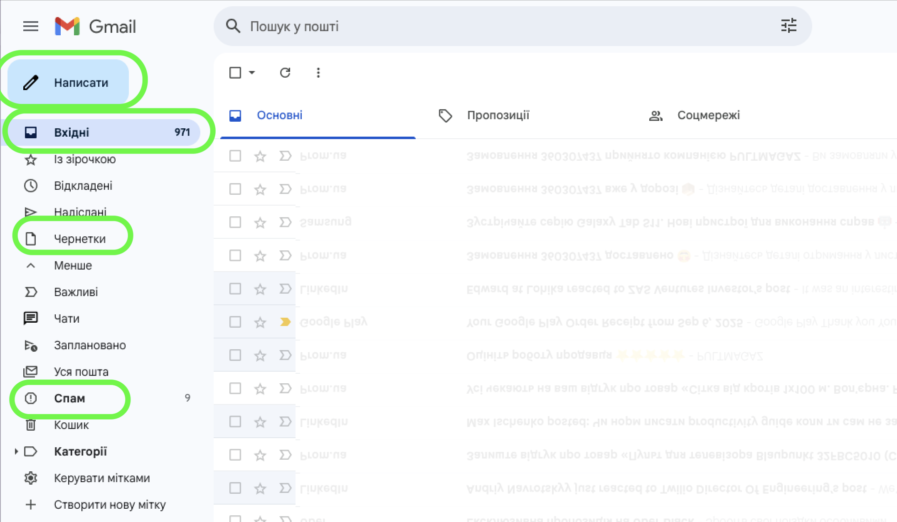
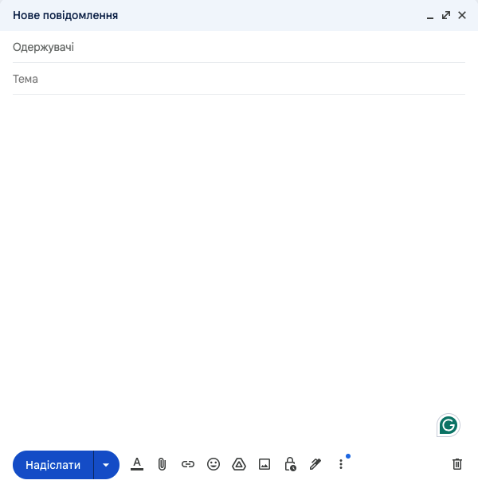
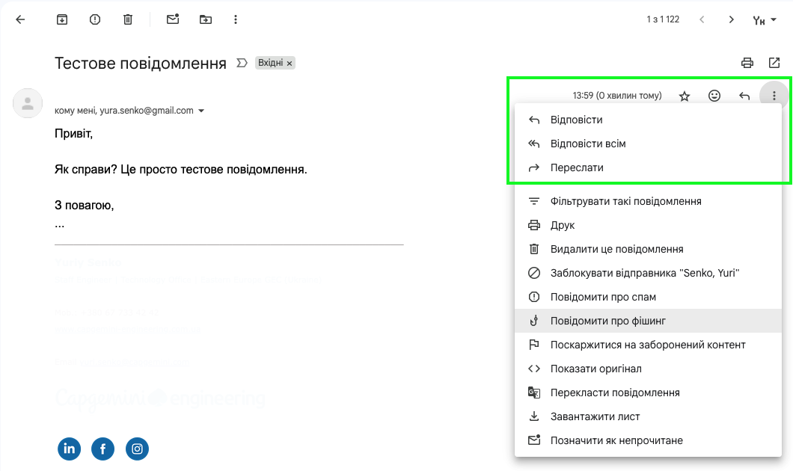

# Надсилання, отримання, та пересилання повідомлень електронної пошти

## Урок **07**

---

## 🎯 На цьому уроці ми дізнаємось

- Як користуватися веб-інтерфейсом Gmail та Proton Mail
- Навчимося:
  - створювати та надсилати листи
  - отримувати та читати листи
  - пересилати й відповідати на листи
  - прикріплювати файли до повідомлень

---

## 🔄 Актуалізація знань

- Що таке електронна пошта?
- Для чого люди користуються поштовими сервісами?
- Чим відрізняється електронний лист від звичайного?

---

## ✉️ Інтерфейс Gmail

  

- 📥 **Вхідні** – отримані листи
- 📤 **Надіслані** – надіслані листи
- 📝 **Чернетки** – незавершені листи
- 🚫 **Спам** – небажані повідомлення
- 🖊️ **Написати** – створити нове повідомлення електронної пошти

  

  

  

---

## 📨 Надсилання листа

  

1. Натиснути кнопку **«Написати»**
2. Вказати одержувачів (*Кому*)
3. (За потреби) вказати одержувачів **копії** (CC), та **прихованої копії** (BCC)
4. Вказати тему листа
5. Написати текст повідомлення
6. За потреби вкласти файли та зображення
7. Натиснути кнопку **«Надіслати»**

  

  

  

---

## 📎 Прикріплення файлів

- Натиснути на значок **📎 Скріпка**
- Обрати файл на комп’ютері
- Максимальний розмір вкладення – **25 МБ**
- Для більших файлів використовується **Google Диск**

---

## 📥 Отримання та читання листа

  

- Листи з’являються у папці **«Вхідні»**
- Щоб відкрити – натиснути на тему листа
- Не відкривайте підозрілі листи та вкладення
- Можна:
  - **Відповісти** (Reply) тільки відправнику
  - **Відповісти всім** (Reply All)
  - **Переслати** (Forward) повідомлення новому одержувачу

  

  

  

---

## 💻 Практична робота

1. Увійдіть у власну поштову скриньку Gmail або Proton Mail
2. Створіть лист і надішліть його на адресу, надану вчителем
3. Додайте до листа вкладений файл (зображення або документ)
4. Отримайте відповідь від вчителя
5. Надішліть лист-відповідь тільки відправнику.
