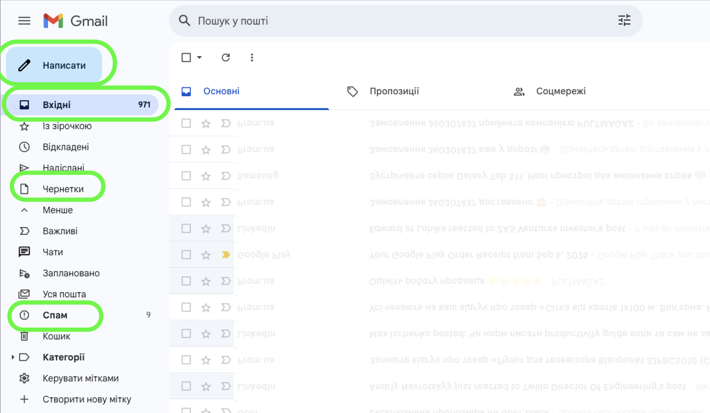
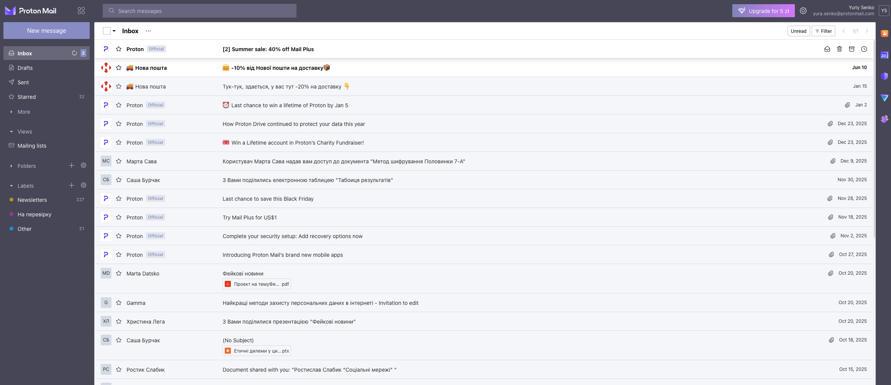
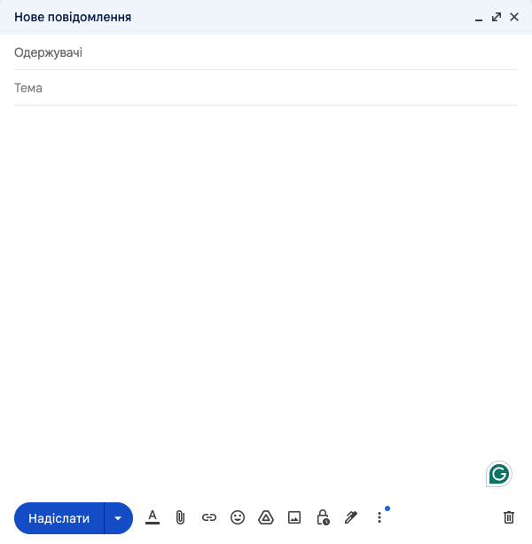
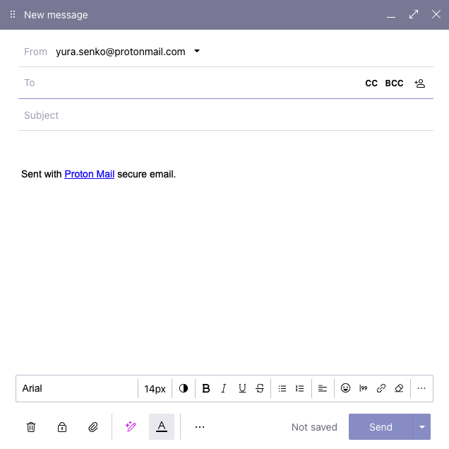
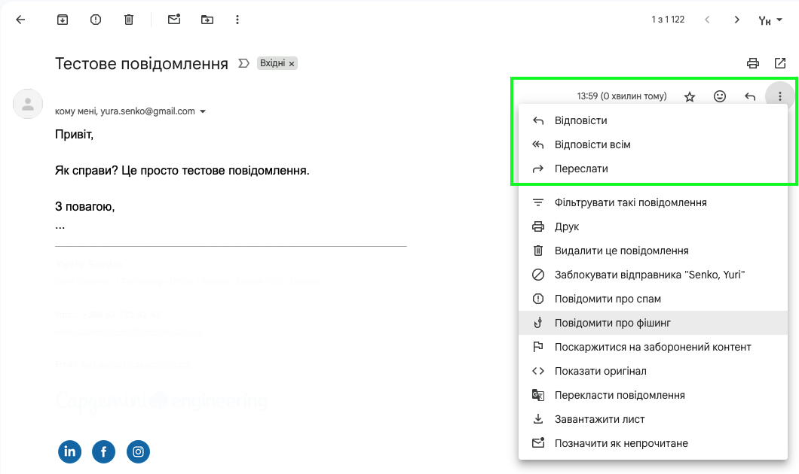
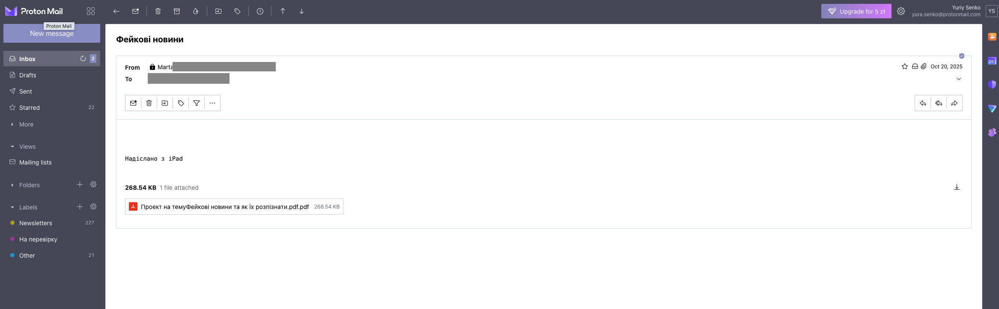
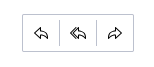

# 📧 Надсилання, отримання, перенаправлення повідомлень. Пересилання файлів

## 🏫 Урок **07**

---

## 🛡️ Пригадуємо: техніка безпеки

- 🖥️ Сідаємо рівно, відстань до екрана — довжина витягнутої руки.
- 🚫 Без їжі, напоїв та верхнього одягу в кабінеті інформатики.
- 🔌 Не чіпаємо кабелі, роз'єми, задню панель монітора чи системного блока.
- ⚡ Не вмикаємо/вимикаємо комп'ютер самостійно, не відкриваємо системний блок.
- 🔥 Побачили дим, почули незвичний звук або сталася помилка — одразу повідомляємо вчителя.

---

## 🎯 Сьогодні ми дізнаємося

- ✉️ Як надсилати листи з полями «Кому», «Копія», «Прихована копія»
- 📎 Як прикріплювати файли до листа
- 📥 Як отримувати, читати листи та зберігати вкладення
- 🔁 Чим «Відповісти» відрізняється від «Переслати»
- 📤 Як пересилати файли разом із повідомленнями

---

## 🔄 Актуалізація знань

- ❓ Що таке поштовий сервер і обліковий запис (акаунт)?
- 📬 Чи всі увійшли у свою поштову скриньку (Proton Mail або Gmail), зареєстровану минулого уроку?
- ✉️ З яких частин складається електронна адреса?

---

## 📁 Структура поштової скриньки

  

- 📥 **Вхідні** – отримані листи
- 📤 **Надіслані** – надіслані листи
- 📝 **Чернетки** – незавершені листи
- 🗑️ **Кошик / Видалені** – видалені листи (можна відновити)
- 🚫 **Спам** – небажані повідомлення

  

  

<!-- TODO: замінити на актуальний знімок вхідних листів у Gmail, якщо інтерфейс змінився -->

<!-- TODO: зробити знімок екрана папки "Вхідні" в Proton Mail (proton.me/mail) з видимим переліком папок ліворуч -->

  

⬆️ Ліворуч — Gmail, праворуч — Proton Mail. Папки мають однакове призначення в обох сервісах.

---

## 📨 Надсилання листа

  

1. Натиснути кнопку **«Написати»**
2. Вказати одержувачів (*Кому*)
3. (За потреби) вказати одержувачів **копії** (CC) та **прихованої копії** (BCC)
4. Вказати тему листа
5. Написати текст повідомлення
6. За потреби вкласти файли та зображення
7. Натиснути кнопку **«Надіслати»**

  

  

<!-- TODO: наявний знімок вікна нового листа в Gmail -->

<!-- TODO: зробити знімок вікна нового листа в Proton Mail з полями Кому/Копія/Прихована копія/Тема/Прикріпити -->

  

---

## 📎 Прикріплення файлів

- Натиснути на значок **📎 Скріпка** («Прикріпити»)
- Обрати файл на комп'ютері
- Максимальний розмір вкладення – **25 МБ**
- Для більших файлів використовується хмарне сховище (Google Диск, Proton Drive) ☁️

---

## 📥 Отримання та читання листа

  

- Листи з'являються у папці **«Вхідні»**
- Щоб відкрити – натиснути на тему листа
- Не відкривайте підозрілі листи та вкладення
- Прикріплені файли можна зберегти на комп'ютер

  

  

<!-- TODO: наявний знімок відкритого листа в Gmail -->

<!-- TODO: зробити знімок відкритого листа з вкладенням у Proton Mail -->

  

---

## 🔀 Відповісти чи переслати?

**↩️ Відповісти (Reply)**
- Лист іде **тільки відправнику**
- Поле «Кому» заповнюється **автоматично**
- Перед темою з'являється `Re:`
- Текст оригінального листа зберігається нижче

**➡️ Переслати (Forward)**
- Лист іде **новому одержувачу**, якого треба обрати самостійно
- Перед темою з'являється `Fwd:`
- **Прикріплені файли пересилаються разом з листом**
- Можна додати власний коментар на початку

<!-- TODO: зробити знімок кнопок "Відповісти" / "Відповісти всім" / "Переслати" під відкритим листом (Gmail або Proton Mail) -->

---

## 📤 Пересилання файлів

- 📎 Якщо переслати лист із вкладенням — файл **не потрібно прикріплювати заново**, він передається разом із повідомленням
- 💾 Отриманий файл можна спочатку зберегти на комп'ютер, а потім прикріпити до нового листа
- ☁️ Для файлів більших за 25 МБ — посилання на хмарне сховище замість вкладення
- 👀 Перш ніж пересилати чужий лист, подумайте, чи варто ділитися ним з новим одержувачем

---

## 🤩 Цікаві факти про електронну пошту

- 📧 Перший електронний лист був надісланий у 1971 році.
- 🌍 Щодня у світі надсилається понад 300 мільярдів електронних листів.
- 🔁 Кнопку «Переслати» придумали, щоб не копіювати текст листа вручну.
- 🚫 Близько половини всіх листів у світі — це спам.
- 🛡️ Більшість сучасних поштових сервісів автоматично фільтрують небезпечні листи та вкладення.

---

## 💻 Практична робота

<section class="task text-medium-small">

Сьогодні листуємося з учителем — адресу він/вона повідомить на початку уроку.

1. ✉️ Складіть лист учителю: тема — **«Практична робота 07»**, у тексті коротко представтеся, прикріпіть власний файл (фото або документ). Натисніть **«Надіслати»**.
2. ⏳ Зачекайте на відповідь від учителя, періодично перевіряючи **«Вхідні»**. Відкрийте відповідь, коли вона прийде, і прочитайте її.
3. 💾 Збережіть прикріплений до відповіді файл на своєму комп'ютері.
4. ↩️ Натисніть **«Відповісти»** та напишіть коротку відповідь учителю.
5. ➡️ Відкрийте відповідь учителя ще раз, натисніть **«Переслати»**, додайте на початку власний коментар і надішліть цей лист учителю повторно.

</section>

---

## 🤔 Обговорення

- 🔁 Чим «Відповісти» відрізняється від «Переслати»?
- 📎 Чому не варто пересилати лист без прикріпленого файлу, якщо файл мав бути в оригіналі?
- 🤐 Чи завжди можна пересилати чужий лист третій особі?

---

## 📌 Висновки

- ✉️ Лист складається з полів «Кому», «Копія», «Прихована копія», «Тема» та тексту
- 📎 До листа можна прикріпити файл розміром до 25 МБ
- ↩️ «Відповісти» — надсилає лист тільки відправнику
- ➡️ «Переслати» — надсилає лист новому одержувачу разом із вкладеннями
- 📥 Отримані файли можна зберегти на комп'ютер або переслати далі

---

## 🏠 Домашнє завдання

1. 📖 Опрацювати матеріал підручника, с. 33–36
2. 📚✉️ Прочитати статтю [«Електронна пошта»](https://uk.wikipedia.org/wiki/Електронна_пошта) у Вікіпедії, письмово відповісти на запитання нижче та **надіслати відповіді листом** на адресу вчителя `yura.senko@protonmail.com`:
   - У якому році та хто надіслав перший електронний лист і що було написано в його тексті?
   - Коли з'явився перший український поштовий сервіс і як він називався?
   - Скільки листів у світі щодня надсилають електронною поштою і яка частка з них — спам?

