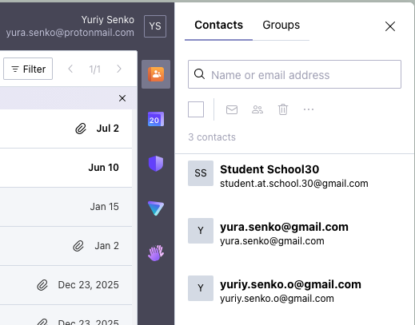
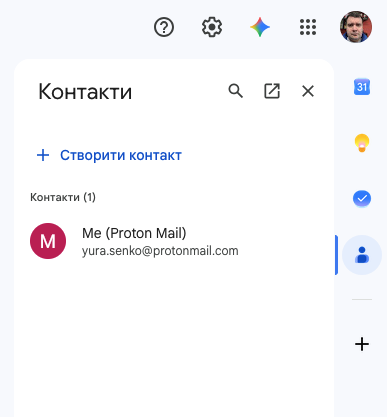
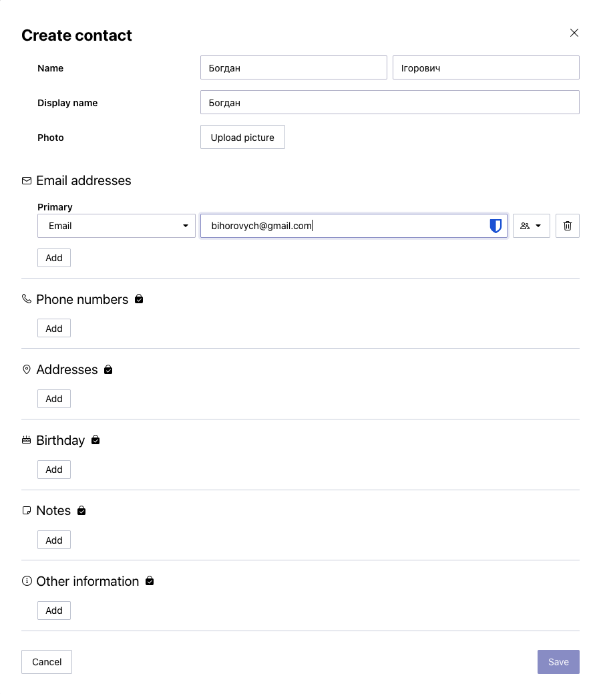
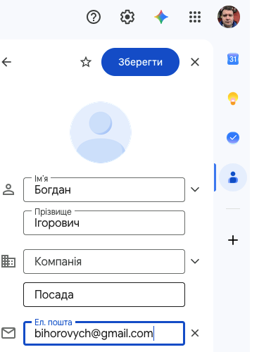
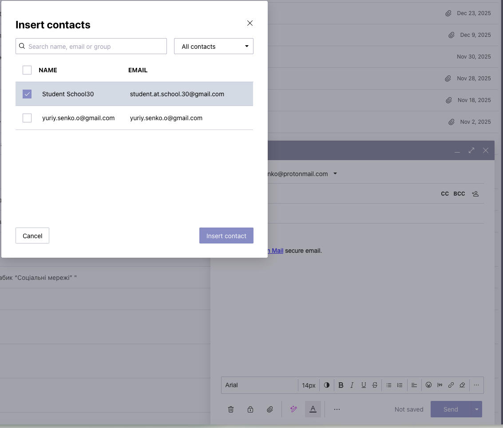
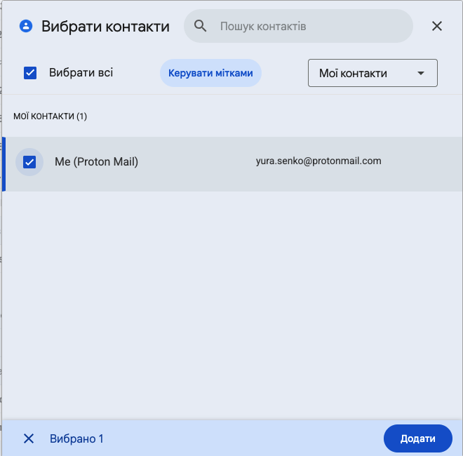
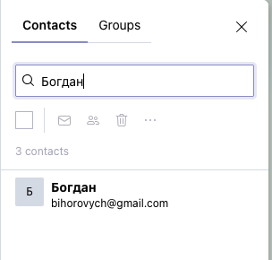
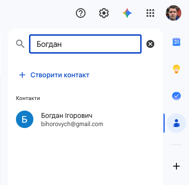

# ✉️ Етикет листування. Адресна книга та списки розсилки

## 🏫📨 Урок **08**

---

## 🛡️ Пригадуємо: техніка безпеки

- 🖥️ Сідаємо рівно, відстань до екрана — довжина витягнутої руки.
- 🚫 Без їжі, напоїв та верхнього одягу в кабінеті інформатики.
- 🔌 Не чіпаємо кабелі, роз'єми, задню панель монітора чи системного блока.
- ⚡ Не вмикаємо/вимикаємо комп'ютер самостійно, не відкриваємо системний блок.
- 🔥 Побачили дим, почули незвичний звук або сталася помилка — одразу повідомляємо вчителя.

---

## 🎯 Сьогодні ми дізнаємося

- 📋 Про правила етикету при листуванні електронною поштою
- 👔 Навчимося відрізняти офіційне і неофіційне спілкування
- 📇 Дізнаємося, для чого потрібна адресна книга та як нею користуватися
- ✍️ Навчимося писати коректні листи, обираючи адресата зі збережених контактів

---

# 📌 Актуалізація

- ❓ Чим «Відповісти» відрізняється від «Переслати»?
- 🏷️ Що обов'язково вказують у темі листа?
- 💬 Чим лист на e-mail відрізняється від повідомлення у месенджері?

Сьогодні узагальнимо правила гарного листування та познайомимося з адресною книгою — інструментом, що допомагає зручно зберігати контакти й швидко надсилати листи.

---

## 📝 Що таке етикет?

Слово «етикет» походить із французької мови — étiquette.

🔹 У перекладі воно означає ярлик, етикетка, припис, правила поведінки.
🔹 Первісно цим словом у Франції називали таблички з написаними правилами поведінки при дворі.
🔹 Пізніше «етикет» почали розуміти ширше — як сукупність норм ввічливості та прийнятих правил поведінки в суспільстві.

**Етикет електронного листування** — це набір правил:

- ✍️ як правильно писати листи
- 🙋‍♂️ як звертатися до адресата
- 🏁 як завершувати повідомлення
- 🤝 як дотримуватися ввічливості

---

## ⚖️ Основні правила етикету

<section class="text-medium">

1. 🏷️ Обов'язково вказуйте тему листа
2. 🙋‍♀️ Використовуйте привітання та ввічливі форми звертання
3. ✏️ Пишіть коротко і зрозуміло
4. 📑 Діліть текст на абзаци
5. 🧐 Використовуйте розділові знаки та перевіряйте текст на помилки
6. 🚫 Уникайте сленгу, надмірних емоцій та написання ВСІМИ ВЕЛИКИМИ ЛІТЕРАМИ
7. ⏰ Відповідайте на листи своєчасно
   - На офіційні листи бажано відповідати протягом 24 годин (1 доби)
   - На неофіційні листи — протягом 1–3 днів

</section>

---

## 🛡️ Безпека листування

- 🚫 Не відкривайте підозрілі вкладення та посилання
- 👀 Перевіряйте адресу відправника
- 🔒 Не передавайте паролі та особисту інформацію у листах

---

# 👔 Офіційне vs неофіційне

  

**Офіційне листування:**

- 👩‍🏫 вчитель, директор, організація
- 🧑‍💼 строгий або діловий стиль, повні речення

  

  

**Неофіційне листування:**

- 🧑‍🤝‍🧑 друг, однокласник
- 😃 допускається більш вільний стиль

  

---

## 🤩 Цікаві факти про етикет електронної пошти

<section class="text-medium-small">

- 📧 Перший офіційний етикет електронної пошти був сформульований ще у 1995 році.
- 🕒 Відповідати на листи протягом 24 годин вважається хорошим тоном у діловому спілкуванні.
- 🏷️ Листи без теми часто потрапляють у спам або залишаються без відповіді.
- 👀 Ввічливе звернення та підпис підвищують шанси отримати відповідь.
- 🚫 Використання ВСІХ ВЕЛИКИХ ЛІТЕР сприймається як "крик" і порушення етикету.
- 🌍 Етикет електронної пошти схожий у багатьох країнах світу, але може мати свої особливості.

</section>

---

## 📇 Що таке адресна книга?

**Адресна книга** — інструмент поштового сервісу для зберігання відомостей про адресатів:

- 📧 електронні адреси
- 🏠 домашня та службова адреси
- ☎️ номери телефонів
- 📝 будь-які додаткові нотатки

---

## 👀 Панель контактів

- Відкривається з бічної панелі поштової скриньки
- Показує всі збережені контакти, кожен можна переглянути, відредагувати або видалити

Proton Mail

Gmail

---

## ➕ Додавання контакту

Proton Mail

Gmail

Щоб додати контакт, натисніть **Додати контакт** ➕ і заповніть поля: ім'я, електронна адреса та (за потреби) телефон чи нотатку.

---

## ✅ Обираємо адресата зі списку

Proton Mail

Gmail

У полі **Кому** почніть вводити ім'я — сервіс запропонує збережений контакт зі списку, і адресу не потрібно вводити вручну.

---

## 🔍 Пошук контакту

Proton Mail

Gmail

Пошук в адресній книзі працює навіть за фрагментом опису контакту — не обов'язково пам'ятати повну адресу.

---

## 📬 Список розсилки

Коли потрібно надіслати той самий лист **одразу кільком адресатам**, їх можна обрати зі збереженої адресної книги у полях **Кому** чи **Копія**, не вводячи кожну адресу вручну.

📌 У Proton Mail збереження **іменованої групи контактів** — платна функція. Тому список розсилки на практиці ми формуємо, обираючи потрібні контакти вручну.

---

<section class="task">

## 💻 Практична робота

✍️ Використовуючи адресну книгу свого поштового сервісу:

**Середній рівень:**
1. 📇 Додайте до адресної книги контакт однокласника/однокласниці, що працює поруч
2. ✉️ Складіть лист із темою **Практична робота 08**, привітанням і підписом (за правилами етикету)
3. ✅ Оберіть адресата у полі «Кому» зі списку контактів — не вводьте адресу вручну
4. 🔎 Перевірте тему, звертання й підпис та натисніть **Надіслати**

**Достатній рівень:**

5. 🔍 Скористайтеся пошуком в адресній книзі, щоб швидко знайти доданий контакт

**Високий рівень:**

6. ✏️ Відредагуйте контакт, додавши нотатку або номер телефону
7. 🗣️ Поясніть, чим адресна книга зручніша за ручне введення адреси та що таке список розсилки

</section>

---

## 🤔 Аналіз результатів

Обговорюємо типові помилки:

- 🏷️ Лист без теми чи підпису
- 🙋 Звертання, що не відповідає адресату (офіційне до друга або навпаки)
- ⌨️ Адреса введена вручну замість вибору з контактів

---

## 🏠 Домашнє завдання

1. 📖 Опрацювати матеріал підручника, с. 36–40
