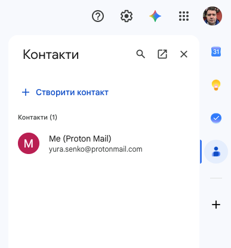
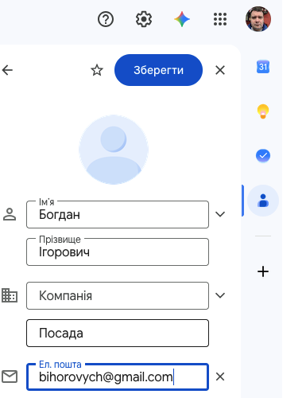

# 📸 Навчальний проєкт «Листуємося як профі»

## 🏫📨 Урок **09**

---

## 🛡️ Пригадуємо: техніка безпеки

- 🖥️ Сідаємо рівно, відстань до екрана — довжина витягнутої руки.
- 🚫 Без їжі, напоїв та верхнього одягу в кабінеті інформатики.
- 🔌 Не чіпаємо кабелі, роз'єми, задню панель монітора чи системного блока.
- ⚡ Не вмикаємо/вимикаємо комп'ютер самостійно, не відкриваємо системний блок.
- 🔥 Побачили дим, почули незвичний звук або сталася помилка — одразу повідомляємо вчителя.

---

## 🎯 Сьогодні ми

- 📬 Покажемо, як орієнтуємося в поштовій скриньці
- 📎 Надішлемо фото вкладенням з телефона на комп'ютер і збережемо його
- 📇 Попрацюємо з контактами та мітками в Google Контактах
- ➡️ Перешлемо лист із копією, ↩️ відповімо всім
- 🙈 Зробимо розсилку з прихованою копією

📱 Телефон лежить на парті й використовується **лише для роботи з поштою**.

---

## ⚡ Бліц-опитування

- ❓ Чим поле **«Копія»** відрізняється від **«Прихованої копії»**?
- 🏷️ Що з'являється перед темою листа після **«Відповісти»**, а що — після **«Переслати»**?
- 👥 Чим **«Відповісти»** відрізняється від **«Відповісти всім»**?
- 📎 Чи треба заново прикріплювати файл, якщо пересилаєте лист із вкладенням?
- 📇 Навіщо обирати адресата зі списку контактів, а не вводити адресу вручну?

---

## 🖼️ Проєкт: фотовиставка «Мій шкільний день»

Кожен учасник фотографує на телефон предмет або куточок класу, а фото «мандрує» поштою:

📱 **Телефон** ➡️ 🖥️ **Шкільний акаунт** + 👩‍🏫 **Вчитель**
🖥️ **Шкільний акаунт** ➡️ 📱 **Власна пошта** (копія 👩‍🏫)
📱 **Власна пошта** ↩️ **Відповісти всім**
🖥️ **Шкільний акаунт** ➡️ 🙈 **Розсилка однокласникам**

✅ Рівні 1–3 ви виконуєте **самостійно** на двох своїх пристроях: 📱 телефон (особиста пошта) і 🖥️ шкільний комп'ютер (спільний шкільний акаунт).

---

## 🏆 Як оцінюємо

| Рівень | Бали | Що робимо |
|---|---|---|
| 1️⃣ Початковий | 1–3 | Орієнтуємося в поштовій скриньці |
| 2️⃣ Середній | 4–6 | Контакти та передавання фото |
| 3️⃣ Достатній | 7–9 | Пересилання, копія, «Відповісти всім» |
| 4️⃣ Високий | 10–12 | Мітка контактів і розсилка |

🪜 Рівні виконуємо **по черзі**. Чим більше рівнів виконано — тим вищий бал!

---

## 📋 Правила спільного шкільного акаунта

📬 **Спільна шкільна адреса:**
`____________________`
<!-- TODO: вписати адресу спільного шкільного акаунта -->

👩‍🏫 **Адреса вчителя:** на дошці

- 🏷️ У **темі кожного листа** — своє прізвище
- 📇 У назві контакту — хто додав: «Олена Петренко (дод. Коваль)»
- 🗂️ Мітку називаємо «Фотовиставка — Прізвище»
- 🚫 Не видаляємо й не змінюємо чужі листи, контакти та мітки
- 🔍 Свої листи шукаємо за прізвищем у рядку пошуку Gmail

---

## 📇 Нагадування: Google Контакти

1. У Gmail натисніть **⋮⋮⋮ Додатки Google** ➡️ **Контакти** (або відкрийте contacts.google.com)
2. Натисніть **Створити контакт**
3. Заповніть ім'я, прізвище, електронну адресу
4. Додайте **нотатку** в полі «Нотатки»
5. Натисніть **Зберегти**

---

## 🗂️ Мітка контактів і розсилка

**Створюємо мітку:**
1. У Google Контактах ліворуч натисніть **➕ Створити мітку**
2. Назвіть її «Фотовиставка — Прізвище»
3. Позначте потрібні контакти ✅ ➡️ кнопка **Керувати мітками** 🏷️ ➡️ оберіть свою мітку

**Надсилаємо розсилку:**
1. У Gmail натисніть **Написати**
2. Натисніть **Прихована копія** праворуч від поля «Кому»
3. Почніть вводити **назву мітки** — Gmail підставить усі адреси з неї

🙈 Адресати з **прихованої копії** не бачать адрес одне одного.

---

<section class="task">

## 1️⃣ Рівень 1. Початковий (1–3 бали)

📱 **Орієнтуємося в поштовій скриньці** (на телефоні, перевірка усна)

1. 📥 Покажіть учителю папку **«Вхідні»**, відкрийте лист і поверніться до списку листів
2. ✉️ Поясніть, з яких частин складається **адреса електронної пошти** — на прикладі своєї адреси
3. 🏷️ Поясніть, що таке **тема листа** і навіщо її заповнювати

🙋 Готові? Піднімайте руку — вчитель підійде!

</section>

---

<section class="task">

## 2️⃣ Рівень 2. Середній (4–6 балів)

1. 📸 Сфотографуйте на телефон предмет або куточок класу
2. 📇 🖥️ У Google Контактах шкільного акаунта додайте два контакти (з «дод. Прізвище» в назві):
   - **себе** — з особистою адресою та нотаткою «Моя пошта на телефоні, урок 09»
   - **однокласника, що сидить поруч** — з його особистою адресою
3. 📤 📱 З особистої пошти надішліть лист із фото **двом адресатам** у полі «Кому»: на **спільну шкільну адресу** та на **адресу вчителя** (на дошці)
   - Тема: **Фото для виставки — Прізвище**
   - Привітання, 1–2 речення про фото, підпис
4. 💾 🖥️ Знайдіть цей лист у шкільному Gmail (пошук за прізвищем) і **збережіть фото** в папку на комп'ютері

</section>

---

<section class="task">

## 3️⃣ Рівень 3. Достатній (7–9 балів)

1. ➡️ 🖥️ Відкрийте свій лист «Фото для виставки — Прізвище» і натисніть **«Переслати»**:
   - **Кому** — оберіть **себе** з підказок контактів
   - **Копія** — учитель
   - на початку листа коментар: «Пропоную це фото для виставки, бо...»
2. ↩️ 📱 Відкрийте на телефоні отриманий лист `Fwd:` і натисніть **«Відповісти всім»**: «Фото отримано, дякую!» + підпис
3. 🔍 🖥️ Знайдіть свою відповідь у шкільній скриньці — тема має починатися з `Re:`

</section>

---

<section class="task">

## 4️⃣ Рівень 4. Високий (10–12 балів)

1. 🗂️ 🖥️ Створіть мітку **«Фотовиставка — Прізвище»** і додайте до неї щонайменше **трьох однокласників** (адреси запитайте в них або використайте вже створені контакти)
2. 🙈 Надішліть зі шкільного акаунта лист-запрошення:
   - **Кому** — учитель; **Прихована копія** — ваша мітка
   - вкладення — ваше збережене фото
   - тема: **Запрошення на фотовиставку — Прізвище**
   - лист за правилами етикету ✍️
3. 💬 Останнім реченням поясніть, **чому** однокласників поставлено в приховану копію

</section>

---

## 👀 Хвилинка для очей

- 🌳 Подивіться у вікно вдалину — 20 секунд
- 😌 Заплющте очі на 5 секунд, розплющте
- 🔄 Повільно поводіть очима вгору-вниз, праворуч-ліворуч
- 😉 Кілька разів швидко поморгайте

---

## 🤔 Аналіз результатів

🙋 До якого рівня ви дійшли?

**Типові помилки:**
- 🏷️ Лист без теми, без прізвища в темі або без вкладення
- ⌨️ Адресу введено вручну з помилкою замість вибору з контактів
- 📎 Пересланий лист без фото
- 🏫 Пересланий лист надіслано на шкільну адресу замість особистої
- ↩️ «Відповісти» замість «Відповісти всім» — учитель не отримав відповіді
- 👀 Однокласників поставлено в «Копію» замість «Прихованої копії»

---

## 📌 Висновки

- ✉️ Адреса = **логін** + `@` + **домен** поштового сервера
- 🏷️ Тема листа коротко описує його зміст
- 📎 Поштою зручно передавати файли між пристроями
- 📇 Контакти й мітки економлять час і захищають від помилок в адресі
- 🙈 Прихована копія береже чужі адреси від сторонніх очей

🔒 Особисті адреси однокласників не можна залишати в акаунті, яким користуються інші класи!

---

## 🏠 Домашнє завдання

1. 📱 Хто не завершив рівень — доробіть «телефонні» кроки вдома до наступного уроку
2. 📖 Повторити матеріал підручника, с. 33–40

