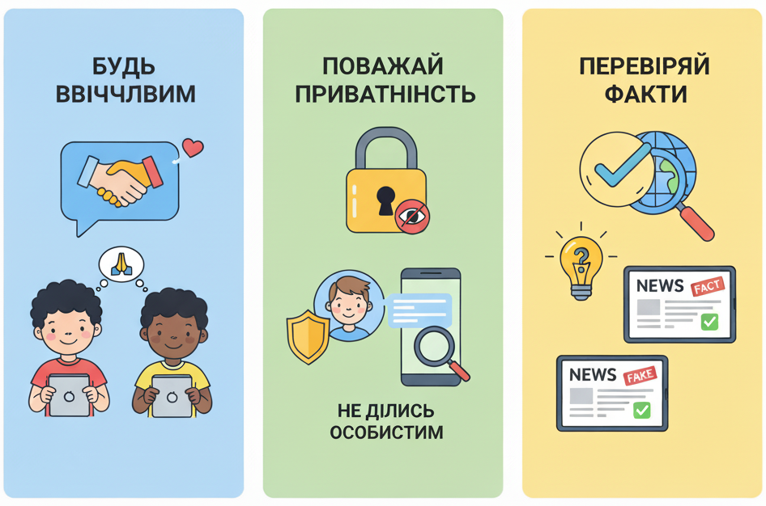
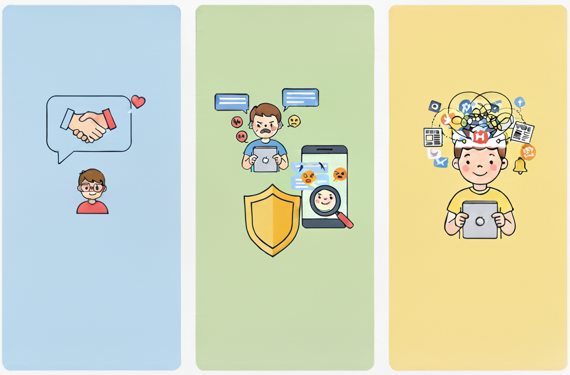
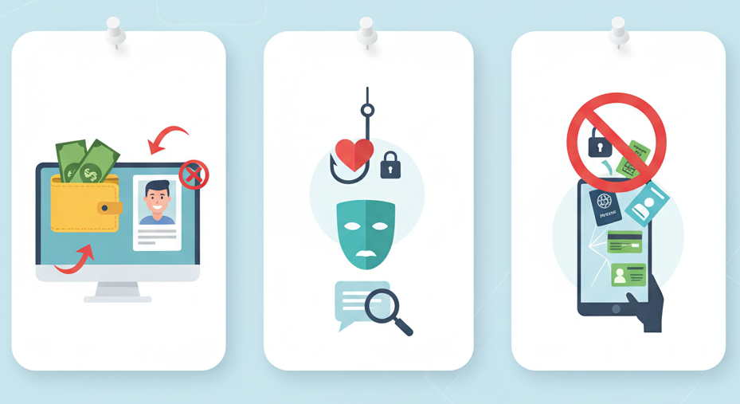

# 🌐🛡️ Етика та безпека у віртуальному світі

## 🏫 Урок **10**

---

## 🎯 Сьогодні ми дізнаємося

- ℹ️ Що таке **етика** та **етикет** у цифровому світі.
- 🔧 Які правила поведінки існують в реальному та віртуальному просторі.
- ⚠️ Які небезпеки можуть виникнути при використанні цифрових пристроїв.
- 🛡️ Як безпечно спілкуватися та взаємодіяти в мережі.

---

## 🤝 Етика та етикет цифрового спілкування

- 🧭 **Етика** – сукупність моральних норм поведінки.
- 📜 **Етикет** – конкретні правила поведінки.

### 💬 **У віртуальному світі ці правила називають "нетикетом".** 🤫

---

## 📝 **Правила "Нетикету"**

  

1. 🙏 **Будьте ввічливими**
   - ✍️ Пишіть грамотно, уникайте образ, "крику" (надмірного використання великих літер) та сленгу.

2. 🔒 **Поважайте чужу приватність**
   - 🚫 Не публікуйте особисту інформацію інших людей без їхнього дозволу.

3. ❌ **Не розповсюджуйте фейки**
   - 🔎 Перевіряйте інформацію, перш ніж нею ділитися.

  

  

  

---

## ⚠️ **Небезпеки використання цифрових пристроїв**

  

1. 😥 **Загрози здоров'ю**

  - 👀 Погіршення зору.
  - 🪑 Проблеми з поставою.
  - 📱 Залежність від гаджетів.

2. 😠 **Кібербулінг**

  - 💢 Цькування, образи або залякування через інтернет.
  - 😔 Може викликати депресію та низьку самооцінку.

3. 🤯 **Інформаційна перевтома**

  - 🧠 Надлишок інформації призводить до стресу та зниження концентрації.

  

  

  

---

## 🕵️ **Небезпеки спілкування з незнайомцями**

  

1. 💰 **Маніпуляція та шахрайство**
  - 👤 Незнайомці можуть використовувати фейкові профілі для вимагання грошей або даних.

2. 🎣 **Грумінг**

  * 🤝 Втертися в довіру з метою отримання особистої інформації.
    * ⚠️ _Пам'ятайте: в Інтернеті людина може бути не тією, за кого себе видає._

3. 🚫 **Витік персональних даних**

  * 🕸️ Будь-яка інформація, яку ви публікуєте, може бути використана проти вас.

  

  

  

---

## 📝 **Практична частина**

### ✅❌ **"Правда чи фейк?"**

1. 📱 Завдяки новій технології, розробленій Google, смартфони тепер можуть заряджатися від енергії, що генерується вашим голосом під час розмови.

2. 💻 Microsoft та Apple спільно планують замінити операційні системи Windows і macOS універсальною операційною системою під назвою "QuantumOS" до 2030 року. Вона працюватиме на основі квантових обчислень.

3. 🤖 Штучний інтелект (ШІ) вже здатний створювати реалістичні зображення, текст і музику, що іноді складно відрізнити від творів, створених людьми.

---

## 📝 **Практична частина**

### 🎭 **Як ти вчиниш, якщо**

1. 🏃‍♂️ Ти бачиш у ТікТоці чи Інстаграмі челендж, де потрібно виконати ризиковану дію (наприклад, швидко пробігти перед рухомим транспортом), то для популярності та хайпу варто це повторити, адже це весело і всі так роблять.

2. 📸 Багато відомих блогерів і стримерів показують, де вони живуть і як проводять свій час. Тому ділитися геолокацією своїх улюблених місць, шкільної адреси чи розкладу дня в соцмережах – це нормально і навіть допомагає знайти нових друзів.

3. 🔑 Тобі в приватні повідомлення прийшло запрошення долучитися до секретної групи в месенджері, де обіцяють безкоштовні скіни для улюбленої гри чи доступ до закритого контенту, але для цього просять ввести логін і пароль від твого акаунта, це є ознакою шахрайства і не варто цього робити.

