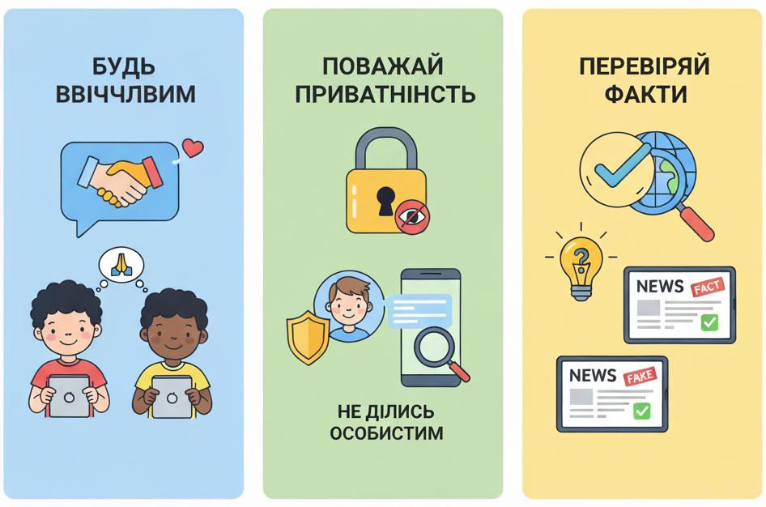

# 🌐🤝 Етика та безпека в реальному й віртуальному світі

## 🏫 Урок **10**

---

## 🛡️ Пригадуємо: техніка безпеки

- 🖥️ Сідаємо рівно, відстань до екрана — довжина витягнутої руки.
- 🚫 Без їжі, напоїв та верхнього одягу в кабінеті інформатики.
- 🔌 Не чіпаємо кабелі, роз'єми, задню панель монітора чи системного блока.
- ⚡ Не вмикаємо/вимикаємо комп'ютер самостійно, не відкриваємо системний блок.
- 🔥 Побачили дим, почули незвичний звук або сталася помилка — одразу повідомляємо вчителя.

---

## 🎯 Сьогодні ми дізнаємося

- ℹ️ Чим **етика** відрізняється від **етикету** і що таке **нетикет**.
- 🔎 Самі дослідимо правила чемної та безпечної поведінки в мережі.
- 🗣️ Навчимо цим правилам однокласників.
- ⚠️ Які небезпеки несуть цифрові пристрої для людини та суспільства.
- 🕵️ Знайдемо й виправимо помилки в електронному листі.

---

## ⚡ Розминка

1. ✉️ Які правила етикету електронного листування ви пам'ятаєте?
2. 🙈 Навіщо ставити однокласників у поле **«Прихована копія»**?

🤔 **Обговорімо:** чи однакові правила поведінки **в класі** та **в чаті класу**? Чим вони відрізняються?

---

## 🧭 Етика, етикет і нетикет

🧭 **Етика** — сукупність моральних норм поведінки: що добре, а що погано.

📜 **Етикет** — конкретні правила поведінки в певних ситуаціях.

💬 **Нетикет** — етикет у мережі: правила спілкування в інтернеті.

---

## 🍲 Складаємо «рецепт» безпеки

❓ Чи можна придумати **«рецепт» дій**, які зроблять роботу в інтернеті **комфортною та безпечною**?

Сьогодні кожна група досліджує **одну частину** рецепта й **навчає інших**. Разом ми складемо карту знань класу:

**🛡️ Діємо безпечно** → 🤝 Етикет · ✉️ Листування і спам · 🎣 Фішинг · 🪞 Репутація · 🩺 Здоров'я · 🌍 Суспільство

---

<section class="task text-medium-small">

## 🔎 Дослідження в групах (12 хв)

1. 📂 Відкрийте в **Google Диску** шкільного акаунта документ **«Діємо безпечно — 7 клас»**.
2. 📚 Дослідіть свою тему: **довідка вашої групи** (слайди далі) та пошук в інтернеті.
3. ✍️ Запишіть у **свій розділ** документа:
   - ✅ **3 головні правила** зі своєї теми;
   - 🎭 **1 ситуацію-запитання** для класу: «Як ти вчиниш, якщо…?»
4. 👥 Розподіліть ролі: 🔍 шукач, ✍️ записувач, 🎤 доповідач.

⚠️ Не змінюйте розділи інших груп!

</section>

---

## 👥 Теми груп 1–3

### 🤝 Група 1. Етикет і чемна комунікація

- Які правила етикету листування й онлайн-спілкування існують?
- Як враховувати вік, культуру та статус співрозмовника?

📚 довідка + 🌐 пошук

### ✉️ Група 2. Безпечне листування і спам

- Яку інформацію не можна повідомляти в листах?
- Що таке спам і як від нього захиститися?

📚 довідка + 🌐 пошук

### 🎣 Група 3. Фішинг

- Що таке фішинг?
- За якими ознаками його розпізнати?
- Що робити, якщо потрапив на гачок?

📚 довідка + 🌐 пошук

---

## 👥 Теми груп 4–6

### 🪞 Група 4. Цифрова репутація

- Що таке цифрова репутація?
- Чому «інтернет пам'ятає все»?
- Як берегти свою репутацію?

📚 довідка + 🌐 пошук

### 🩺 Група 5. Цифрові пристрої та здоров'я

- Як пристрої впливають на зір, поставу, сон?
- Що таке цифрова залежність?
- Що таке правило **20-20-20**?

📚 довідка + 🌐 пошук

### 🌍 Група 6. Технології та суспільство

- Що таке кібербулінг і фейки?
- Чим небезпечні незнайомці в мережі (грумінг)?
- Як діяти в таких ситуаціях?

📚 довідка + 🌐 пошук

---

## 📚 Довідка. Група 1: 🤝 Етикет і чемна комунікація

**✉️ Етикет електронного листування** — неформальний кодекс поведінки, за яким регулюється спілкування користувачів. Його основа:

- 🙏 **Ввічливість**
- 🛡️ **Безпека**
- ✍️ **Грамотність**
- ⚖️ **Коректність**
- ⏰ **Вчасність**

**💬 Поради для спілкування в мережі:**

- 👥 **Розуміння аудиторії** — враховуйте вік, цінності, традиції й інтереси співрозмовника.
- 🤝 **Повага** — без стереотипів та образливих слів.
- 🎩 **Мова** — формальна чи неформальна залежно від того, кому пишете.
- 😉 **Смайли й гумор** — різні покоління й культури сприймають їх по-різному.
- 👂 **Уважність** — поводьтеся так, як під час реального спілкування.

---

## 📚 Довідка. Група 2: ✉️ Безпечне листування і спам

**🔐 Небезпеки листування:**

- 🏠 Приватні дані про себе й родину можуть потрапити до незнайомців.
- 🎭 Співрозмовник із листування може виявитися не тим, за кого себе видає.
- 🔑 Хто знає ваш пароль, може читати пошту й писати листи **від вашого імені**.
- 📎 Вкладення від невідомих осіб можуть містити **шкідливі програми**.
- 📰 Не все, що написано в листі, — правда.

**🗑️ Спам** — небажані рекламні листи, повідомлення, дзвінки чи SMS, що надходять **без згоди** користувача.

- 🌐 Спамери збирають адреси, зокрема на сумнівних сайтах.
- 🔗 Відповідь на спам чи перехід за посиланням показує, що адреса «жива».
- 🚫 У поштовому сервісі можна позначити лист кнопкою **«Спам»** — наступні листи з цієї адреси потраплятимуть у папку **«Спам»**.

---

## 📚 Довідка. Група 3: 🎣 Фішинг

**🎣 Фішинг** — атака, під час якої шахраї створюють **копію сайту** банку, магазину чи соцмережі та розсилають листи, щоб людина ввела там свої дані.

- ⚠️ Привід: «збій у системі», «акаунт буде заблоковано».
- 🎯 **Цільовий фішинг** — лист з особистою інформацією про адресата, тому він дуже переконливий.
- 💳 Шахраїв цікавлять: логіни й паролі, PIN-коди, номери карток, дата народження.

**🔍 Ознаки фішингу:**

- ✍️ Граматичні помилки, автопереклад.
- ⏱️ Вимога **негайної** дії.
- 📧 Дивна адреса відправника.
- 🔗 Підозріле посилання, адреса сайту не збігається з назвою.
- 🪟 Спливаючі вікна, важливе дрібним шрифтом.

**🆘 Якщо потрапив на гачок:** повідомити дорослих, змінити паролі, попередити друзів, позначити лист як спам.

---

## 📚 Довідка. Група 4: 🪞 Цифрова репутація

**👣 Цифровий слід** — усе, що залишається про людину в інтернеті:

- ✍️ **Активний** — те, що ви публікуєте самі: пости, фото, коментарі, лайки.
- 🕵️ **Пасивний** — те, що збирають сайти й застосунки: пошукові запити, геолокація, історія переглядів.

**🪞 Цифрова репутація** — враження, яке складається про людину з її цифрового сліду.

**🤔 Цікаві факти:**

- 📸 Видалений допис міг устигнути потрапити на **скриншот** або в чужі репости.
- 🔎 Інформацію про вас можуть шукати вчителі, тренери, організатори конкурсів, а згодом — роботодавці.
- 👫 На вашу репутацію впливає й те, що про вас публікують **інші**: фото, відмітки, коментарі.
- 🔒 У соцмережах можна налаштувати, хто бачить ваші дописи.

---

## 📚 Довідка. Група 5: 🩺 Цифрові пристрої та здоров'я

- 👀 **Зір.** Дивлячись на екран, ми кліпаємо значно рідше → очі сохнуть і втомлюються, болить голова.
- 🦒 **Постава.** Коли голова нахилена до телефона на 60°, шия тримає навантаження ≈ **27 кг** («текстова шия»).
- 😴 **Сон.** Яскраве світло екрана ввечері заважає організму виробляти гормон сну (мелатонін) → важче заснути.

- 📱 **Цифрова залежність** — коли людина не може контролювати час із гаджетом: дратується без нього, забуває про сон, їжу, уроки, друзів.
- 🏃 **Мало руху** — довге сидіння за екраном шкодить серцю, м'язам і хребту.
- ⏱️ **Правило 20-20-20** — кожні 20 хв дивитися 20 с на предмет за 20 футів (≈ 6 м).

---

## 📚 Довідка. Група 6: 🌍 Технології та суспільство

- 😠 **Кібербулінг** — цькування через інтернет: образливі повідомлення, поширення чужих фото чи чуток, виключення з групових чатів, фейкові акаунти від імені іншої людини. Може спричинити стрес, страх і низьку самооцінку.
- 📰 **Фейк** — неправдива інформація, подана як правдива. Ознаки: емоційний заголовок, немає джерела, заклик «терміново поширте!».

- 🎭 **Грумінг** — коли дорослий у мережі видає себе за однолітка, втирається в довіру, просить фото, особисті дані, зустріч і вимагає «тримати все в секреті».
- 🤯 **Інформаційна перевтома** — надлишок інформації призводить до стресу та зниження концентрації.
- ☎️ **Національна дитяча «гаряча лінія»: 116 111** (безкоштовно).

---

## 💡 Приклад ситуації-запитання

🎭 **Як ти вчиниш, якщо…** тобі в приватні повідомлення прийшло запрошення до «секретної» групи, де обіцяють безкоштовні скіни для гри, але просять ввести **логін і пароль** від твого акаунта?

🎭 **Як ти вчиниш, якщо…** у соцмережі популярний челендж, де потрібно зробити щось **ризиковане**, а «всі так роблять»?

💡 Добра ситуація — **життєва**, має **кілька можливих варіантів** дій і перевіряє одне з ваших правил.

---

## 🗣️ Обмін знаннями

🎤 Кожна група має **≈1 хвилину**:

1. ✅ Назвіть свої **3 правила**.
2. 🎭 Поставте класу **ситуацію-запитання**.
3. 💬 Прокоментуйте відповіді однокласників.

👀 Слухаємо уважно й стежимо в документі **«Діємо безпечно — 7 клас»**: так складається наша спільна карта знань!

---

<section class="task text-medium-small">

## 🕵️ Практична робота «Лист-детектив» (12 хв)

Учень написав учительці лист, у якому **багато помилок**: етикету, етики та безпеки. Допоможіть їх виправити!

1. 🔍 Уважно прочитайте лист на наступному слайді.
2. 📝 Знайдіть і запишіть помилки.
3. ✉️ Зі **шкільного акаунта Gmail** напишіть учителю **виправлений** лист.
   - 📌 Тема: **Лист-детектив — Прізвище**
   - 📧 Адреса вчителя — на дошці.
4. 🛡️ Для рівня «Високий» — у кінці листа поясніть, які **порушення безпеки** ви знайшли і чому вони небезпечні.

</section>

---

## ✉️ Лист із помилками

**Від:** superkiller2013@example.com
**Кому:** olena.vchytelka@example.com
**Копія:** dmytro.7a@example.com, marina.7a@example.com, sofia.7a@example.com … *(ще 21 адреса)*
**Тема:** *(порожньо)*
**Вкладення:** *(немає)*

ПРИВІТ!!!!!! 😜😜😜 ми з групою не встигли здати проект про пошту бо Максим взагалі нічого не робив, він в нас найтупіший 🤬 тому це не наша вина!!! скиньте плз ще раз дз бо я не знайшов а ще продовжте нам термін до понеділка ОК??? проект у вкладенні. якщо не відкриється то зайдіть в мій щоденик логін kovalenko7 пароль 12345 там все є. а ще ось номер Марини 067 123 45 67 вона теж не здала напишіть їй
ВІДПОВІДАЙТЕ ШВИДКО!!!!!
спс

🔢 У листі **понад 15 помилок**. Скільки знайдете ви?

---

## 📊 Критерії оцінювання

| Рівень | Що має бути виконано |
|---|---|
| 🥉 **Середній** | Знайдено й записано щонайменше **6 помилок етикету** |
| 🥈 **Достатній** | + Надіслано вчителю **виправлений лист** з темою «Лист-детектив — Прізвище»: звертання, абзаци, підпис; без сленгу, ВЕЛИКИХ ЛІТЕР, смайлів та образ |
| 🥇 **Високий** | + Знайдено щонайменше **3 порушення безпеки чи приватності**; у кінці листа пояснено, чому їх небезпечно залишати |

⚠️ Лист без прізвища в темі не зараховується: усі листи зі шкільного акаунта надходять від однієї адреси.

---

## 👀 Хвилинка для очей: правило 20-20-20

👁️⏱️🌳

Кожні **20 хвилин** дивіться на **20 секунд** на предмет, що розташований **за 20 футів** (≈ 6 метрів).

Подивіться у вікно, а потім кілька разів поморгайте 😌

---

## 🤔 Рефлексія

- 🔍 Які помилки в листі було **найважче** помітити?
- 🛡️ Чому порушення **безпеки** часто пропускають?
- 🍲 Яке **одне правило** з нашого «рецепта» ви почнете виконувати **вже сьогодні**?

💡 Поводьтеся в мережі так, як під час **реального** спілкування: поважайте інших і бережіть свої та чужі дані.

---

## 🏠 Домашнє завдання

1. 📖 Опрацювати матеріал підручника, **с. 41–48**.
2. 🎮 *(За бажанням)* Пройти одну місію гри [Interland](https://beinternetawesome.withgoogle.com/uk_ua/interland) та назвати на наступному уроці **одне нове правило**, яке ви з неї дізналися.

