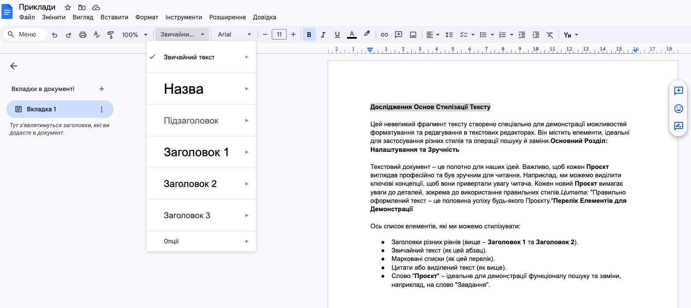
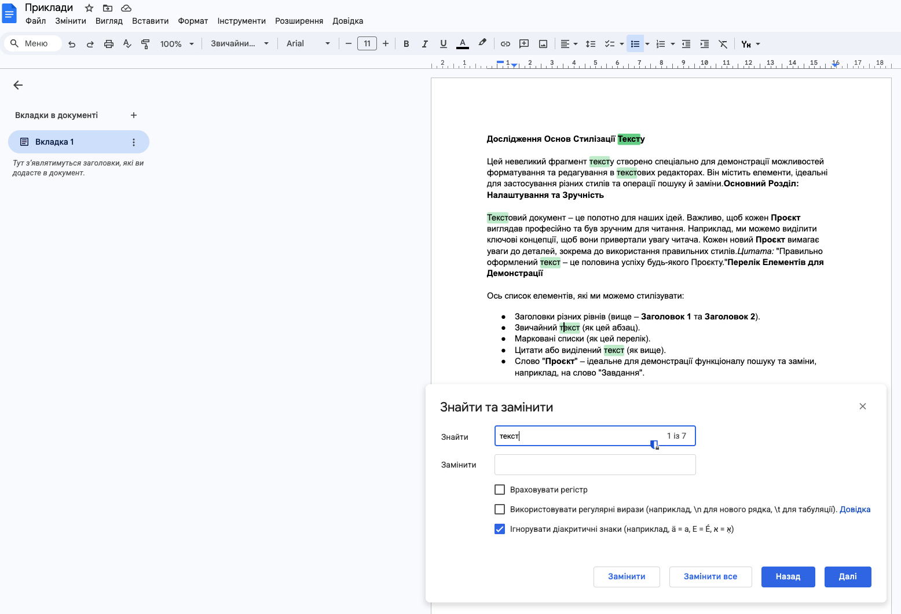

# Форматування зі стилями. Пошук та заміна тексту.

## 🏫 Урок **36**

---

## 🎯 Сьогодні ми дізнаємося

- 💡 Що таке **стиль** тексту та навіщо він потрібен.
- 🛠️ Як використовувати стилі в **Google Документах**.
- 🔍 Як швидко **знайти та замінити** слова у великому тексті.

---

## 👋 Пригадаємо разом

<div class="important-to-remember">

### Текстовий процесор

Програма для створення, редагування та складного форматування текстів.

</div>

### Приклади:

[Google Документи](https://docs.google.com/document/u/0/), Microsoft Word, LibreOffice Writer.

---

## 🖋️ Що таке стиль?

<div class="important-to-remember">

**Занотуйте**:

Стиль — це іменований набір параметрів форматування (шрифт, розмір, колір, вирівнювання), який дозволяє швидко змінити вигляд тексту.

</div>

- **Швидкість:** Один клік замість десяти налаштувань.
- **Єдність:** Весь документ виглядає в одному стилі.
- **Структура:** Допомагає створити автоматичний зміст.

---

## 🛠️ Як застосувати стиль?

<div class="two-columns">
<div class="text-left text-medium-small">

1. **Виділіть** потрібний фрагмент тексту або встановіть курсор на абзац.
2. На панелі інструментів знайдіть випадне меню **"Стилі"** (зазвичай там написано "Звичайний текст").
3. **Оберіть** потрібний рівень (наприклад, Заголовок 1).

</div>
<div class="image-center card">



</div>
</div>

---

## 🔍 Як знайти та замінити?

<div class="two-columns">
<div class="text-left text-medium-small">

1. Натисніть **Ctrl + H** або перейдіть у меню **Правка -> Знайти та замінити**.
2. У полі **"Знайти"** впишіть слово, яке хочете змінити.
3. У полі **"Замінити на"** впишіть нове слово.
4. Натисніть **"Замінити все"**.

</div>
<div class="image-center card">



</div>
</div>

---

## 💻 Практичне завдання ⭐️⭐️

<div class="task">

  1. Створіть [Google Документ](https://docs.google.com/document/u/0/).
  2. Скопіюйте у нього текст з нвступного слайду.
  3. Застосуйте стиль "Заголовок 1" до рядка "Історія інформації"
  4. Застосуйте "Заголовок 2" до рядка "Способи передачі".
  5. Застосуйте стиль "Звичайний текст" до решти рядків.
  6. Замініть через **Ctrl + H** слово "Інформація" на слово "Дані".

</div>

---

## 📝 Текст для копіювання

```text
Історія інформації

Інформація завжди була важливою. Давні люди малювали на стінах печер.

Способи передачі інформації

Спочатку були звуки, потім вогонь, а пізніше — папір. Сьогодні ми використовуємо інтернет.
```
